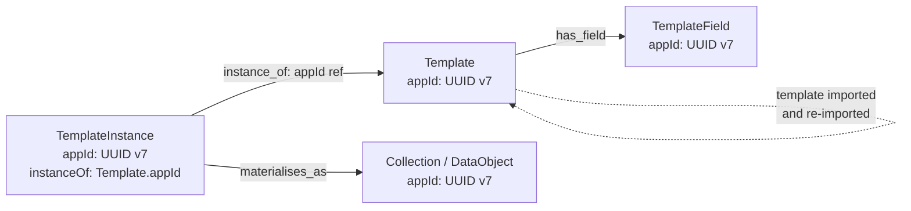

# Neo4j ID Migration — Design (L2)

**Scope.** Forward-looking design note for backlog item **L2** (`aidocs/16-dispatcher-backlog.md`, originating from `aidocs/input/input_raw.md:90` and `:715-717`): retire Neo4j's deprecated `id()` function from every Cypher query and every cross-store / API surface, in favour of an **application-generated stable identifier** (`appId`). This is the load-bearing prerequisite for Templates (**L3**) and removes the largest residual blocker on the search (`aidocs/13`) and semantic-annotation (`aidocs/14`) work.

**Status.** Phase 1 (L2a) **landed** `fec7979` (cherry-pick onto `claude/implement-input-raw-changes-2WiOF`, merged via PR #1003 at `79f3ffd`). Phase 2 (L2b) **landed** `796bc11` (PR #1020). C5 (the gating Cypher-injection fix) **landed** `ab3f9da` — L2c precondition cleared. **L2c is unblocked**; recommended to land **C5b** (the second-wave injection sites in `*ReferenceDAO` / `GenericDAO` / `VersionDAO` / `SemanticAnnotationDAO`) before L2c so the parameter-type swap (long → String) doesn't open new injection sites. L2d gated on P4 + H4.

**Snapshot date.** 2026-05-07.

**Companion docs.** Reads as a fourth member of the C-section (`12`/`13`/`14`); extends `aidocs/12-timescaledb-performance-analysis.md` §11 (identifier discipline) — does not duplicate it.

---

## 1. Decision and rationale

The maintainer's direction is **not** to switch to `elementId()`. The function call is replaced by an application-generated property `appId` on every node whose internal id is reachable through any persistence boundary or API. `elementId()` would solve the deprecation warning and nothing else — the underlying brittleness reasons that motivated the deprecation still apply.

Maintainer note, verbatim:

> Every node and relationship is guaranteed an element ID. This ID is unique among both nodes and relationships across all databases in the same DBMS within the scope of a single transaction. However, no guarantees are given regarding the order of the returned ID values or the length of the ID STRING values. Outside of the scope of a single transaction, no guarantees are given about the mapping between ID values and elements.
>
> Neo4j reuses its internal IDs when nodes and relationships are deleted. Applications relying on internal Neo4j IDs are, as a result, brittle and can be inaccurate. It is therefore recommended to use application-generated IDs.

**Scope.** Every entity type whose internal Neo4j id is currently exposed at the API layer or persisted across the data DBs. Concretely: `Collection`, `DataObject`, all `BasicReference` subtypes, `FileContainer`, `StructuredDataContainer`, `TimeseriesContainer`, `Permissions`, `SemanticAnnotation`, `SemanticRepository`, `Subscription`, `UserGroup`, `VersionableEntity`, `AnnotatableTimeseries`, and the four future bridge nodes from `aidocs/14` §2. Connecting use case (L3): a template instance must reference its template after the template has been deleted and re-imported — `id()` reuse breaks this.

---

## 2. ID scheme choice

| Scheme | Length | Time-ordered | Java 21 support | URL-friendly | Notes |
|---|---|---|---|---|---|
| **UUID v4** | 128 bit / 36 char | No | `java.util.UUID.randomUUID()` (built-in) | OK | Random; b-tree pages fragment on insert; canonical |
| **UUID v7** (RFC 9562) | 128 bit / 36 char | Yes (ms-precision prefix) | `com.github.f4b6a3:uuid-creator`, `io.hypersistence:hypersistence-utils-hibernate-63`, JDK 26+ native | OK | Time-ordered; b-tree-friendly; stable URL form |
| **ULID** | 128 bit / 26 char base32 | Yes | several libraries (`com.github.f4b6a3:ulid-creator`) | Better (shorter, no `-`) | Lexicographic order ≡ time order; not as canonical as UUID |
| **Snowflake-style** | 64 bit | Yes | bespoke | OK (numeric) | Needs worker-id coordination across replicas; unnecessary moving part for an on-prem deployment |
| **Hash / content-addressable** | — | n/a | n/a | n/a | Out of scope: identity must not depend on payload |

**Recommendation: UUID v7** (`com.github.f4b6a3:uuid-creator`).

Reasons:

- **B-tree friendliness.** Neo4j's lookup and unique-constraint indexes are b-tree backed. UUID v7's monotonic prefix keeps insertion at the right edge of the index — same property that makes it the recommended Hibernate id strategy in current docs. UUID v4 fragments; we'd be paying random-page-write cost on every insert into a hot index, exactly the failure mode `aidocs/12 §3` had to fix on the Postgres side.
- **Hibernate / OGM ergonomics.** `java.util.UUID` round-trips through Neo4j-OGM and the Neo4j Java driver as a `STRING` property without custom converters. The migration to a future driver-only stack (when Neo4j-OGM is finally retired — `aidocs/03-issues-status.md` #274) keeps the type stable. v7 vs v4 is a generation-side decision; storage and retrieval are identical.
- **URL friendliness.** 36 chars URL-safe (no percent-encoding). Long but workable. ULID is shorter (26 chars) but loses the canonical `UUID` type; client SDKs already speak `UUID` (`backend/src/main/java/de/dlr/shepard/common/util/UUIDHelper.java:11-12` already does `UUID.randomUUID()`). Adopting ULID would force a new type across every generated client.
- **Cursor pagination.** `aidocs/13 §2.6` proposes cursor-based pagination keyed on `(orderBy, id)`; `aidocs/12 §11.A.2` step 6 proposes `(time, id)` cursors. Both compose with v7's monotonic prefix — sorting by `appId` approximates sorting by creation time without an extra column.
- **Alignment with `aidocs/12 §11.B`.** §11.B's recommendation kept the **numeric** `TimeseriesEntity.id` (Postgres `bigint`) as the canonical timeseries address. That stays; an `appId` is added orthogonally on the **container** (which lives in Neo4j) and on the `AnnotatableTimeseries` bridge (`backend/src/main/java/de/dlr/shepard/context/semantic/entities/AnnotatableTimeseries.java:18-26`). The timeseries `id: bigint` is **not** replaced — see open question §10.

ULID is a serious second choice; if URL length pressure increases (e.g. deep `/v2/` paths nesting 3+ ids), revisit.

Snowflake is rejected: even one shared worker-id register is one more piece of infra than a `random()`-style scheme. Hash-based is rejected by definition.

---

## 3. Where the id lives

### 3.1 Neo4j

Each entity node gains a property `appId: STRING` (UUID v7 canonical). A unique constraint and a lookup index. The existing `id` property (the OGM-mirrored Long, see `backend/src/main/java/de/dlr/shepard/common/neo4j/entities/AbstractEntity.java:30-32`) stays in place during the deprecation window — it is the OGM's primary key and yanking it requires the full OGM-removal pass on `aidocs/03-issues-status.md` #274 to land first.

Cypher migration **as shipped** in L2a is `V11__Add_appId_unique_constraints.cypher` (constraints only — 28 per-label `REQUIRE n.appId IS UNIQUE`, idempotent via `IF NOT EXISTS`). The backfill below is the **L2b** payload, slated for `V12__Backfill_appId.cypher`:

```cypher
// Phase 2 backfill — run idempotent.
MATCH (n)
WHERE (n:Collection OR n:DataObject OR n:BasicReference OR
       n:FileContainer OR n:StructuredDataContainer OR n:TimeseriesContainer OR
       n:Permissions OR n:SemanticAnnotation OR n:SemanticRepository OR
       n:Subscription OR n:UserGroup OR n:VersionableEntity OR
       n:AnnotatableTimeseries)
  AND n.appId IS NULL
SET n.appId = randomUUID();   // v4 here; v7 generated server-side at write
```

Constraint + index, in a `V11__appId_constraints.xml` catalog (matching the `V1__Add_indixes.xml` style at `backend/src/main/resources/neo4j/migrations/V1__Add_indixes.xml:124-257`):

```xml
<constraint name="unique_appId_BasicEntity" type="unique">
  <label>BasicEntity</label>
  <properties><property>appId</property></properties>
</constraint>
```

(Repeat per concrete label that does not inherit from `BasicEntity`: `Permissions`, `SemanticAnnotation`, `SemanticRepository`, `UserGroup`, `Subscription`, `AnnotatableTimeseries`.)

`randomUUID()` (Cypher built-in) is acceptable for the backfill — those rows will never need the time-ordered prefix because they predate the migration. New writes go through Java with v7.

### 3.2 API contract

Today's path patterns: `/collections/{collectionId: long}` (`backend/src/main/java/de/dlr/shepard/context/collection/endpoints/CollectionRest.java:111`, `:144`, `:164`, etc.; same shape on every `*Rest` endpoint).

Target: `/v2/collections/{appId: string}`. Coupled to **P4** (API versioning). The `/v1/...` paths keep `long` for one deprecation window (≥ 2 minor releases, mirroring the `aidocs/12 §11.B.3` precedent). Inside the backend the v1 path is a thin translator: read the long `pathParam`, look up the node by internal id, project `appId`, then run the same Cypher as the v2 path.

OpenAPI: a `/v2` group on the spec; clients regenerate with `appId` typed as `string` (or `UUID` where the generator supports it; OpenAPI Generator does for Java and Python).

### 3.3 Cache layer

`PermissionsService` (`backend/src/main/java/de/dlr/shepard/auth/permission/services/PermissionsService.java:114-128`) is annotated `@CacheResult(cacheName = "permissions-service-cache")`. The cache key is the method-argument tuple `(long entityId, AccessType accessType, String username)`; eviction crosses the `CompositeCacheKey` boundary at `:142-147`, where invalidation pulls element 0 and `equals`-checks against a `long`.

**Decision: keep `long` as the cache key shape.** Translate at the API boundary.

Why:

- Re-keying to `appId: String` flushes the entire cache once on cutover. Tolerable in absolute terms, but on a busy instance every request starts cold; warming is `O(open requests)` and intersects A4c (cache warming work).
- The cache is a **per-instance** lookup table; its key shape is internal. The `appId` is a **public** identifier. Conflating them couples the public surface to the cache invalidation strategy — a long-term tax.
- The translation `appId → internal-long` is one indexed Cypher lookup (sub-millisecond on the new index); on cache miss, that probe is dwarfed by the `getUserRolesOnEntity` chain. On hit, the long key avoids any string allocation.
- `PermissionsDAO.findByEntityNeo4jId` (`backend/src/main/java/de/dlr/shepard/auth/permission/daos/PermissionsDAO.java:12-19`) is the only call site that takes the long. Its body switches from `WHERE ID(e) = %d` to `WHERE e.appId = $appId`; the *parameter* it accepts becomes a string only at the public-API edge. Internally it can still look up by `appId` and project the OGM long id back as needed, or — simpler — keep the long path internally and only translate at controller boundary until v2 rolls out.

A single edge-of-system table (or, better, a method-level adapter on the resource class) does the `appId ↔ long` translation, inserts into a request-scoped map, and the cache stays untouched. When P5 retires the OGM (#274) the long disappears organically; the cache key migrates **then**, in a separate change.

### 3.4 Cross-DB references

Two DBs hold a long that is the Neo4j-side container id:

- **TimescaleDB.** `TimeseriesEntity.containerId: long` (`backend/src/main/java/de/dlr/shepard/data/timeseries/model/TimeseriesEntity.java:22-23`) is the FK from a timeseries row to its `TimeseriesContainer` Neo4j node. Stored on every row of the hypertable and indexed via `(timeseries_id, time DESC)` (V1.8.0). Migrating means an additive `container_app_id: TEXT` column, dual-write for one release, backfill from Neo4j (`UPDATE … SET container_app_id = (SELECT appId FROM ...)` is a join across DBs — done in app code via a one-shot job, not in pure SQL), then drop the old column. **Time budget**: 1 day to add column, 1 day for the cross-DB backfill job, 1 day soak before drop. Aligns with the `migration_progress` pattern (post-P3) for observability.
- **MongoDB.** `FileService` and `StructuredDataService` derive a Mongo collection name from a UUID (`backend/src/main/java/de/dlr/shepard/data/file/services/FileService.java:48`, `backend/src/main/java/de/dlr/shepard/data/structureddata/services/StructuredDataService.java:37`) — `mongoId = "FileContainer" + UUID.randomUUID()`. The Neo4j `FileContainer` node already stores this `mongoId`; it is **not** the Neo4j internal id. **No migration needed** for the Mongo-side reference. The path the API uses is the Neo4j container's long id → the container node → its `mongoId` property → Mongo. Replace step 1 with `appId → container node → mongoId`; the rest is untouched.

### 3.5 Generated clients

`clients/java`, `clients/python`, `clients/typescript` regenerate from OpenAPI. The new `id` field appears as `string` (`UUID` in Java/Python). The `id: integer` field stays in `/v1/` schema for the deprecation window. **Breaking change** for clients consuming `/v2/` directly — bumped via the API version, not via the client major version (clients trail the API).

A note on Java client: `clients/java/config.yaml` already pins `useBeanValidation` and similar; the regen pass needs a config tweak (`UUID` mapping) but no manual code.

---

## 4. Migration plan

Five phases. Each ships independently. Preconditions cite the backlog ID at `aidocs/16`.

### Phase 0 — instrumentation

**Goal.** Confirm the call-site inventory before touching code.

**Change set.** Add a `Cypher.audit` log at `backend/src/main/java/de/dlr/shepard/common/neo4j/daos/GenericDAO.java:107-115` (`findByQuery`) and the equivalent in `PermissionsDAO`, that emits a counted log line whenever the query string contains `id(` or `ID(`. Same instrumentation in `Neo4jQueryBuilder` (search). Log shape: `cypher.id_function`, `caller_class`, `endpoint_path`. Aggregate over a week of dev/staging traffic.

**Observability.** Prometheus counter `shepard_cypher_internal_id_calls_total{caller}`.

**Rollback.** None — log-only.

**Exit criterion.** Counter holds steady for 7 days; the inventory of caller classes matches the grep result (~26 Cypher `id()` sites across 4 modules: `auth/permission`, `common/search`, `common/neo4j`, `context/{collection,references,semantic,version}`).

### Phase 1 — generate `appId` server-side, additive

**Backlog ID.** L2a.

**Goal.** Every newly-created node has a valid, unique `appId`. Read paths still use the internal id. No client-facing change.

**Change set.**

1. Cypher migration `V11__Add_appId_unique_constraints.cypher` — 28 per-label `REQUIRE n.appId IS UNIQUE` (idempotent via `IF NOT EXISTS`). **Landed.**
2. New mixin `HasAppId` (interface, `getAppId() / setAppId(String)`) implemented by 28 `@NodeEntity` classes — 18 via `AbstractEntity`, 2 via `AbstractMongoObject`, 8 standalones (`User`, `ApiKey`, `Permissions`, `Subscription`, `AnnotatableTimeseries`, `SemanticAnnotation`, `Version`, `ReferencedTimeseriesNodeEntity`). **Landed.** Note: implementation does **not** mint at construction (would have required adding `appId` to existing hand-written `equals/hashCode` — out of additive scope); the seam mints at the DAO write boundary instead, see (3).
3. `GenericDAO.createOrUpdate` (`backend/src/main/java/de/dlr/shepard/common/neo4j/daos/GenericDAO.java`) gains a one-line guard: `if (entity instanceof HasAppId hai && hai.getAppId() == null) hai.setAppId(AppIdGenerator.next());` before `session.save`. Single seam, no per-DAO instrumentation. **Landed.**
4. `Neo4jQueryBuilder` and `PermissionsDAO` Cypher unchanged — still `WHERE ID(e) = %d`.

**Deviation from spec list.** `Roles` (`backend/.../auth/permission/model/Roles.java`) is a plain DTO, not `@NodeEntity` — no `appId`, no constraint. Spec mentioned it as a node label; it isn't one in this codebase.

**Observability.** Add an integration test that creates 1000 collections and asserts `MATCH (c:Collection) WHERE c.appId IS NULL RETURN count(*) = 0` and that no two collections share an `appId`.

**Rollback.** Drop the unique constraint; the column becomes a nullable property. No data destroyed.

**Exit criterion.** All `*DAO.createOrUpdate` paths exercised in CI; CI assertion that newly-created entities of every label carry an `appId`. **Must exist tests:** property-based test on `UuidCreator.getTimeOrderedEpoch()` returning monotonically increasing values within one JVM run; round-trip `Entity → save → load → equals` preserves `appId`.

### Phase 2 — backfill

**Backlog ID.** L2b.

**Goal.** Every existing entity (pre-Phase-1) gets an `appId`.

**Preconditions.**
- **L2a landed** (`fec7979`) — every new write since L2a already has a v7 `appId`. The backfill only touches rows older than L2a's deploy.
- ~~MigrationsRunner fail-fast.~~ **Already satisfied.** `A1e` shipped this in commit `0f2f512` — `MigrationsRunner.apply` propagates `MigrationsException` as a `RuntimeException` at `MigrationsRunner.java:115-117`, aborting startup. (Risk #4 in the original design draft is closed; left in §risks below for historical context.)

**Change set.** Cypher migration `V12__Backfill_appId.cypher` per the sketch in §3.1, **idempotent** (the `WHERE n.appId IS NULL` filter). The `MigrationsRunner` (`backend/src/main/java/de/dlr/shepard/common/neo4j/MigrationsRunner.java`) picks it up on next startup; thanks to A1e a backfill collision aborts startup rather than leaving the cluster on a half-migrated graph. Migration runs in `PER_STATEMENT` transaction mode (`:39`); on a graph with > 1 M nodes this is a lightly chunked cypher (`CALL { ... } IN TRANSACTIONS OF 10000 ROWS`). The unique constraint from V11 already guards against collisions — a violation aborts the chunk, the runner propagates, the boot fails with a clear `MigrationsException`.

**Observability.** Log progress per chunk; mirror the `migration_progress` table pattern from P3 (TimescaleDB-side) with a Neo4j-side `MigrationProgress` node, or — simpler — emit Prometheus counters.

**Rollback.** `MATCH (n) WHERE n.appId IS NOT NULL REMOVE n.appId`. Idempotent reverse migration in `V12_R`.

**Exit criterion.** `MATCH (n) WHERE n.appId IS NULL RETURN count(*) = 0` across every label in scope. CI gate: a test that imports a pre-migration dump and asserts the count after backfill.

### Phase 3 — read path uses `appId` internally

**Backlog ID.** L2c.

**Precondition.** **C5 (Cypher injection) must land first** (`aidocs/16`, `aidocs/07-security-issues.md`). Every line that builds Cypher with `String.formatted(entityId)` is a potential escape-bug surface; replacing the literal with `$appId` parameter binding is the right *time* to fix it. Not before — the ID migration, done correctly, eliminates the `WHERE ID(e) = %d` pattern, which is the bulk of `aidocs/07` C5's remaining sites.

**Goal.** Cypher under `/v1/` no longer calls `id()` or `ID()`. Lookups go through `MATCH (e) WHERE e.appId = $appId`. The OGM still surfaces a `Long id` from `AbstractEntity` for compatibility; the application boundary translates `long ↔ appId` in one place (a `EntityIdResolver` request-scoped bean).

**Change set.**

1. Replace the 26 Cypher sites that grep with `WHERE ID(e) = %d` (e.g. `PermissionsDAO.java:14`, `DataObjectDAO.java:46/53/62/70/257/280`, `Neo4jQueryBuilder.java:336/356/415/424/434/492/501`, `GenericDAO.java:157/177/195`, `SemanticAnnotationDAO.java:18`, `VersionDAO.java:74/90/209`, `ShepardFileDAO.java:22`, `StructuredDataDAO.java:22`, `*ReferenceDAO.java`).
2. The translation layer at the controller edge: `EntityIdResolver.appIdToLong(String appId, Class<? extends BasicEntity>)` and the inverse, both backed by a request-scoped Caffeine map.
3. Permissions cache stays keyed by `long` (§3.3); `EntityIdResolver` is invoked at the `@Authz` boundary (or, post-A4 evolution per `aidocs/24`, inside the unified authz interceptor).

**Observability.** The Phase 0 counter goes to zero in steady state. Any non-zero reading post-cutover is a regression.

**Rollback.** Per-Cypher-site revert is mechanical; the `EntityIdResolver` becomes a no-op shim.

**Exit criterion.** No `id(` or `ID(` substrings in `backend/src/main/java/de/dlr/shepard/**.java` Cypher strings (CI grep); permissions integration tests still pass; `aidocs/07` C5 finding closed.

**Must exist tests.** Property-based test that round-trips id ↔ appId for every entity type in a single transaction. Regression test on `PermissionsDAO.findByEntityNeo4jId` re-keyed to `findByEntityAppId`. Search regression on `Neo4jQueryBuilder` against a fixed corpus, asserting result-set parity vs the pre-Phase-3 query.

### Phase 4 — `/v2/...` exposes `appId` natively

**Backlog ID.** L2d.

**Precondition.** **P4 (API versioning)** and **H4 (RFC 7807 error shape)** lined up. Phase 4 ships under the `/v2/` prefix; making it land in `/v1/` would re-break clients twice.

**Goal.** Public API accepts and returns `appId` as the canonical id. `/v1/` continues to accept and return the long; the resource layer translates.

**Change set.**

1. `/v2/collections/{appId}`, `/v2/data-objects/{appId}`, `/v2/{file,timeseries,structured-data}-containers/{appId}`, `/v2/permissions/{appId}`, `/v2/subscriptions/{appId}`, `/v2/user-groups/{appId}`. Path param type: `String`, validated as UUID at the JAX-RS edge (`@Pattern`).
2. Response DTOs in `/v2/` carry `appId: String`; legacy `id: long` is a frozen alias on `/v1/`.
3. OpenAPI: a single combined spec that describes both versions; clients regenerate cleanly.
4. `PermissionsService.isAllowed` (`backend/src/main/java/de/dlr/shepard/auth/permission/services/PermissionsService.java:198-243`) parses path segments by numeric check (`StringUtils.isNumeric(idSegment)` at `:226`). For `/v2/`, the parser branches on `/v2/`-prefix and accepts non-numeric segments. **This is the highest-risk individual line in the migration**: a wrong branch here permits unauthorized access. Either fold this into the `@Authz` evolution from `aidocs/24` (cleaner) or add an explicit `else if (UUID.fromString(idSegment) != null)` (dirtier, faster). See §5.

**Observability.** Prometheus split `shepard_request_total{api_version}`. Track v1 decay; gate Phase 5 on v1 traffic dropping below an agreed threshold (mirrors `aidocs/12 §11.B.3` step 5).

**Rollback.** `/v2/` route disabled; clients fall back to `/v1/`.

**Exit criterion.** All four official client packages publish a release that uses `/v2/` by default; reference frontends migrated; v1-traffic monitor below threshold for ≥ 1 release cycle.

### Phase 5 — drop the legacy `id()`-based code paths and the dual-write

**Backlog ID.** L2e.

**Goal.** Retire `/v1/` for entities; remove the `EntityIdResolver` translator; flip `permissions-service-cache` key to string (then-uncontroversial); drop the `container_id: bigint` column on TimescaleDB once `container_app_id` carries 100% of traffic.

**Change set.**

1. Remove the `/v1/` long-id path handlers (≈ 30 endpoints across `*Rest.java`). LoC count: ~600 lines including tests.
2. `permissions-service-cache` re-keyed from `(long, AccessType, String)` to `(String, AccessType, String)`. One-time cache flush at deploy.
3. TimescaleDB: drop `container_id` column; rename `container_app_id` → `container_id`. Flyway `V1.9.0`.
4. `AbstractEntity.id: Long` (the OGM mirror) can be removed *only* once Neo4j-OGM is gone (`aidocs/03-issues-status.md` #274). Until then, the field stays but no Cypher reads it externally.

**Risks.** Anyone running `<v2-clients` pre-this-cycle is bricked. Time budget: schedule with the maintainer-confirmed deprecation window.

**Exit criterion.** Grep for `WHERE ID(` and `findByNeo4jId` returns zero hits; `/v1/` endpoints return `410 Gone`; CI passes.

---

## 5. Risks and surprises

1. **Cypher injection (C5) compounds with this migration.** Sites like `backend/src/main/java/de/dlr/shepard/auth/permission/daos/PermissionsDAO.java:14` (`"WHERE ID(e) = %d ".formatted(entityId)`), `Neo4jQueryBuilder.java:501` (`"(id(" + ... + ") = " + collectionId + " AND id(d) = " + dataObjectId + ")"`), and `DataObjectDAO.java:46-70` build Cypher by string-formatting longs. A `long` is not a forgeable injection vector; a `String appId` is. **Switch to parameter binding (`$appId`) at the same time**. Doing the ID migration without C5 turns every one of these sites into an actual injection bug. **Fix C5 before Phase 3.**

2. **Permission cache invalidation cliff.** Even keeping `long` keys (§3.3), Phase 3 changes how `findByEntityNeo4jId` resolves under the hood. Mixed-key entries during deploy (some node was looked up by long, some by appId-then-long) can yield a stale `false` for an entity whose permissions changed mid-deploy. Mitigation: invalidate all on cutover, accept one cold cycle.

3. **`PermissionsService.isAllowed` segment dispatch is numeric-only.** At `backend/src/main/java/de/dlr/shepard/auth/permission/services/PermissionsService.java:226` the gate is `if (StringUtils.isNumeric(idSegment))`. A non-numeric segment falls through to the closing `return false`. **A `/v2/` deployment without a parser update returns 403 on every entity request.** Either fold into the `@Authz` evolution from `aidocs/24` (preferred, when it lands) or patch this method with an explicit non-numeric branch in Phase 4. There is no in-between safe state.

4. **`MigrationsRunner.apply()` swallows `MigrationsException`.** `backend/src/main/java/de/dlr/shepard/common/neo4j/MigrationsRunner.java:66-74` catches `MigrationsException` and logs an error — the app starts up regardless. Post-A1e plans to make this fail-fast. A botched ID migration (e.g. constraint conflict because two pre-existing nodes happen to land on the same Cypher `randomUUID()`) **must abort startup**; otherwise the running cluster will accept writes on a half-migrated graph. Add an explicit `--dry-run` mode (a config flag that runs the migration on a clone DB) before Phase 2 hits production.

5. **Subscription filter loops over usernames, not entity ids.** Minimal blast radius — webhook delivery (`SubscriptionService`) does not key by entity id. P2c is unaffected.

6. **OGM round-trip on `appId`.** Neo4j-OGM treats `@Property` strings transparently; the `@Id @GeneratedValue Long id` on `AbstractEntity.java:30-32` is **not** the `appId`. Don't touch it during this migration. Removing `@GeneratedValue` is part of #274, not L2.

7. **Search regression risk.** `Neo4jQueryBuilder.java` has hot paths that interpolate longs into Cypher in 6+ places (`:336`, `:356`, `:366`, `:415`, `:424`, `:434`, `:492`, `:501`). Any change to the produced query plan can degrade search latency (`aidocs/13` is sensitive). Capture a query-plan snapshot before/after Phase 3; compare with `EXPLAIN`.

---

## 6. Templates (L3) coupling

Templates motivate the migration. A template can be deleted and re-imported (e.g. across a `shepard` instance migration); a `TemplateInstance` references its `Template` by `appId`, which survives the round-trip. With `id()`, an instance's `templateRef` would silently bind to a different node after re-import, and likely a wrong one (id reuse).

Sketch model:



A template id is just an `appId`; nothing structurally special. The instance carries a single string property `instanceOf` whose value is a template's `appId`. On template re-import, the new template node's `appId` is preserved (the export/import round-trip carries `appId` in the RO-Crate) — the instances rebind by lookup.

**SPW (`shepard-process-wizard`, `aidocs/input/input_raw.md:98-99`) compatibility.** SPW defines its own model (`spw-model`); it is referenced by `aidocs/16` L3 / `aidocs/19` E14 as the integration target. **Open question** (§10): does SPW today reference `shepard` entities by internal long, by `shepardId` (the versioning key, see `VersionableEntity.shepardId` at `backend/src/main/java/de/dlr/shepard/context/version/entities/VersionableEntity.java:21`), or by some opaque identifier? If long: SPW must also migrate to `appId`. If `shepardId`: orthogonal — keep both. If opaque: nothing changes. Clarify with SPW maintainer before Phase 4 ships.

The `shepardId` (`VersionableEntity.java:21`) is **not** the `appId`. `shepardId` is stable across versions of one entity (a head and its history share it); `appId` is stable for one node only. The two are orthogonal — both stay.

---

## 7. Sized rollout

| Phase | T-shirt | Comment |
|---|---|---|
| 0  Instrumentation | S | One log statement, one counter, one week soak |
| 1  Generate `appId` (L2a) | M | Mixin + migration + tests, ≈ 1 week |
| 2  Backfill (L2b) | S | One Cypher migration, idempotent, ≈ 2 days |
| 3  Read path on `appId` (L2c) | L | 26 Cypher sites + translation layer + C5 fix; ≈ 2-3 weeks. **The big one.** |
| 4  /v2 exposure (L2d) | L | New REST surface, OpenAPI bump, four client regenerations, `PermissionsService.isAllowed` parser update; ≈ 2-3 weeks; coupled to P4 |
| 5  Drop legacy (L2e) | M | Mostly removal; cache flip; TimescaleDB column drop; ≈ 1 week + deprecation window |

**Total honest estimate.** ≈ 7-9 engineer-weeks of net effort, spread across ≥ 2 minor releases with a deprecation window in the middle. Less than the 12-15 week handover-doc estimate for `#274` because L2 sidesteps the OGM rewrite — it adds `appId` *alongside* `@Id Long id` and lets #274 retire the latter at its own pace.

---

## 8. Backlog IDs spawned

| ID | One-line description |
|---|---|
| **L2a** | Phase 1 — additive `appId` (mixin, write-side generation, unique constraint, no read-path change) |
| **L2b** | Phase 2 — backfill `appId` on existing nodes via idempotent Cypher migration |
| **L2c** | Phase 3 — switch every Cypher read from `WHERE ID(e) = %d` to `WHERE e.appId = $appId`; coupled to and gated on **C5** |
| **L2d** | Phase 4 — expose `appId` on `/v2/` REST endpoints; coupled to **P4** (versioning) and **H4** (error shape); update `PermissionsService.isAllowed` parser |
| **L2e** | Phase 5 — drop `/v1/` long-id paths, flip permissions cache key, drop TimescaleDB `container_id` legacy column |

---

## 9. Things to deliberately *not* do

1. **Do not migrate to `elementId()`.** That is the maintainer's whole point — element ids carry the same brittleness contract as `id()`.
2. **Do not expose Neo4j internal id in any new API.** The `/v2/` surface accepts `appId` only; never a `long` PathParam, never an `id: integer` field.
3. **Do not add `appId` to relationships in v1.** Only nodes. Relationship ids are not currently exposed at the API or persisted across DBs; widening this scope multiplies the migration cost without a use case.
4. **Do not target zero-downtime in v1.** A scheduled maintenance window is acceptable for an on-prem research-data platform (`aidocs/01`). Pretending otherwise turns a 5-phase rollout into a 9-phase one.
5. **Do not replace `shepardId` with `appId`.** They model different things — version-stable key vs. node-stable key. Both stay (`VersionableEntity.java:21`, this proposal).
6. **Do not touch the Mongo-side `mongoId` derivation.** It already uses `UUID.randomUUID()` (`FileService.java:48`, `StructuredDataService.java:37`); the link from Neo4j to Mongo is via the container node's `mongoId` property, not via the Neo4j internal id. No cross-DB migration on the Mongo side.

---

## 10. Open questions for maintainer

- **UUID flavour.** v7 (default in this proposal) vs. v4 vs. ULID vs. straight `randomUUID()` from Cypher. v7 wins on b-tree friendliness and cursor-pagination alignment; ULID wins on URL length. Decide before L2a.
- **`/v2/` rollout shape.** One PR that flips every endpoint to `/v2/`, or one PR per resource (Collection first, then DataObject, then containers)? The latter trickles risk; the former is one cleaner client-regen pass.
- **SPW compatibility.** Does `shepard-process-wizard` reference `shepard` entities by internal long, `shepardId`, or opaque token? Confirm before L2d to know whether SPW needs its own migration.
- **Replace the timeseries 5-tuple with `appId`?** `aidocs/12 §11.B` left the 5-tuple as a creation-time descriptor and the numeric `TimeseriesEntity.id` as the canonical id. Should `appId` replace the numeric `id` on timeseries too, or stay orthogonal? Default: orthogonal — `appId` is on the **container** (Neo4j), the timeseries `id` is the Postgres `bigint` PK. But if cursor-pagination wants a single id-shape across kinds (`aidocs/13`), revisit.
- **Permission cache key — keep `long` or re-key on string?** §3.3 recommends `long` for the deprecation window; flip at Phase 5. Maintainer veto-able.
- **`MigrationsRunner` dry-run.** Should the dry-run mode (§5 risk 4) be a CLI flag, a config property, or a separate Maven goal? Each has trade-offs in CI ergonomics.

---

## 11. Cross-references

- `aidocs/12-timescaledb-performance-analysis.md` §11 — identifier discipline; this doc extends but does not duplicate.
- `aidocs/13-search-improvements.md` §2.3, §2.6 — search results carry numeric ids today; they carry `appId` post-L2d. Cursor pagination keys.
- `aidocs/14-semantic-improvements.md` §2.1, §2.3 — bridge nodes (Annotatable*) get `appId` like any other entity.
- `aidocs/16-dispatcher-backlog.md` — **L2** (this), **L3** (Templates, motivating use case), **A4 / A4c / A4d** (permission cache key), **C5** (Cypher injection — gate for Phase 3), **P3** (`migration_progress` pattern), **P4** (API versioning — gate for Phase 4), **H4** (error shape — Phase 4).
- `aidocs/19-architecture-feedback.md` E14, `aidocs/20-epic-roadmap.md` E5 — alignment of the ID epic with the broader roadmap.
- `aidocs/24-authz-evolution.md` — if/when this lands, fold `PermissionsService.isAllowed` segment-dispatch into the unified interceptor (§5 risk 3).
- `aidocs/input/input_raw.md:90`, `:715-717` — original ask.
