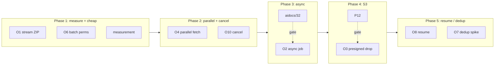

# 31 — RO-Crate Export Optimisation

**Snapshot date:** 2026-05-07.
**Scope:** the export pipeline under
`backend/src/main/java/de/dlr/shepard/context/export/` after R2, R2b, R2d
landed (commits `be0eb26`, `60a3ea1`, `d5fa03c`). R2c (per-field
redaction) and R2d2 (subscriptions) are still in flight; this document
optimises for the post-R2 shape and notes where R2c / R2d2 widen or
narrow each lever.

This is **research and design only.** No source code is modified. The
file is registered centrally by the dispatcher; **`aidocs/00-index.md`
is not edited by this commit.**

---

## 1. Summary

The exporter walks the entire `(Collection → DataObject → Reference →
Payload)` tree synchronously inside one HTTP request, materialises every
binary payload as `byte[]` via `readAllBytes()`, and buffers the entire
ZIP archive into a `ByteArrayOutputStream` before the first byte goes
out (`ExportBuilder.java:47`, `ExportBuilder.java:170-184`). For small
collections this is fine; for the canonical user-visible long-running
operation it is not. The biggest near-term win is **streaming the ZIP
straight to the response** combined with **batching the permission check
once across the whole tree** — both are mechanical and clarify the rest.
The single thing to deliberately *not* do this iteration is replace the
`edu.kit.datamanager.ro_crate` library with a hand-rolled emitter; the
JSON-LD finalisation cost is real but small relative to payload bytes,
and a custom emitter trades a bounded library risk for an unbounded
maintenance one.

---

## 2. Bottleneck inventory

Numbered, with code citations against `/home/user/shepard/backend/...`.

1. **Whole-tree walk in one synchronous request.**
   `ExportService.exportCollectionByShepardId` loads the collection eagerly
   (`ExportService.java:107`) and then iterates dataobjects → references →
   payloads → metadata in a single thread inside one `@RequestScoped`
   bean (`ExportService.java:50`). Memory and request lifetime grow
   linearly with collection size. The endpoint at
   `CollectionRest.java:359-397` blocks the worker thread until
   `exportBuilder.build()` returns — there is no early flush.

2. **Whole crate buffered in a `ByteArrayOutputStream`.**
   `ExportBuilder` constructs `baos = new ByteArrayOutputStream();
   zos = new ZipOutputStream(baos)` (`ExportBuilder.java:47-49,
   59-61`) and finally returns
   `new ByteArrayInputStream(baos.toByteArray())` from `build()`
   (`ExportBuilder.java:183`). Peak heap ≈ size of the ZIP. A 5 GB
   payload set is a 5 GB allocation. JAX-RS streams the resulting
   `InputStream` to the wire, but only after the in-memory copy exists.

3. **Binary payloads pulled in full as `byte[]`.**
   `writeFilePayload` does
   `nis.getInputStream().readAllBytes()` (`ExportService.java:426`);
   `writeTimeseriesPayload` does
   `payload.readAllBytes()` (`ExportService.java:439`);
   `writeStructuredDataPayload` does `sdp.getPayload().getBytes()`
   (`ExportService.java:432`). Each payload is materialised *twice* —
   once in heap, once again inside `baos` — before any of it streams.
   The CSV path is the same vector identified in
   `aidocs/12 §11.A.1`: appears streaming, isn't.

4. **Permission checks per entity, not batched.**
   `PermissionsService.filterAllowedForUser(Collection<Long>, ...)` exists
   (`PermissionsService.java:177-209`) and resolves an uncached batch in
   one Cypher round-trip via `permissionsDAO.findByEntityNeo4jIds(...)`.
   The exporter walker doesn't yet use it — service-level checks happen
   per-entity inside each `*Service.getReference(...)` call
   (`ExportService.java:240, 321, 383, 406, 417`). Even with the post-A4
   Caffeine cache, the per-node round-trips compound across thousands of
   references.

5. **Single-pass JSON-LD serialisation.**
   `RoCrateBuilder.build()` is called once at the very end inside
   `ExportBuilder.build()` (`ExportBuilder.java:171-179`), then the JSON
   tree is parsed back, `selection` is injected, and the result is
   pretty-printed and added to the ZIP. The whole graph of data /
   contextual entities lives in memory until then.

6. **No streaming progress signal.**
   The client gets `200 OK` and `attachment; filename="export.zip"`
   (`CollectionRest.java:362-364, 394-396`). Until the entire crate is
   built and `baos` is flipped to an `InputStream`, no bytes go out — and
   when bytes do go out, there is no way to surface "fetched 312 of 4112
   payloads". A failure mid-walk surfaces as a stalled connection or a
   500.

7. **CSV serialisation per timeseries inside the request thread.**
   `timeseriesReferenceService.exportReferencedTimeseriesByShepardId(...)`
   produces a CSV `InputStream` per reference (`ExportService.java:289-304`)
   that is then `readAllBytes()`-ed (`ExportService.java:439`). The
   serialisation cost is the §11.A vector at the export edge.

8. **No payload de-duplication.**
   `ExportBuilder.addToZip` short-circuits on filename duplicates
   (`ExportBuilder.java:276-285`) but the *bytes* are still materialised
   and the duplicate is detected only by the chosen filename
   (`<oid>.<ext>` for files, `<oid>.json` for structured data,
   `<uniqueId>.csv` for timeseries). The same blob referenced from N
   distinct `FileReference`s is fetched N times even though it is written
   to the ZIP once. Worse: if two references resolve different filenames
   for the same OID, the bytes are emitted twice.

9. **No back-pressure or cancellation.**
   JAX-RS does not propagate client disconnect to the worker thread by
   default; the walker continues fetching even after the user hits Cancel
   in the browser. The bigger the export, the bigger the leak.
   `aidocs/19 §2.6` already flags this pattern at the timeseries read
   path.

10. **Metadata bundles are eagerly walked even when small.**
    R2d (`ExportService.java:124-149`) calls
    `permissionsService.getPermissionsOfEntityOptional(entity.getId())`
    once per entity when `selection.includePermissions()` is true and
    `versionService.getAllVersions(ioId)` once per collection. Each is a
    discrete Cypher / Neo4j round-trip. Bundling these from one tree
    walk would amortise the round-trips, but today they are executed
    per-node.

---

## 3. Optimisations, ranked by ROI

T-shirt sizes are S (≤ 1 day), M (≤ 1 sprint), L (≥ 1 sprint). Risks
are qualitative; numbers are deliberately avoided per the doc constraint.

### O1 — Stream the ZIP from the writer, drop the `ByteArrayOutputStream`

**Pitch.** Replace `baos` with a `PipedOutputStream` /
`StreamingOutput`-driven `ZipOutputStream` that writes directly into the
JAX-RS response body. The exporter becomes a producer; JAX-RS becomes
the consumer; back-pressure is the OS socket. Combine with `transferTo()`
on payload streams in place of `readAllBytes()` so payloads no longer
buffer (`ExportService.java:426, 432, 439`; `ExportBuilder.java:80-92`).

**Size.** S–M. The `ro-crate-metadata.json` is the only entry that has to
be deferred to the end; emit a placeholder ZIP entry and re-open the
archive in `STORED` mode, *or* write metadata last (the writer naturally
writes the ZIP central directory at the end anyway).

**Risk.** Low. `ZipOutputStream` is already used. The JSON-LD tree from
`RoCrateBuilder.build()` (`ExportBuilder.java:171`) still has to be held
until the end, but its size is small relative to payload bytes.

**Prerequisite.** None. The `ExportBuilder.addToZip` filename-dedup pass
(`ExportBuilder.java:276-285`) needs to keep working through the rewrite.

### O2 — Async export job + status endpoint

**Pitch.** `POST /collections/{id}/export` returns 202 with
`{ jobId, statusUrl }`; the actual walk runs on a worker pool; the
client either polls `GET /export-jobs/{jobId}` or subscribes via the
P13 SSE feed when it lands. This is the canonical long-running-process
pattern; the design **belongs in `aidocs/32`** (long-running-process
design) — this doc only commits to the export-side semantics
(idempotency key, terminal states, ZIP TTL).

**Size.** L. New table for job state (mirrors P3 `migration_progress`),
new REST surface, new background runner, and a deliberate decision about
where the ZIP is held while the user fetches it (heap vs. disk vs. S3 —
see O3).

**Risk.** Medium. Requires a new resource type in the API (29 → 30 in
`aidocs/26`), implications for the convenience client (`aidocs/27`), and
shared state for the worker pool (`@RequestScoped` becomes wrong).
Coupled to the SSE proxy compatibility check (`aidocs/16` P22).

**Prerequisite.** **`aidocs/32`** for the cross-cutting long-running-job
shape; **P13** for live progress (optional — polling is acceptable).
Dovetails with **A0** if the maintenance UI for jobs needs an admin
view.

### O3 — Drop the export at an S3-presigned URL

**Pitch.** When the async job (O2) completes, upload the ZIP to S3 and
hand back a presigned GET URL with a TTL bounded by the
`shepard.permissions.cache.ttl` invariant (the **P23** tripwire from
`aidocs/28 §7`). The user downloads from S3, not through the JVM. The
202 response on `POST` becomes `{ jobId, downloadUrl }` once `state =
DONE`.

**Size.** M. Depends on **P12** (S3-presigned for blob payloads) being
available — same bucket, same credentials, same presigning code. If
P12 has not landed, this falls back to a server-served file with a
random opaque path (still better than the current heap-buffered shape
because the JVM is a passive file server, not the producer).

**Risk.** Low (security) — same model as P12. Medium (operations) —
introduces a new piece of stateful infrastructure (object store) into
shepard's deployment. `infrastructure/docker-compose.yml` today has
**no** S3 / MinIO service; standing one up is a deployment-side change
that the maintainer has to sign off on. **Open question:** should the
shepard footprint take an MinIO dependency, or assume an external S3?

**Prerequisite.** **P12** (recommended); **O2** (hard, since this only
makes sense post-async).

### O4 — Parallel payload fetch per data object, bounded

**Pitch.** Use `CompletableFuture` (or, post-Java 21, virtual threads)
to fetch references in parallel within a data object. A bounded
semaphore (`shepard.export.parallel-payload-fetches`, default ~8) keeps
MongoDB and TimescaleDB from being overwhelmed. The fetch step in
`fetchAndWriteDataObject` (`ExportService.java:151-208`) is naturally
embarrassingly parallel up to the *write* step, which has to serialise
back into the single `ZipOutputStream`.

**Size.** M.

**Risk.** Medium. The transactional boundary on the timeseries CSV
fetch (`§11.A.2` on streaming timeseries) has to be preserved per
fetch; the cursor cannot be shared across threads. Concurrent writers
into one `ZipOutputStream` is a hard no — fetch-then-queue + a single
writer thread.

**Prerequisite.** O1 (because the writer side becomes a single sink
that has to keep up).

### O5 — Continuous aggregates / materialised views for timeseries CSV

**Pitch.** Pre-bucketed CSVs for the common export windows (e.g.
1-minute, 1-hour) so the export endpoint serves a view, not a raw 1 Hz
× 90-day query. Intersects **P2b** in the backlog
(`16-dispatcher-backlog.md` P2b) and `aidocs/12 §5`'s bucket discussion.

**Size.** M. Schema work; runs in background.

**Risk.** Medium. The export contract today is "CSV of every row";
serving a bucketed view is a *different* contract — the selection
surface should let the user opt in (`R2b` `perPayload.timeRange` opens
the door; `R2c` per-field redaction tightens it).

**Prerequisite.** P2b for the materialised views; R2b is already
landed.

### O6 — Batch permission check via `filterAllowedForUser`

**Pitch.** Walk the collection tree once to collect every entity ID,
batch-call `filterAllowedForUser(Collection<Long>, AccessType.Read,
username)` (`PermissionsService.java:177-209`), and skip any entity not
in the result during the actual fetch loop. Today the per-node services
each call `isAccessTypeAllowedForUser` (`PermissionsService.java:121-125`);
even with Caffeine caching, the first export of a fresh tree is N misses.

**Size.** S.

**Risk.** Low. The post-A4 Caffeine cache `(entityId, AccessType,
username) → Boolean` is exactly what `filterAllowedForUser` writes to,
so the batch warms the cache for follow-up calls and stays consistent
with single-entry semantics.

**Prerequisite.** None. **P2** in the backlog already calls for this in
general; the export is the first concrete consumer.

### O7 — Content-addressable de-duplication

**Pitch.** Hash payload bytes (SHA-256, streaming) once per payload;
store the blob in the ZIP under `payload/<sha256>` and emit a `FileEntity`
that references it from each occurrence. The same blob referenced from N
data objects is fetched once and stored once.

**Size.** M (research spike first — see §6).

**Risk.** Medium. RO-Crate consumers expect human-friendly filenames
(today `<oid>.<ext>` per `ExportService.java:422-425`); flipping to a
hash breaks tooling that reads the crate offline. Mitigation: keep the
`<oid>.<ext>` name on the *first* occurrence and add a `sameAs` link from
subsequent occurrences. Annotation / metadata-coupling questions
(R2c per-field redaction means "same blob, different metadata
projection" is now possible — does dedup interact with redaction?) are
unresolved and want a research spike.

**Prerequisite.** O1 (so the hash is a streaming pass over a `transferTo`
pipe); coordination with **R2c** for the redaction-vs-dedup interaction.

### O8 — Resumable / partial export

**Pitch.** Persist per-job progress (mirrors P3's `migration_progress`)
keyed by entity ID; on retry, skip entities already in the ZIP. Combined
with O2 (async jobs), a 4-hour export that fails at hour 3 resumes from
hour 3, not hour 0.

**Size.** M.

**Risk.** Medium. The ZIP format is append-friendly only with care
(central directory at the end). Either store partial entries in a
staging directory and zip at the end, or use ZIP64 with a manifest of
"entries written so far" and resume by re-zipping from the staging
area.

**Prerequisite.** O2.

### O9 — Parallel ZIP composition

**Pitch.** Multi-writer ZIP libraries (`Zip4j`'s split archives, or
emitting multiple ZIPs and concatenating) let multiple threads compose
entries in parallel.

**Size.** M.

**Risk.** **High relative to gain.** ZIP central directory is inherently
serial; the deflate per entry is parallelisable but the synchronisation
cost on a single output stream typically eats the win. The honest
assessment is: don't do this until measurement (§5) shows that ZIP
composition (not payload fetch) is the dominant cost. It almost
certainly is not.

**Prerequisite.** Measurement.

### O10 — Cancellation propagation

**Pitch.** Detect client disconnect (the `AsyncResponse` /
`ServerRequestFilter` route in JAX-RS, or the simpler `CompletionCallback`
on a `Suspended` async response) and signal the walker to stop. Today
JAX-RS does not give this for free, and the walker has no
cancellation token.

**Size.** S–M.

**Risk.** Low if scoped to a `volatile boolean cancelled` flag the
walker checks between entities. Medium if it has to interrupt an
in-flight Hibernate stream — that goes through transaction management.

**Prerequisite.** Naturally pairs with O2 (async jobs — cancel means
"abandon this job"); for the synchronous endpoint a check between
`fetchAndWriteDataObject` iterations is the cheap version.

---

## 4. Compatibility with R2 / R2b / R2d / R2c-in-flight / R2d2-in-flight

How each optimisation interacts with the post-R2 selection surface:

- **O1 (streaming ZIP).** Independent. The selection block is injected
  into `ro-crate-metadata.json` as the last step (`ExportBuilder.java:170-184,
  186-203`); streaming-mode keeps the JSON-LD held until the end and writes
  it as the final ZIP entry, which is fine.
- **O2 (async job).** The `ExportSelection` request body (`ExportSelection.java:20`)
  becomes the *immutable* job parameters. `selection.warnings` (R2b,
  `ExportBuilder.java:51-52, 145-148`) becomes part of the job result,
  not just the manifest — surface it on `GET /export-jobs/{id}`.
- **O3 (S3 drop).** Bigger ROI when the selection narrows the export
  (smaller artefacts are more S3-friendly because TTLs are tighter).
  `selection.strictPerPayload` (R2b, `ExportSelection.java:42`) becomes a
  job-level pre-flight: validate before scheduling, fail-fast on stale
  OIDs / unknown columns rather than at minute 45 of a 60-minute job.
- **O4 (parallel fetch).** Completely orthogonal; the selection just
  filters the work-list before the fan-out.
- **O6 (batch permissions).** The selection lets us pre-prune the tree
  to the included kinds before the batched permission call; the batch
  is smaller, and the result feeds the per-node fetch step that already
  honours `selection.excludesId(...)` (`ExportService.java:166`).
- **O7 (de-dup).** Becomes more impactful when `payloads.perPayload.fileOids`
  (`ExportSelection.java:72`) lets users pick subsets — the same OID
  from two references hits the dedup short-circuit. **R2c** per-field
  redaction couples here: if the same blob is exported with different
  redactions to different consumers, "content addressable" needs to be
  scoped to `(payload-hash, redaction-profile)`, not just
  `payload-hash`. The research spike (§6) has to resolve this.
- **O8 (resumable).** The selection is part of the job; resume must
  re-validate the selection against the *current* tree (entities can
  have been deleted between schedule and resume) and either fail or
  emit a `selection.warnings` entry — same shape as R2b stale-OID
  reporting.
- **R2d2 (subscriptions).** Once the URL-pattern → entity-URL helper
  lands and `addSubscriptionsFor(...)` (`ExportBuilder.java:105-113`) is
  called from the walker, it's just one more per-entity Neo4j round-trip
  — bundles into the O6 batch envelope.
- **O10 (cancellation).** In a selection-aware export, cancel-then-resubmit
  with a narrower selection is the user-friendly pattern; the warnings
  block in the manifest already gives consumers a vocabulary for "this
  is a partial result."

---

## 5. Measurement plan

Before any of O2 / O3 / O7 / O8 lands, the team should know **what is
actually slow**. The pattern from `aidocs/12 §11` (measure the
read path, *then* stream it) applies here.

### 5.1 Benchmark harness

A `@QuarkusComponentTest` (or Testcontainers integration test) that
exports a synthetic collection at three sizes, with per-phase timing:

| Size | DataObjects | Refs / DO | File payloads | Timeseries rows |
|---|---|---|---|---|
| S | 10 | 5 | 1 KB × 50 | 1k |
| M | 200 | 5 | 1 MB × 1000 | 1 M |
| L | 2000 | 10 | 10 MB × 20000 | 100 M |

Per phase, emit:

- `walk` — Neo4j round-trips for collection / dataobjects / refs
  metadata.
- `permission` — calls into `PermissionsService` (single vs. batched).
- `fetch` — Mongo / Timescale payload bytes pulled per kind.
- `serialise` — RO-Crate `FileEntity` construction + JSON-LD `build()`.
- `zip` — `ZipOutputStream` write time (wall-clock between
  `putNextEntry` and `closeEntry`).
- `network` — TTFB (time-to-first-byte) and wall-clock to last byte.

Run on the CI image, not a developer laptop, and bake the medium size
into PR-blocking regression bounds (e.g. ±20% of last-known-good
wall-clock).

### 5.2 Production-side timers

Micrometer is already on the classpath (`backend/pom.xml` has
`quarkus-micrometer-registry-prometheus`). Add `Timer`s on the existing
emitters in `ExportBuilder` / `ExportService`:

- `shepard.export.phase.walk` (per export)
- `shepard.export.phase.permission`
- `shepard.export.phase.fetch{kind=file|timeseries|structured|uri|basic}`
- `shepard.export.phase.serialise`
- `shepard.export.phase.zip`
- `shepard.export.bytes{kind=...}` (counter)
- `shepard.export.entities{kind=...}` (counter)

Surface in Grafana via the existing `infrastructure/prometheus`
scrape config so production traffic explains the breakdown. This is
A4d-shaped (`16-dispatcher-backlog.md` A4d) and keeps the export
within the same metrics envelope as the rest of shepard.

### 5.3 Discipline

The single most important question to answer first is **what fraction
of total wall-clock today is payload-fetch vs. ZIP composition vs.
JSON-LD serialisation**. The answer determines whether O1 alone is
sufficient, whether O4 (parallel fetch) is worth the complexity, and
whether O9 (parallel ZIP) is permanently dropped. Without that answer,
the rollout below is plausible but unanchored.

---

## 6. Sized rollout — 5 phases

The phasing keeps the cheap, clarifying work in front of the
long-running-process arc.

1. **Phase 1 — Measure + cheap wins.** Land **O1** (streaming ZIP) +
   **O6** (batch permissions) + the **§5 measurement plan** (harness +
   Micrometer timers). Phase 1 is one sprint; nothing here changes the
   API. Result: a known performance baseline and bounded heap.

2. **Phase 2 — Cancellation + parallel fetch.** Land **O10** (the cheap
   version: a `volatile cancelled` checked between data objects) and
   **O4** (parallel payload fetch, bounded by a configurable semaphore).
   These together close the "user closes the tab and the JVM keeps
   churning" leak and use the headroom freed by O1.

3. **Phase 3 — Async jobs (depends on `aidocs/32`).** **O2** lands the
   long-running-process surface that the export shares with future bulk
   operations (P3-shaped migration runners, R2d2 subscription
   replays). The synchronous `GET /collections/{id}/export` stays as a
   convenience for small collections; the new
   `POST /collections/{id}/export` returns 202 if the selection / size
   crosses a threshold.

4. **Phase 4 — Drop at S3.** **O3** rides on **P12** (S3-presigned for
   blob payloads). The job result is a presigned URL with a
   permission-cache-bounded TTL (the P23 tripwire). At this point the
   JVM is no longer in the gigabyte-streaming path.

5. **Phase 5 — Resumable + de-dup spike.** **O8** (resumable) follows
   naturally from O2's job state. **O7** (content-addressable dedup)
   should run as a **research spike** rather than a phase: open
   questions on hash scope under R2c redaction, on RO-Crate filename
   ergonomics, and on dedup interaction with R2d2 subscriptions need
   answers before the spike becomes work. **O5** (continuous
   aggregates) and **O9** (parallel ZIP) stay unscheduled until the
   measurement evidence justifies them.

---

## 7. Things to deliberately *not* do

1. **Don't replace the `edu.kit.datamanager.ro_crate` library with a
   hand-rolled JSON-LD emitter just to get streaming.** The library's
   final-pass cost (`ExportBuilder.java:171`) is small relative to
   payload bytes (§5 will confirm). A custom emitter trades a bounded
   library risk for an unbounded ongoing maintenance burden against a
   moving spec.

2. **Don't precompute every collection's RO-Crate eagerly on a
   schedule.** The selection surface (R2 / R2b) means there is no single
   "the export" for a collection; precomputation degenerates into
   precomputing every (collection, selection) tuple. Cache the *bytes*
   of completed jobs (Phase 4's S3 drop is enough), don't speculate.

3. **Don't introduce a separate "export microservice".** The exporter
   talks to four shepard databases, one auth seam, and shares the
   permission cache; pulling it out is a multi-quarter project for what
   is — at today's volumes — a short-running operation. Phase 3's async
   job runner stays inside the shepard JVM.

4. **Don't replace `ZipOutputStream` with a parallel-deflate library
   pre-emptively.** O9 lists the case; §5 will confirm whether ZIP
   composition is even on the critical path. Almost certainly the
   payload-fetch and JDBC fetch-size discussion (`aidocs/12 §11.A`) is
   where the time goes.

5. **Don't make the synchronous `GET /collections/{id}/export` go
   away.** It's the byte-identical-legacy contract (R2 Phase 1 design
   note, `16-dispatcher-backlog.md` R2). Small-collection users (most
   users today) should keep getting one round-trip and one ZIP. Async
   is for the cases where it pays.

---

## 8. Open questions for the maintainer

- **Peak export volume today.** Largest observed export by byte count
  and by entity count? This gauges whether async (O2) is yet justified
  or whether O1+O6 alone is enough for Phase 1 to close the practical
  pain.
- **Object-store decision.** Does the shepard footprint take a MinIO
  dependency in `infrastructure/docker-compose.yml`, or does P12 / O3
  assume an external S3 supplied by the operator? Affects Phase 4's
  rollout shape.
- **Re-export frequency.** How often does a user export the same
  collection more than once per day? Controls O7's ROI — if the answer
  is "never", de-dup pays only across simultaneously-running jobs and
  is harder to justify.
- **Acceptable cancel latency.** Is "cancel takes effect at the next
  data-object boundary" acceptable for O10, or does mid-fetch
  cancellation need to abort an in-flight Hibernate cursor? The latter
  is a multiplier on O10's cost.
- **R2c (per-field redaction) timing.** O7's dedup spike waits on R2c's
  shape — if R2c lands on per-export-static profiles, the dedup key is
  `(blob-hash, profile-id)`; if redaction is per-consumer dynamic, dedup
  collapses.
- **`aidocs/32` (long-running-process design) status.** O2, O8 and the
  Phase 3+ rollout assume `aidocs/32` lands the cross-cutting
  job-state / SSE-progress / cancellation contract that the export
  shares with other long-running shepard operations (P3 migrations, P14
  ingest jobs, future R2d2 replays). This document does not duplicate
  that work; it consumes it.

---

## 9. References

- `aidocs/00-index.md` — Chapter D context.
- `aidocs/12-timescaledb-performance-analysis.md` §11 — streaming
  read-path discipline; the export is the second consumer of the same
  `getResultStream()` + `StreamingOutput` pattern.
- `aidocs/16-dispatcher-backlog.md` — R2 (`be0eb26`), R2b (`60a3ea1`),
  R2d (`d5fa03c`), R2c (queued), R2d2 (queued); P2 / P2b / P10 / P12 /
  P13 / P22 / P23; A4 / A4d.
- `aidocs/19-architecture-feedback.md` §2.6 (heap-buffered hot reads),
  §2.8 (no correlation id — the export will benefit from request-id
  threading once landed).
- `aidocs/26-crud-consistency.md` — adding `/export-jobs/{id}` is one
  more resource type; align verbs (POST create, GET status, DELETE
  cancel) with the table.
- `aidocs/28-paradigms-and-clients-synthesis.md` §3.1 (Surface A REST
  core), §3.3 (Surface C blob side door — O3 piggybacks here), §3.4
  (Surface D SSE — feeds O2's progress channel via P13).
- `aidocs/32` (forthcoming) — the cross-cutting long-running-process
  design; O2 / O8 consume it.

Code citations (paths under `backend/src/main/java/de/dlr/shepard/`):

- `context/export/ExportService.java:50,107,151-208,289-304,422-440`
- `context/export/ExportBuilder.java:47-72,80-92,105-148,170-184,
  186-203,276-285`
- `context/export/ExportSelection.java:20,42,72,94-176`
- `context/export/ExportConstants.java:1-13`
- `context/collection/endpoints/CollectionRest.java:359-397`
- `auth/permission/services/PermissionsService.java:121-125,177-209`
- `data/timeseries/repositories/TimeseriesDataPointRepository.java:33,81,139,152`
- `infrastructure/docker-compose.yml` — neo4j, mongo, timescale,
  postgis, caddy, prometheus, grafana (no S3 / MinIO today).
