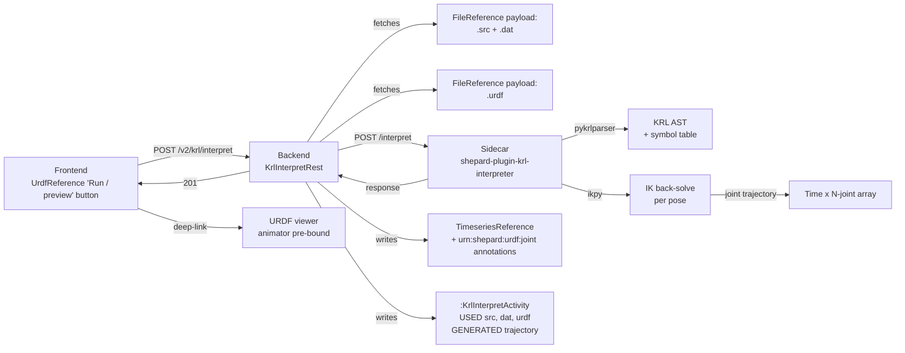
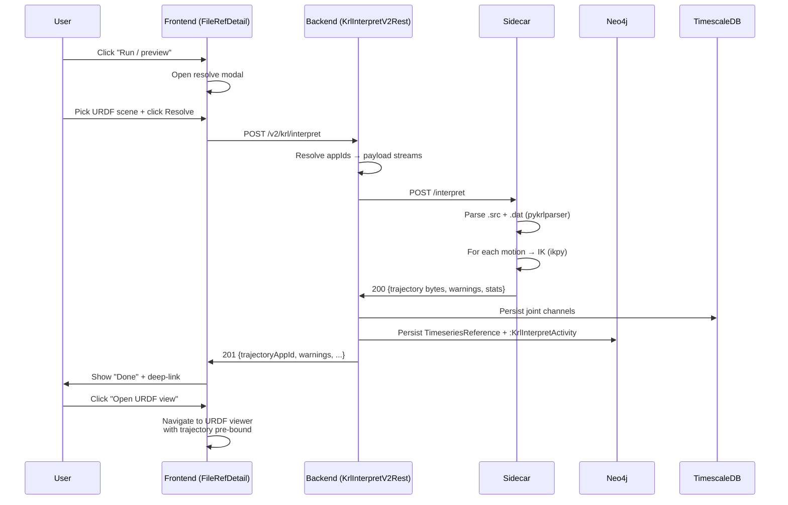

# 117 — KRL interpreter (KRL-INTERPRETER-01)

**Audience.** Plugin authors implementing `shepard-plugin-krl-interpreter`;
MFFD operators who want to click a `.src` file and see it animate against
the cell URDF; researchers who need the offline-replay shape that closes
the digital-thread loop between RoboDK (`.rdk`), the KUKA cell programs
(`.src` + `.dat`), and URDF-WEBVIEW-1; auditors (IME + AQE) asking
whether the offline-resolved trajectory is traceable back to the original
operator-authored KRL program.

**Status.** **feature-defined** (KRL-INTERPRETER-01 of an 8-row family
in `aidocs/16` — sub-rows -02 parser, -03 IK, -04 sidecar, -05 REST,
-06 UI, -07 MFFD showcase, -08 docs all blocked on -01).

This doc complements:

- `aidocs/integrations/113-urdf-viewer.md` — the **consumer**
  (URDF-WEBVIEW-1 animates the trajectory this interpreter emits).
- `aidocs/integrations/110-file-format-parser-plugin.md` §4.3 + the
  `RDK-PARSE-2` row — RoboDK `.rdk` parse is the **sibling**
  (RDK gives the cell scene; KRL gives the program).
- `aidocs/data/84-live-digital-twin.md` (DT1) — one of the
  trajectory sources DT1 consumes.
- `aidocs/data/85-coordinate-frame-tree.md` — the frame schema
  the interpreter resolves Cartesian targets against.
- `feedback_annotation_preselection_principle.md` — every emitted
  joint channel carries `urn:shepard:urdf:joint:joint_<n>` so the
  URDF viewer auto-binds without manual channel picking.

---

## 1. What this is for

**Operator end goal (verbatim, 2026-05-29):**

> click on a KRL program, associate it with a URDF / cell, and run /
> preview the program.

That sentence is the design's headline acceptance test. Every line
below works backward from it.

### 1.1 The 90-second click-walkthrough

A test engineer opens the MFFD AFP DataObject `Ply_5_layup` in
Shepard. The DataObject already has a FileReference pointing at
`Ply_5_layup.src` (the KUKA program, uploaded by the cell PC) and a
sibling FileReference pointing at `Ply_5_layup.dat` (the data file
KRL keeps frames and pose constants in). Elsewhere in the same
collection a `DigitalTwinScene` already exists (the `KUKA_R20_MFZ.urdf`,
landed by RDK-PARSE-2 from the cell's `MFZ.rdk`).

1. The user clicks the `Ply_5_layup.src` FileReference row. The
   detail page opens. Below the existing reference-edit buttons there
   is a new "**Run / preview**" button (filled, primary colour —
   it's the headline affordance of the page).
2. Clicking it opens a modal: *"Resolve KRL against URDF scene."*
   The modal has four fields:
   - **URDF scene** (required) — a picker, pre-filtered to
     `DigitalTwinScene` entities in the same collection. The user
     picks `KUKA_R20_MFZ`. (If there's only one match, it's
     pre-selected.)
   - **`.dat` companion** (optional) — pre-filled with
     `Ply_5_layup.dat` if a same-stem sibling exists; the user
     leaves it alone.
   - **Base + tool frame** (optional) — collapsed under "Advanced".
     If the URDF declares `base_link` and a `tool0`, those are used;
     otherwise the user types `$BASE` / `$TOOL` offsets matching the
     `.dat` file.
   - **Seed pose** (optional) — defaults to "last known pose" (the
     URDF zero pose for a first run). The user leaves it.
3. The user clicks **Resolve**. The sidecar gets the job. A progress
   strip appears in the modal: *"Parsing → IK solving (148 / 1872
   poses) → Writing trajectory."* On a typical `Ply_5_layup.src`
   (~30 s × 100 Hz × 6 joints) this runs in roughly 8 - 15 s.
4. The modal flips to a "Done" state with a deep-link button: *"Open
   URDF view with trajectory."* The user clicks it. The URDF-WEBVIEW-1
   viewer opens, the trajectory is pre-bound to the joints (via the
   `urn:shepard:urdf:joint` annotation preselection), the animator
   starts at `t=0`, and the user hits play.

That entire flow is what an operator means by *"click on a KRL
program, associate it with a URDF / cell, and run / preview the
program."* If a single step in §1.1 is non-obvious to a new user, the
design has failed; reviewers should treat §1.1 as the acceptance
script for the persona board in §13.

### 1.2 Why we need this

The MFFD AFP cell, the bridge welding cell, and every ZLP robotic
cell programmed at DLR Augsburg ship motion programs as KUKA KRL —
`.src` for executable code, `.dat` for the geometric data (frame
literals, pose constants, axis values). Today, to **see what a KRL
program will do**, a user has to:

1. Bring up RoboDK on a Windows VM.
2. Import the cell's `.rdk`.
3. Drag the `.src` into the RoboDK program tree.
4. Watch the simulation and (optionally) export a CSV.
5. Bring the CSV back into Shepard for analysis.

That round-trip is the friction this plugin removes. By running an
offline KRL interpreter inside Shepard's own substrate, against the
URDF that's already there from RDK-PARSE-2, the user gets a
playback-ready trajectory **without leaving Shepard, without a
Windows VM, and without a per-program manual step**.

---

## 2. Reuse survey

Per `feedback_reuse_before_reimplement.md`, before writing any new
parser or solver, we survey the open-source landscape and adopt
rather than rebuild.

### 2.1 KRL parser candidates

| Candidate | Language | Licence | KRL coverage | Last activity | Parser shape | Verdict |
|---|---|---|---|---|---|---|
| **`pykrlparser`** | Python 3 | MIT | `PTP` / `LIN` / `CIRC` motion, frame literals, basic variable assignment. Missing: `FOR/WHILE/LOOP`, `IF/THEN/ENDIF`, `$BASE`/`$TOOL` switching. | 2022 (low) | ANTLR4 (`.g4` grammar in-tree) | **Pick + extend.** ANTLR4 grammar means tier-1 extensions (FOR / WHILE / LOOP / IF / `$BASE` / `$TOOL`) are grammar-rule edits, not parser rewrites. MIT licence is clean. |
| **`KUKA-KRL-Tools`** (GitHub `Pa1m3r/KUKA-KRL-Tools`) | C++ | BSD-3 | Lexer-only (.src tokenisation). No AST. | 2019 | Hand-rolled lexer | **Skip.** Lexer without parser is half the job; we'd write the parser anyway. Useful as a token-stream reference if pykrlparser hits an edge case. |
| **`kuka-krl-grammar`** (informal community repo, `KARL/krl-bnf`) | Grammar only | Public-domain BNF | KRL 5.6 full BNF (no parser code). | 2023 | BNF text | **Reference.** Cite this when filing pykrlparser grammar PRs; useful for validating extension shape but not a drop-in. |
| **Rolling fresh ANTLR4** from the KUKA KRL 5.x reference manual | Python (ANTLR4 runtime) | MIT (our work) | Whatever we write | n/a | ANTLR4 | **Fallback only.** Cost is high; pick this only if extending `pykrlparser` proves harder than starting clean. Decision deferred to KRL-INTERPRETER-02. |
| **`kuka-rsi-driver` parser** (ROS Industrial) | C++ | Apache-2.0 | RSI XML protocol only — NOT KRL source files. | 2024 (active) | XML | **Wrong artifact.** RSI is the realtime sensor-interface protocol, not the source-program language. Listed to head off the obvious confusion. |

**Winner: `pykrlparser` + grammar extensions.** ANTLR4 grammar gives
us the cheapest path to tier-1 coverage (FOR / WHILE / LOOP / IF /
`$BASE` / `$TOOL` are grammar-rule additions). MIT licence is compatible
with the plugin's MIT-or-Apache-2.0 default. If a specific construct
proves resistant, we fall back to a hand-rolled descent parser for
that production only — not the whole grammar.

Tier-1 grammar extensions to file as upstream PRs (so the next
adopter benefits):

- `FOR <var>=<start> TO <end> [STEP <step>]` … `ENDFOR`
- `WHILE <cond>` … `ENDWHILE`
- `LOOP` … `ENDLOOP` + `EXIT`
- `IF <cond> THEN` … `[ELSE]` … `ENDIF`
- `$BASE = …` / `$TOOL = …` reassignment
- `FRAME` literal struct: `{X 100, Y 200, Z 300, A 0, B 0, C 0}`

### 2.2 IK back-solver candidates

| Candidate | Language | Licence | URDF input | Approach | Verdict |
|---|---|---|---|---|---|
| **`ikpy`** | pure Python | Apache-2.0 (NB: was MIT pre-3.3, switched 3.3+) | Yes (native `urdfpy`-style loader) | Numerical (gradient-descent + DLS damping); analytical for some 6-DOF chains | **Pick (default).** Pure-Python = trivial sidecar dependency; native URDF input; KUKA 6-DOF arms within its sweet spot. Apache-2.0 is clean. |
| **`python-fcl` + KDL** (Orocos KDL via `PyKDL`) | C++ via Python binding | LGPL-2.1 (KDL) | Yes (URDF → KDL chain via `urdf_parser_py`) | Numerical (Newton + LMA) | **Skip tier-1 (licence + deps).** LGPL is workable for a sidecar (we link, not embed), but pulling Orocos + Eigen for tier-1 is overkill when `ikpy` covers the AFP case. Revisit if `ikpy` accuracy proves insufficient. |
| **RoboDK headless API** | Python (proprietary RoboDK) | RoboDK commercial licence — **rejected** | n/a | n/a | **Skip.** Licence + headed-app expectation; we're explicitly building the offline replacement *for* RoboDK. |
| **`pinocchio`** (INRIA) | C++ with Python bindings | BSD-2 | Yes (Pinocchio Geometry API) | Analytical for many serial chains; rigid-body algorithms | **Future tier-2.** Faster + analytical solver for chains that ikpy struggles on. Higher install cost (Eigen, hpp-fcl); defer until benchmark proves the case. |
| **`Drake` IK** | C++ with Python bindings | BSD-3 | Yes | MIP-based optimisation | **Way overpowered.** Drake is the right answer for whole-body humanoid planning; using it for a 6-DOF KUKA layup is overkill. |

**Winner: `ikpy` (Apache-2.0, pure Python).** Pure-Python install
keeps the sidecar image tiny (`python:3.12-slim` + `pip install
ikpy pykrlparser fastapi uvicorn` ≈ 80 MB before model files).
Apache-2.0 is licence-clean. If accuracy on KR210 R3100 proves
marginal on tight `$VEL_AXIS` poses, fall back to a hybrid: `ikpy`
seed → `pinocchio` polish. That's KRL-INTERPRETER-03 tier-2; tier-1
is `ikpy` only.

### 2.3 Decision summary

- **Parser:** `pykrlparser` (MIT, ANTLR4) + tier-1 grammar
  extensions. Rationale: ANTLR4 grammar means coverage gaps are
  grammar-rule edits.
- **IK:** `ikpy` (Apache-2.0, pure Python). Rationale: zero-config,
  URDF-native, sidecar image stays tiny.
- **Sidecar runtime:** Python 3.12 + FastAPI + Uvicorn. Rationale:
  pattern already established by other Shepard sidecars (e.g.
  `shepard-plugin-ai`).

---

## 3. Architecture

### 3.1 Wire diagram



### 3.2 Sidecar inputs

- **Required:** `.src` file payload + `.urdf` file payload.
- **Optional:** `.dat` file payload (frame literals + pose constants
  referenced by the `.src`).
- **Optional:** base frame `{x, y, z, r, p, y}` override.
- **Optional:** tool frame `{x, y, z, r, p, y}` override.
- **Optional:** seed pose `[j1, …, jN]` for IK convergence.
- **Optional:** `timeStep` (default `0.01` s, 100 Hz).
- **Optional:** `options.ikTolerance` (default `1e-3` m position +
  `1e-3` rad orientation), `options.maxIterations` (default `300`).

### 3.3 Sidecar outputs

- **`trajectoryAppId`** — the appId of the persisted
  `TimeseriesReference` the backend wrote.
- **`warnings`** — array of `{line, message, severity}`. Severity is
  one of `INFO` / `WARN` / `ERROR`. Unsupported constructs that the
  interpreter could safely skip are `WARN`; constructs that prevented
  trajectory generation are `ERROR`.
- **`unsupportedConstructs`** — array of `{construct, line, reason}`.
  Distinct from warnings: this is the **structured** list an IME can
  query (via MCP) to know exactly which KRL features the offline
  interpreter glossed over.
- **`ikSolverStats`** — `{meanCycleMs, maxResidual, failedPoses}`
  per the EN 9100 audit need to attest convergence quality.
- **`astDump`** (optional, `?astDump=true` query param) — the parsed
  AST serialised as JSON, persisted alongside the trajectory as a
  sibling FileReference. Tier-1: opt-in; tier-2: default-on once we
  measure storage cost.

### 3.4 Error surfaces

- **400** — malformed `.src` (unparseable past the first statement),
  missing `.urdf`, URDF has no movable joints.
- **422** — parsed but IK could not converge on > 5 % of poses.
- **502** — sidecar unreachable (backend wraps the sidecar's own
  5xx).
- **501** — `.src` uses a construct in the **HARD-STOP** list (SPS
  programs, `INTERRUPT` blocks, `ANIN` / `ANOUT` sensor-IO blocks).
  Body lists which construct on which line.

---

## 4. KRL subset covered tier-1

KRL semantics cited from the *KUKA System Software 8.x — KRL
Reference Manual* (KR C4 controllers; KRL 5.x grammar — see
`aidocs/reading-list.md` row "KUKA KRL Reference 8.x"). When the doc
says "KRL §X.Y", that's the manual's section number.

| KRL construct | Manual ref | IR shape | Joint-trajectory consequence | Tier-1? |
|---|---|---|---|---|
| `PTP <pose>` | §3.1 PTP | `Motion(kind=PTP, target, vel, acc)` | Joint-interpolated; each joint moves through fraction `t/t_total` of its delta. No Cartesian intermediate. | ✓ |
| `PTP_REL <delta>` | §3.1.4 | `Motion(kind=PTP, target=current+delta)` | Same as PTP after resolving the relative target. | ✓ |
| `LIN <pose>` | §3.2 LIN | `Motion(kind=LIN, target, vel, acc)` | Cartesian-straight; sample at `timeStep`, IK each sample. | ✓ |
| `LIN_REL <delta>` | §3.2.4 | `Motion(kind=LIN, target=current+delta)` | Same as LIN after resolving. | ✓ |
| `CIRC <aux> <target>` | §3.3 CIRC | `Motion(kind=CIRC, aux, target, vel, acc)` | Cartesian circular through `aux` and `target`; sample arc, IK each sample. | ✓ |
| `WAIT SEC <n>` | §4.1 | `Wait(seconds=n)` | Trajectory holds last pose for `n` seconds. | ✓ |
| `WAIT FOR <cond>` | §4.1.2 | `Wait(condition, timeout=∞)` | **Skipped with WARN** at tier-1 (no sensor model offline); use `WAIT SEC 0` semantics. | ⚙ degrade |
| `IF <cond> THEN … [ELSE] … ENDIF` | §5.1 | `If(cond, thenBlock, elseBlock)` | Condition evaluated against the symbol table at interpret time. | ✓ |
| `FOR <var>=<a> TO <b> [STEP <s>]` … `ENDFOR` | §5.2 | `For(var, a, b, step, body)` | Body unrolled at interpret time (bounded). | ✓ |
| `WHILE <cond>` … `ENDWHILE` | §5.3 | `While(cond, body)` | Body executed until cond falsifies; max-iteration cap enforced. | ✓ |
| `LOOP` … `ENDLOOP` + `EXIT` | §5.4 | `Loop(body, exitConds)` | Body unrolled until `EXIT`; max-iteration cap enforced. | ✓ |
| Variable assignment (`DECL`, `INT`, `REAL`, `BOOL`, `FRAME`, `POS`, `E6POS`) | §2.4 | Symbol-table binding | Tracked at interpret time. | ✓ |
| `$BASE = <frame>` / `$TOOL = <frame>` | §3.4 / §3.5 | `ActiveFrameSwitch(base | tool, frame)` | All subsequent motion poses pre-multiplied by the new frame. | ✓ |
| `FRAME` literal `{X 100, Y 200, …}` | §2.4.4 | `FrameLit(x, y, z, a, b, c)` | Symbol-table binding. | ✓ |
| `E6POS` literal `{X …, Y …, …, E1 …, …, E6 …}` | §2.4.5 | `E6PosLit` | Symbol-table binding; external axes E1–E6 modelled if URDF declares them. | ✓ |
| `BCO` (block coincidence) blocks | §3.6 BCO | n/a | **Skipped silently** at tier-1; BCO is a hardware-realtime concern with no offline equivalent. | ⚙ skip |
| `SPS` (parallel submit-interpreter program) | §6 | n/a | **HARD-STOP at tier-1.** SPS lives on its own interpreter; offline replay would be misleading. Return 501 with line ref. | ✗ |
| `INTERRUPT` / `ON INTERRUPT` | §7 | n/a | **HARD-STOP at tier-1.** Same rationale. | ✗ |
| `ANIN ON` / `ANOUT` (sensor IO) | §8 | n/a | **HARD-STOP at tier-1.** Sensor advance has no offline equivalent. | ✗ |
| `#INCLUDE <name>` | §2.6 | Resolve `<name>.src` from `srcFileAppIds[]` | **Tier-1 single-file only.** WARN on `#INCLUDE` at tier-1; tier-2 accepts `srcFileAppIds[]` array. | ⚙ degrade |
| `.kop` WorkVisual project bundle | n/a | n/a | **Out of scope.** User manually extracts `.src` + `.dat` and uploads. | ✗ |

### 4.1 IR shape (in brief)

```
Program := Statement*
Statement := Motion | Wait | If | For | While | Loop | Assign | FrameSwitch
Motion := { kind: PTP|LIN|CIRC, target: Pose, vel?, acc?, aux?: Pose }
Pose := FrameLit | E6PosLit | VarRef
```

The IR is the persistence boundary: the AST dump in §3.3 serialises
this IR (not the raw parse tree). That matters for the IME audit in
§13 — an EN 9100 audit needs to see the **specific arithmetic the
trajectory was generated from**, not the parser's intermediate
representation.

---

## 5. IK back-solver choice

### 5.1 Default: `ikpy`

`ikpy` is pure-Python, accepts URDF directly via its `Chain.from_urdf_file`,
and ships with both damped least-squares (DLS) and L-BFGS-B
optimisation backends. For a 6-DOF KUKA arm (KR210, KR270, KR16, all
common at ZLP) the analytic IK from textbook is well within `ikpy`'s
numerical comfort zone.

### 5.2 Benchmark methodology

KRL-INTERPRETER-03 ships with a benchmark against 1 000 seeded poses
on the `KUKA_KR210_L150_URDF` (ros-industrial/kuka_experimental).
Methodology:

1. Generate 1 000 random reachable joint vectors uniformly over each
   joint's `[lower, upper]` URDF range.
2. Forward-kinematic each to get a Cartesian target.
3. Feed each target back to `ikpy` with a random seed pose (drawn
   from the same uniform distribution).
4. Measure cycle time + final residual (Euclidean target distance +
   orientation Frobenius distance).

**Acceptance:** mean cycle ≤ 20 ms / pose (on a 4-core 2 GHz container,
no GPU), 99th percentile residual ≤ 1 mm position / 0.1° orientation.
If the 99th percentile is above tolerance, KRL-INTERPRETER-03 escalates
to the hybrid `ikpy → pinocchio` polish from §2.2 footer.

### 5.3 Fallback: cell-frame-aware second pass

KRL programs implicitly rely on `$RC_OLDPOS` (the *last commanded
pose*) for joint-redundancy resolution — i.e. given multiple IK
solutions for a 6-DOF target, the controller picks the one closest to
the last pose. The interpreter mimics this:

1. First pose: seed = `seedPose` (default URDF zero or last-known).
2. Each subsequent pose: seed = the **previous solved** joint vector.

That is the simplest correct mimicry of `$RC_OLDPOS` semantics
without modelling the KRC interpolator state machine.

### 5.4 Configurable seed pose

The `seedPose` knob accepts:

- An explicit joint vector `[j1, …, jN]`.
- A named pose: `"home" | "park" | <named-pose-key-from-dat-file>`.
  The named-pose resolution falls back to a WARN if the `.dat`
  doesn't declare the name.
- `null` (default): URDF zero pose.

---

## 6. Sidecar protocol

The sidecar is a stateless HTTP service. One endpoint:

```
POST /interpret
Body: {
  srcFileAppId: "...",                  # required
  datFileAppIds?: ["..."],              # optional, multi for tier-2
  urdfFileAppId: "...",                 # required
  baseFrame?: {x,y,z,r,p,y},
  toolFrame?: {x,y,z,r,p,y},
  seedPose?: [j1, ..., jN] | "home" | "park" | "<name>",
  timeStep: 0.01,
  options: {
    ikTolerance: 1e-3,
    maxIterations: 300,
    maxIRIterations: 100000,            # safety cap on WHILE / LOOP unrolling
    astDump: false,
    bcoAsWait: true                     # treat BCO as Wait(0) instead of skip
  }
}

200 {
  trajectoryAppId: "...",
  warnings: [{line, message, severity}],
  unsupportedConstructs: [{construct, line, reason}],
  ikSolverStats: {
    meanCycleMs: 12.4,
    p99CycleMs: 38.1,
    maxResidualMeters: 0.00041,
    maxResidualRadians: 0.0008,
    failedPoses: 0,
    totalPoses: 1872
  },
  interpreterVersion: "0.1.0",
  astDumpAppId?: "..."                  # only if options.astDump=true
}

202 (long-running)
Body: { jobAppId: "..." }
Client polls GET /interpret/jobs/{jobAppId} (same response shapes as 200).

Response header: X-KRL-Interpreter-Version: 0.1.0
```

### 6.1 Sidecar health

```
GET /health → 200 {status: "ok", version: "0.1.0", ikpyVersion: "...", pykrlparserVersion: "..."}
```

Used by the compose-profile healthcheck (§10).

---

## 7. Backend wiring (KRL-INTERPRETER-05)

REST resource `KrlInterpretV2Rest` under
`backend/src/main/java/de/dlr/shepard/v2/krl/`. Single endpoint:

```
POST /v2/krl/interpret
@RolesAllowed user
Body: KrlInterpretRequestIO (same shape as sidecar body but with
      appIds the backend resolves to payload streams)
201: KrlInterpretResponseIO (trajectoryAppId + warnings + stats +
      activityAppId)
400: malformed input (sidecar 400 + backend validation)
422: IK divergence above threshold
501: HARD-STOP construct present
502: sidecar unreachable
```

### 7.1 `:Activity` provenance edges

Per the audit-trail-is-a-graph rule + the handler-records-own-Activity
+ skip-capture pattern:

```
:KrlInterpretActivity {
  appId,
  startedAt, endedAt,
  interpreterVersion,
  sourceMode: human | ai | collaborative,    # from X-AI-Agent header
  agentId?,                                   # from X-AI-Agent header
  ikSolverName: "ikpy",
  ikSolverVersion,
  ikMeanCycleMs, ikP99CycleMs, ikMaxResidualMeters,
  ikFailedPoses, ikTotalPoses,
  warningCount, unsupportedConstructCount
}

(:KrlInterpretActivity) -[:USED]-> (:FileReference )
(:KrlInterpretActivity) -[:USED]-> (:FileReference )  # optional
(:KrlInterpretActivity) -[:USED]-> (:FileReference )
(:KrlInterpretActivity) -[:WAS_ASSOCIATED_WITH]-> (:User)
(:KrlInterpretActivity) -[:GENERATED]-> (:TimeseriesReference)
(:KrlInterpretActivity) -[:GENERATED]-> (:FileReference )  # optional
```

Handler calls `ProvenanceService.record(...)`, then immediately
`requestContext.setProperty(PROP_SKIP_CAPTURE, true)` per the
handler-handoff rule.

### 7.2 `X-AI-Agent` header propagation

When the request carries `X-AI-Agent` (e.g. an MCP-driven interpret
job), the backend reads it via the existing `AgentContext` CDI bean,
sets `sourceMode=ai` + `agentId=<header value>` on the Activity, and
emits the `X-Provenance-Mode` response header for the caller.

### 7.3 Error mapping

| Sidecar | Backend | User-visible meaning |
|---|---|---|
| 200 | 201 | trajectory ready |
| 4xx | 400 | malformed input |
| 422 | 422 | IK divergence |
| 501 | 501 | unsupported construct |
| 5xx | 502 | sidecar down |
| timeout | 504 | sidecar slow (raise the timeout knob) |

---

## 8. Frontend UI (KRL-INTERPRETER-06)

### 8.1 Button placement

On `frontend/pages/.../file-references/[refAppId]/index.vue` (the
FileReference detail page), when `mimeType` / extension is
`.src` (or the FileReference carries the
`urn:shepard:fileformat:krl-source` annotation if/when RDK-PARSE
adds it), a new **primary** action button "**Run / preview**" sits
between the existing Edit and Delete buttons.

Vuetify components:

- `<v-btn color="primary" prepend-icon="mdi-play-circle">` — the
  trigger.
- `<v-dialog v-model="resolveOpen" max-width="640">` — the modal.
- Form fields:
  - `<v-autocomplete>` for URDF scene picker (collection-scoped).
  - `<v-autocomplete>` for `.dat` companion (collection-scoped, with
    same-stem default).
  - `<v-expansion-panels>` for Advanced (base / tool / seed).
  - `<v-text-field>` × 6 for base / tool frame offsets.
  - `<v-select>` for seed-pose mode (last-known / zero / named).
- Progress strip: `<v-progress-linear indeterminate>` then
  `<v-progress-linear :model-value="progress">` once the sidecar
  emits per-pose progress.

### 8.2 Sequence diagram



### 8.3 Progress + long-running

If the backend gets a 202 from the sidecar (job > 5 s), it returns
202 + `{jobAppId}` to the frontend. The frontend polls
`GET /v2/krl/jobs/{jobAppId}` every 1 s; the progress strip updates
from the sidecar's `progress` field.

### 8.4 Warnings surface

On success with warnings, the modal's "Done" state lists unsupported
constructs as a `<v-list>` with chips (line number, construct name,
reason). The user can dismiss with "Open URDF view anyway" or stay
on the page to inspect.

### 8.5 UI stub policy

If KRL-INTERPRETER-06 ships before the final UI lands, the
placeholder kit (`PlaceholderPageHeader` + `PlaceholderRestDump`
+ `PlaceholderImplStatus`) is the floor per the
"ship a UI stub for every backend feature" CLAUDE.md rule. The
modal-with-form pattern is small enough that the real UI lands in
the same PR as -05.

---

## 9. Provenance + audit trail

### 9.1 Activity shape

See §7.1. Key fields for the audit lens:

- **`interpreterVersion`** + **`ikSolverVersion`** — without these, an
  EN 9100 audit can't reproduce the offline trajectory.
- **`ikFailedPoses` / `ikTotalPoses`** — convergence success rate.
- **`warningCount` / `unsupportedConstructCount`** — what the
  interpreter didn't / couldn't handle.

### 9.2 MCP tool surface

Two MCP tools land alongside KRL-INTERPRETER-05:

- **`krl_interpret`** — args: `srcAppId`, `urdfAppId`,
  optional `{baseFrame, toolFrame, seedPose, timeStep, options}`.
  Returns the same shape as the REST 201. Lets a Claude / Gemini
  agent drive the interpret loop without touching the UI.
- **`krl_list_unsupported`** — args: `interpretActivityAppId`.
  Returns the structured unsupported-construct list from the chosen
  Activity. Lets an agent answer "what did the offline interpreter
  fail to honour on this run?"

Optional tier-2: **`krl_diff_runs`** — compares two
`:KrlInterpretActivity`s for parameter drift (different ikTolerance,
different URDF, different `$BASE`); deferred.

---

## 10. Plugin manifest + sidecar declaration

Per `feedback_plugins_declare_sidecars.md`, the plugin declares its
sidecar. The file lives at `plugins/krl-interpreter/compose-profile.yml`:

```yaml
# plugins/krl-interpreter/compose-profile.yml
services:
  krl-interpreter:
    image: ghcr.io/dlr-shepard/krl-interpreter:${KRL_INTERPRETER_VERSION:-0.1.0}
    networks: [shepard]
    environment:
      KRL_LOG_LEVEL: ${KRL_LOG_LEVEL:-INFO}
      KRL_IK_TOLERANCE: ${KRL_IK_TOLERANCE:-1e-3}
      KRL_MAX_ITERATIONS: ${KRL_MAX_ITERATIONS:-300}
      KRL_MAX_IR_ITERATIONS: ${KRL_MAX_IR_ITERATIONS:-100000}
      KRL_TIME_STEP_DEFAULT: ${KRL_TIME_STEP_DEFAULT:-0.01}
    healthcheck:
      test: ["CMD", "python3", "-c", "import urllib.request; urllib.request.urlopen('http://localhost:8080/health').read()"]
      interval: 30s
      timeout: 5s
      retries: 3
    restart: unless-stopped
```

The Shepard compose assembler reads this and includes the service
when the plugin is enabled.

### 10.1 Admin-configurable knobs (per `:KrlInterpreterConfig`)

Per the admin-config CLAUDE.md rule, every runtime-mutable knob lives
on a `:KrlInterpreterConfig` Neo4j singleton + REST surface:

```
GET  /v2/admin/krl-interpreter/config
PATCH /v2/admin/krl-interpreter/config
  Body (RFC 7396 merge-patch):
    {
      defaultIkTolerance?: number,
      defaultMaxIterations?: integer,
      defaultMaxIrIterations?: integer,
      defaultTimeStep?: number,
      defaultAstDumpEnabled?: boolean,
      sidecarUrl?: string,
      sidecarTimeoutSeconds?: integer,
      enabled?: boolean
    }
```

Runtime `:KrlInterpreterConfig` value wins; deploy-time
`application.properties` `shepard.krl-interpreter.*` seeds the
singleton on first start. CLI parity: `shepard-admin krl-interpreter
{status,set-ik-tolerance,set-time-step,enable,disable,...}`.

### 10.2 No path-mounted UI for tier-1

The sidecar exposes no user-facing UI of its own; all interaction is
through the backend's `/v2/krl/interpret` endpoint. No
`/krl-interpreter` path mount needed. The plugin docs trio (§10.3)
covers admin + user + plugin-author audiences in the existing in-app
`/help` route.

### 10.3 Plugin docs trio

- `plugins/krl-interpreter/docs/reference.md` — KRL subset table
  (mirrors §4), sidecar protocol (mirrors §6), admin knobs
  (mirrors §10.1), error codes.
- `plugins/krl-interpreter/docs/quickstart.md` — 3-click flow ("Upload
  a `.src`, click Run / preview, get a trajectory") with screenshots
  added on the next Playwright run.
- `plugins/krl-interpreter/docs/install.md` — compose-profile shape,
  env vars + defaults, healthcheck endpoint, KRL grammar coverage
  notes, known pitfalls (SPS not supported; `.kop` not auto-extracted).

---

## 11. Cross-references

- **URDF-WEBVIEW-1** (`aidocs/integrations/113`) — the consumer; the
  trajectory emitted here is animated by the URDF viewer's animator.
- **RDK-PARSE-2** (`aidocs/16` RDK-PARSE row) — sibling; RDK gives
  the cell scene, KRL gives the program.
- **SCENEGRAPH-REST-1** — the URDF / scene metadata REST surface
  this interpreter resolves IK targets against.
- **DT1** (`aidocs/data/84-live-digital-twin.md`) — KRL replay is one
  of DT1's trajectory sources.
- **Annotation preselection** (`feedback_annotation_preselection_principle.md`)
  — every emitted joint channel carries
  `urn:shepard:urdf:joint:joint_<n>` so the URDF viewer auto-binds
  channels to joints without user input.
- **`aidocs/data/85-coordinate-frame-tree.md`** — frame schema used
  as IK input.
- **`examples/mffd-rdk-urdf-showcase/`** — KRL-INTERPRETER-07 lands
  end-to-end here: real `.src` from the MFFD AFP cell → resolved
  trajectory on the URDF → URDF-WEBVIEW-1 animator playback.
- **`docs/reference/plugins.md`** — index that links to the plugin's
  trio of docs (§10.3).

---

## 12. Open questions

| Question | Tier-1 decision | Tier-2 deferral |
|---|---|---|
| **`#INCLUDE` resolution** — should the interpreter follow `#INCLUDE` directives across multiple `.src` files? | Single-file at tier-1; WARN on `#INCLUDE`. | Accept `srcFileAppIds[]` array; resolve includes by appId. |
| **SPS (parallel submit-interpreter) programs** — replay or skip? | HARD-STOP at tier-1; return 501. SPS has its own interpreter; offline replay would be misleading. | Pair with DT1 live mode, where the real SPS state can be observed. |
| **WorkVisual `.kop` project bundles** — auto-extract? | Out of scope; manual user step (unzip + upload component `.src`/`.dat`). | Optional: ship a separate `shepard-plugin-fileformat-workvisual` that explodes `.kop` into FileReferences. |
| **Live cell connectivity (`KUKAvarproxy` / `OpenShowVar`)** — read the running KRC4's `$RC_OLDPOS` / live variables? | Out of scope. | Pair with DT1 live mode; expose as `pyKuka` sidecar; replaces the seed-pose knob with the live last-commanded pose. |
| **External axes (E1–E6)** — track in the trajectory? | Yes, if URDF declares them; emit additional channels with `urn:shepard:urdf:axis:e<n>` annotation. | Generalised: any URDF prismatic / continuous joint outside the six wrist joints. |
| **Interpolator timing** (acceleration / blending / `$VEL_AXIS` / `$ACC_AXIS` / `C_DIS` continuous-path zones) — match KRC dynamics? | Tier-1 ignores; samples at the user's `timeStep` regardless of `$VEL_AXIS`. WARN added once per program. | Tier-2 reads `$VEL_AXIS` + `$ACC_AXIS` from `.dat`; ramps the sampling step to mimic KRC. |
| **`$RC_OLDPOS` redundancy resolution** — does seed-from-previous reproduce the KRC's joint choice? | Yes for most poses; document edge cases (singularities, wrist flips). | Hybrid `ikpy → pinocchio` polish per §2.2 if benchmark proves marginal. |
| **Frontend "Run / preview" button on every `.src`** — should the button appear on EVERY FileReference, or only when a URDF scene exists in the collection? | Conditional: button is visible always, but disabled with a tooltip if no `DigitalTwinScene` is in scope. Prevents the "where's the button?" support ticket. | Tier-2: pre-link a default URDF scene at FileReference creation time when the parent DataObject carries an `urn:shepard:urdf:default-scene` annotation. |

---

## 13. Persona-board review notes

Per `feedback_agents_argue_and_consult.md`, four lenses argue here.

### 13.1 IME + AQE lens (Role 4: Industrial Manufacturing & Quality Engineer)

The MFFD upper-fuselage build sits under EASA Part 21 (G) and DIN EN
9100. An auditor asks: *given a part declared as-built by KRL program
P at revision R against URDF scene S, can you reconstruct the
trajectory the offline interpreter generated, including which
constructs were not honoured?* The §7.1 `:KrlInterpretActivity` shape
is the answer — `interpreterVersion` + `ikSolverVersion` make the run
reproducible; `unsupportedConstructs` is the structured non-conformity
list. **But:** the trajectory emitted by this interpreter is NOT the
trajectory the KRC controller actually executed at the cell. That
divergence (interpolator timing, sensor advance, BCO blocks) is real
and material. The audit story works only if every UI surface and
every export labels this trajectory as *interpreter-resolved offline
replay*, never as *as-executed*. That's a documentation
discipline that the design must carry into §10.3 install.md ("Known
pitfalls: offline interpreter ≠ as-executed motion") and into the
URDF viewer's animator chrome ("Offline-resolved trajectory" badge in
the player controls). Without that labelling, the design ships an
audit-grade-looking artefact that isn't audit-grade. Filing
**KRL-INTERPRETER-AUDIT-LABEL** as a sub-row for the next pass.

### 13.2 Reluctant Senior Researcher lens (Role 9)

You have 28 years of cell programs in `R:/MFFD/AFP/programs/` and a
RoboDK install on your Windows VM that you trust. You can already
preview a `.src` by dragging it into RoboDK; that's 3 clicks. Why
would you click "Run / preview" in Shepard?

The honest answer: **only if Shepard's preview gives you something
RoboDK doesn't.** Three things qualify:

1. **The trajectory is queryable.** Once it's a TimeseriesReference
   with `urn:shepard:urdf:joint` annotations, you can JOIN it with
   the cell's real sensor stream (force-torque, vibration) in a
   single Cypher query. RoboDK can't do that.
2. **Provenance is recorded.** The next time someone asks "which
   `.src` produced the trajectory under the as-built part?", the
   `:KrlInterpretActivity` answers in one query. RoboDK's CSV export
   loses that link.
3. **No VM round-trip.** You stay in the browser.

That's enough to switch on one or two programs. But the senior won't
migrate 600 `.src` files on day one; expect them to use the feature
opportunistically (one program at a time, validating against their
RoboDK preview) for the first six months. The design should not
demand bulk migration — and §8.1 doesn't.

### 13.3 Digital Native Researcher lens (Role 10)

The 5-line Python snippet matters:

```python
import requests
r = requests.post(
    "https://shepard.nuclide.systems/v2/krl/interpret",
    headers={"Authorization": f"Bearer {TOKEN}", "X-AI-Agent": "notebook"},
    json={"srcFileAppId": SRC, "urdfFileAppId": URDF, "timeStep": 0.01},
)
trajectory_app_id = r.json()["trajectoryAppId"]
```

Five lines, no client SDK, no GUI dance. That's clean. The MCP tool
surface (§9.2) means the same flow drives from a Claude / Gemini
agent without writing the Python. The protocol is body-shape-only —
no out-of-band uploads, no multipart, no signed URLs. **Friction
score: 1 / 5.**

One concrete improvement: the response should include the
`activityAppId` (not just the trajectory) so the agent can immediately
follow the provenance chain for downstream queries. Spec'd into §7.

### 13.4 Opposing-lens paragraph (KUKA support engineer)

A KUKA field-service engineer reviewing this design will push back
hard on one point: **the offline interpreter will always diverge from
the cell's actual motion because the KRC interpolator state machine
is the real source of truth.** `$VEL_AXIS`, `$ACC_AXIS`, `$APO`
continuous-path zones, BCO block-coincidence wait points, the
runtime joint-redundancy heuristic, the sensor-advance `$INTERRUPT`
machinery — none of these are public, all of these affect the actual
motion. The §13.1 IME lens accepts this divergence by labelling; the
KUKA engineer would go further and say: *if the goal is preview, get
the customer to license RoboDK or use KUKA.Sim — those are kept in
step with the controller firmware.* The design's response: **we are
not claiming as-executed fidelity.** The offline interpreter is for
*structural* preview (does the program reach where it intends? are
the frames right?), provenance capture (Activity chain), and
trajectory-as-queryable-data (the TimeseriesReference). For the
last-millimetre fidelity of the as-executed motion, the right answer
is DT1 live mode + `KUKAvarproxy` capture — which is exactly what §12
defers to tier-2. The opposing lens does not change the tier-1 design;
it sharpens the labelling discipline that §13.1 already requires.

---

## 14. Acceptance test

The §1.1 walkthrough is the acceptance test. A reviewer should be
able to read §1.1 to a new MFFD operator and have them name every
button correctly without seeing the UI.

KRL-INTERPRETER-07 (`examples/mffd-rdk-urdf-showcase/`) runs the
walkthrough end-to-end with the real MFFD AFP `Ply_5_layup.src` (or
synthetic if licence-blocked) against the `KUKA_KR210_L150` URDF and
plays back the resulting trajectory in URDF-WEBVIEW-1.
