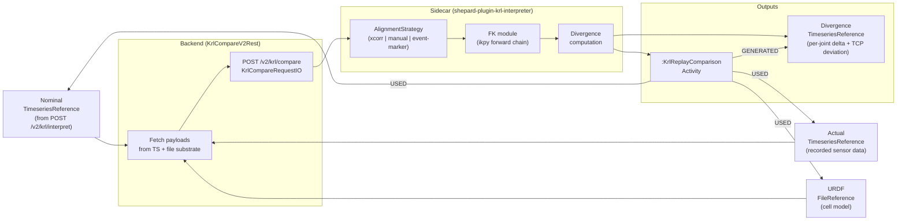

# 118 — KRL nominal vs actual trajectory comparison (KRL-COMPARE-01)

**Audience.** Plugin authors extending `shepard-plugin-krl-interpreter`;
MFFD process engineers who need to verify that the AFP robot actually
followed the planned path; Quality Engineers using Shepard as an audit
substrate for EN 9100 as-built traceability; researchers comparing
offline-resolved motion to real sensor recordings.

**Status.** **fragment** — design pass KRL-COMPARE-01-DESIGN; all
implementation rows (KRL-COMPARE-02 through KRL-COMPARE-09) blocked on
this doc passing persona review.

This doc complements:

- `aidocs/integrations/117-krl-interpreter.md` — the **upstream plugin**
  (KRL-INTERPRETER-05 produces the nominal trajectory this feature
  compares against).
- `aidocs/integrations/113-urdf-viewer.md` — the **viewer** (Trace3D
  dual-trail mode is this feature's primary visualisation consumer).
- `aidocs/data/84-live-digital-twin.md` — the actual timeseries recorded
  during a live robot run is the comparison's input.
- `aidocs/platform/87-timeseries-appid-migration.md` — the 5-tuple →
  appId migration affects how both nominal and actual trajectories are
  addressed by this feature.

---

## 1. Purpose

When a KUKA AFP robot executes a layup program, two trajectories exist:
the **nominal** path (joint angles derived offline by the KRL interpreter
from the `.src` program against the cell URDF) and the **actual** path
(joint positions recorded from the robot's sensor stream during the real
run, stored as a `TimeseriesReference`). These two trajectories should
agree within the robot's positioning repeatability; when they diverge,
something went wrong — a mechanical obstruction, a calibration drift,
a thermal deformation, an operator E-stop and resume, a workpiece
fixture slip.

Today there is no automated way to surface this divergence inside
Shepard. A process engineer who suspects a deviation must export both
trajectories to CSV, load them into Python, write alignment code, compute
residuals, and interpret the result manually — a loop that takes an
experienced engineer 30–60 minutes per run and leaves no traceable record
of whether the run was cleared for quality.

The KRL comparison feature closes this loop. A single `POST
/v2/krl/compare` call aligns the two trajectories, computes per-joint
angular divergence and Cartesian TCP path deviation, writes the
divergence as a new `TimeseriesReference`, records the comparison as a
`:KrlReplayComparison` Activity overlay, and surfaces the result in a
purpose-built UI panel. An IME can then answer "did the robot follow the
planned path?" in under 90 seconds, with a traceable provenance record
linking the outcome back to both input trajectories and the URDF.

This is the tier-1 scope. Multi-robot comparison, DTW (Dynamic Time
Warping), and live-stream comparison are tier-2 (see §2).

---

## 2. Scope

### 2.1 Tier-1 (this doc)

- Single-robot, single-run comparison: one nominal `TimeseriesReference`
  (produced by `POST /v2/krl/interpret`) vs one actual `TimeseriesReference`
  (recorded sensor data).
- Three alignment strategies via the `AlignmentStrategy` SPI (§4):
  xcorr default, manual time-offset, event-marker.
- Forward kinematics (FK) to compute TCP pose from joint angles on both
  sides (§5).
- Divergence metrics: per-joint angular difference + TCP Euclidean path
  deviation, written as a new `TimeseriesReference`.
- `:KrlReplayComparison` Activity overlay in Neo4j (§7).
- REST endpoint `POST /v2/krl/compare` (§6).
- Frontend "Compare with actual" button on the nominal TimeseriesReference
  detail page + result panel (§9).
- Trace3D dual-trail mode: nominal (blue) + actual (red/orange, divergence
  heat-mapped) in the URDF 3D viewer (§9).
- Per-joint ECharts divergence sparkline panel (§9).
- MCP tool `krl_compare` (§10).
- Sidecar `/compare` endpoint extending the existing
  `shepard-plugin-krl-interpreter` container (§8).

### 2.2 Tier-2 (deferred)

| Deferred item | Rationale | SPI hook |
|---|---|---|
| **DTW (Dynamic Time Warping)** | Adds complexity without a clear user need in tier-1. The `AlignmentStrategy` SPI (§4) makes DTW a 1-row addition when needed. | `AlignmentStrategy` impl: `DtwAlignmentStrategy` |
| **Multi-robot / multi-arm comparison** | Requires a session concept spanning multiple TimeseriesReferences. Deferred pending DT1 session design. | Request body: `actualTrajectoryAppIds[]` array |
| **Live-stream comparison** | Real-time divergence alert against a live joint stream. Pairs with DT1 live mode. | `StreamingAlignmentStrategy` SPI variant |
| **DTW-based clustering** (batch quality scoring across a campaign's runs) | Aggregate analysis across many runs. Analytics-TS plugin is the right home. | `shepard-plugin-analytics-ts` |
| **Sparse annotation divergence** (store divergence as `SemanticAnnotation` instead of a dense TS) | Saves storage for low-frequency comparisons; loses query granularity. | Schema-free annotation predicate |

---

## 3. Architecture overview



The sidecar performs the compute-intensive steps (alignment, FK, divergence
calculation). The backend handles appId resolution, timeseries writes,
and Neo4j provenance edges. The frontend consumes the result through the
existing `TimeseriesReference` detail page + the new comparison result
panel.

---

## 4. Alignment strategies

### 4.1 Strategy table

| Strategy | ID constant | Inputs | Algorithm sketch | Use case |
|---|---|---|---|---|
| **xcorr default** | `XCORR` | nominal TS, actual TS | Cross-correlation of the first shared joint channel (joint_0 by convention). Finds the time-shift `τ` that maximises `corr(nominal[t], actual[t+τ])` over a configurable search window (`maxShiftSeconds`, default 10 s). Sub-sample interpolation for sub-millisecond alignment. | Default for most runs. Works when the robot starts and stops at similar positions. |
| **manual scrubber** | `MANUAL` | nominal TS, actual TS, `offsetSeconds` param | Applies a fixed user-specified time offset. The frontend exposes a scrubber slider to preview the alignment before committing. | When xcorr gives a false peak (e.g. the robot repeated a sub-motion multiple times). |
| **event-marker** | `EVENT_MARKER` | nominal TS, actual TS, `syncPointAnnotationAppId?` (optional) | Looks up a `urn:shepard:krl:sync-point` semantic annotation on both the nominal and actual TimeseriesReferences. The annotation's `value` is the wall-clock timestamp of a known event (e.g. toolpath start, E-stop, PLC trigger). Aligns by anchoring those two timestamps. If `syncPointAnnotationAppId` is supplied, uses that annotation directly; otherwise searches both TSes for their respective sync-point annotations. | Highest accuracy when a hardware sync signal (PLC trigger, barcode scan) was recorded in both streams. |

### 4.2 `AlignmentStrategy` SPI interface

```java
// plugins/krl-interpreter/src/main/java/de/dlr/shepard/v2/krl/compare/AlignmentStrategy.java
package de.dlr.shepard.v2.krl.compare;

import de.dlr.shepard.v2.timeseries.io.TimeseriesWindowIO;

/**
 * SPI for time-alignment of a nominal and actual joint trajectory.
 *
 * Implementations receive sampled joint-angle arrays (same joint order,
 * possibly different time grids) and return a single scalar time offset
 * in seconds. The caller applies the offset by shifting the actual
 * trajectory before computing divergence.
 */
public interface AlignmentStrategy {

    /** Stable identifier used in {@code KrlCompareRequestIO.alignmentStrategy}. */
    String id();

    /**
     * Compute the time offset τ (seconds) to add to nominal timestamps so that
     * nominal[t] aligns with actual[t + τ].
     *
     * @param nominal sampled joint angles for the nominal trajectory (time × joints)
     * @param actual  sampled joint angles for the actual trajectory (time × joints)
     * @param params  strategy-specific parameters from the request body
     * @return alignment result (offset + diagnostics)
     */
    AlignmentResult align(TrajectoryWindow nominal, TrajectoryWindow actual,
                          AlignmentParams params);
}
```

```java
public record AlignmentResult(
    double offsetSeconds,           // positive = shift actual forward in time
    double alignmentQuality,        // strategy-dependent [0,1]; 1 = perfect correlation
    String strategyId,
    String diagnosticMessage        // human-readable; surface in UI
) {}
```

DTW fits here as a fourth `AlignmentStrategy` implementation without any
API surface changes — it is a 1-class addition when tier-2 need arises.

---

## 5. Forward kinematics module (KRL-COMPARE-03-FK)

### 5.1 Purpose

Both the nominal and actual trajectories are joint-angle time series.
To compute **TCP path deviation** (the Euclidean distance between where
the tool-centre point was planned to be vs where it actually was), we
need to forward-kinematically project each joint-angle snapshot into a
Cartesian TCP pose `{x, y, z, roll, pitch, yaw}`.

### 5.2 Location

The FK module lives inside the existing
`shepard-plugin-krl-interpreter` sidecar Python package:

```
plugins/krl-interpreter/krl_interpreter/fk/
    __init__.py
    fk_chain.py      # Chain wrapper around ikpy FK path
    pose_types.py    # TcpPose(x, y, z, roll, pitch, yaw) dataclass
```

It is a sibling to `krl_interpreter/ik/` (which houses the IK back-solver
already used by `POST /interpret`). Both share the same URDF chain object,
so URDF loading (the expensive step) is done once per sidecar request.

### 5.3 ikpy FK path

`ikpy` exposes FK as `chain.forward_kinematics(joints)` → a 4×4
homogeneous transformation matrix. The FK module wraps this:

```python
# krl_interpreter/fk/fk_chain.py
from ikpy.chain import Chain
import numpy as np
from .pose_types import TcpPose

class FkChain:
    def __init__(self, urdf_content: bytes, base_elements: list[str] | None = None):
        # Build ikpy Chain from URDF bytes (same as IK solver)
        self._chain = Chain.from_urdf_string(
            urdf_content.decode(),
            base_elements=base_elements,
        )

    def tcp_pose(self, joint_angles: list[float]) -> TcpPose:
        """
        Forward-kinematic projection of joint_angles to TCP pose.
        joint_angles: list of floats in radians, length = chain.active_joints.
        Returns TcpPose in metres + radians.
        """
        T = self._chain.forward_kinematics(joint_angles)
        # Extract translation
        x, y, z = T[:3, 3]
        # Extract ZYX Euler angles (roll=Rx, pitch=Ry, yaw=Rz)
        roll  = np.arctan2( T[2, 1],  T[2, 2])
        pitch = np.arctan2(-T[2, 0],  np.sqrt(T[2,1]**2 + T[2,2]**2))
        yaw   = np.arctan2( T[1, 0],  T[0, 0])
        return TcpPose(x=x, y=y, z=z, roll=roll, pitch=pitch, yaw=yaw)
```

### 5.4 Input / output types

```python
# krl_interpreter/fk/pose_types.py
from dataclasses import dataclass

@dataclass
class TcpPose:
    x:     float  # metres
    y:     float  # metres
    z:     float  # metres
    roll:  float  # radians (ZYX Euler Rx)
    pitch: float  # radians (ZYX Euler Ry)
    yaw:   float  # radians (ZYX Euler Rz)

    def distance_to(self, other: "TcpPose") -> float:
        """Euclidean distance in metres (position only)."""
        return ((self.x-other.x)**2 + (self.y-other.y)**2 + (self.z-other.z)**2)**0.5
```

### 5.5 IK residual check

The FK module also serves as a validation path: after the IK solver
produces a joint-angle vector for a Cartesian target, calling
`fk_chain.tcp_pose(solved_angles)` and comparing to the original target
gives the **IK residual**. The `POST /compare` sidecar response reports
`ikResidualNominalMax` and `ikResidualActualMax` (§8) to satisfy the EN
9100 auditor's convergence question.

---

## 6. REST API

### 6.1 Endpoint

```
POST /v2/krl/compare
@RolesAllowed("user")
Content-Type: application/json
```

The caller must have **Read** permission on the collection containing
`nominalTrajectoryAppId` and `actualTrajectoryAppId`, and **Write**
permission on `outputContainerAppId` (or the collection if
`outputContainerAppId` is absent).

### 6.2 Request shape (`KrlCompareRequestIO`)

| Field | Type | Required | Description |
|---|---|---|---|
| `nominalTrajectoryAppId` | `string (UUID v7)` | yes | appId of the nominal `TimeseriesReference` produced by `POST /v2/krl/interpret` |
| `actualTrajectoryAppId` | `string (UUID v7)` | yes | appId of the actual (measured) `TimeseriesReference` |
| `urdfFileAppId` | `string (UUID v7)` | yes | appId of the URDF `FileReference` used for FK computation |
| `alignmentStrategy` | `"XCORR" \| "MANUAL" \| "EVENT_MARKER"` | no | Default: `"XCORR"` |
| `alignment.offsetSeconds` | `number` | conditional | Required when `alignmentStrategy = "MANUAL"` |
| `alignment.maxShiftSeconds` | `number` | no | xcorr search window (default: `10.0`) |
| `alignment.syncPointAnnotationAppId` | `string (UUID v7)` | no | Optional override for `EVENT_MARKER` strategy; if absent, sidecar searches both TSes for `urn:shepard:krl:sync-point` annotations |
| `outputContainerAppId` | `string (UUID v7)` | no | Container in which to write the divergence `TimeseriesReference`. Defaults to the container of `actualTrajectoryAppId`. |

### 6.3 Response shape (`KrlCompareResponseIO`)

| Field | Type | Description |
|---|---|---|
| `divergenceTrajectoryAppId` | `string (UUID v7)` | appId of the written divergence `TimeseriesReference` |
| `comparisonActivityAppId` | `string (UUID v7)` | appId of the `:KrlReplayComparison` Activity node |
| `alignmentOffsetSeconds` | `number` | Applied time offset |
| `alignmentQuality` | `number [0,1]` | Strategy-reported quality metric |
| `tcpMaxDeviationMm` | `number` | Maximum TCP Euclidean path deviation across the aligned window (mm) |
| `tcpMeanDeviationMm` | `number` | Mean TCP deviation (mm) |
| `jointRmsDeviationDeg` | `number[]` | Per-joint RMS of `nominal[t] - actual[t]` in degrees (same joint order as the URDF chain) |
| `ikResidualNominalMax` | `number` | Max IK residual (m) when FK-projecting the nominal trajectory |
| `ikResidualActualMax` | `number` | Max IK residual (m) when FK-projecting the actual trajectory |
| `alignedWindowStartMs` | `long` | Start of aligned comparison window (epoch ms) |
| `alignedWindowEndMs` | `long` | End of aligned comparison window (epoch ms) |
| `warnings` | `{message: string, severity: "INFO"\|"WARN"\|"ERROR"}[]` | Sidecar-reported warnings (e.g. short overlap window, high xcorr noise) |

### 6.4 Error codes

| HTTP | Condition |
|---|---|
| `400` | Missing required field; `nominalTrajectoryAppId` does not refer to a KRL-derived trajectory (no `:KrlInterpretActivity` GENERATED edge); URDF has no movable joints |
| `403` | Missing Read permission on nominal or actual TS, or Write permission on output container |
| `409` | Aligned window shorter than `minAlignedWindowSeconds` (default 1 s); raise via request param to override |
| `422` | No `urn:shepard:krl:sync-point` annotation found on either TS when `EVENT_MARKER` strategy is requested; or MANUAL offset places the aligned window entirely outside both series |
| `502` | Sidecar unreachable |
| `504` | Sidecar timeout (raise `shepard.v2.krl-compare.sidecar.timeout-seconds`) |

### 6.5 Response headers

| Header | Value |
|---|---|
| `X-Activity-AppId` | `comparisonActivityAppId` — so the caller can follow the provenance chain immediately |
| `X-Provenance-Mode` | `human \| ai \| collaborative` from `X-AI-Agent` request header |

---

## 7. Activity shape

### 7.1 `:KrlReplayComparison` Neo4j entity

Inherits from `:Activity` (same HMAC chain, same `WAS_ASSOCIATED_WITH`
→ `:User` edge). Additional fields:

| Property | Type | Description |
|---|---|---|
| `appId` | UUID v7 | Stable ID (`HasAppId`) |
| `startedAt` | datetime | Comparison start |
| `endedAt` | datetime | Comparison end |
| `alignmentStrategyKind` | `"XCORR" \| "MANUAL" \| "EVENT_MARKER"` | Strategy used |
| `alignmentOffsetSeconds` | float | Applied offset |
| `alignmentQuality` | float [0,1] | Strategy quality metric |
| `nominalTrajectoryAppId` | UUID v7 | Denormalized for fast Cypher filtering |
| `actualTrajectoryAppId` | UUID v7 | Denormalized |
| `urdfFileAppId` | UUID v7 | Denormalized |
| `ikResidualNominalMax` | float | metres |
| `ikResidualActualMax` | float | metres |
| `tcpMaxDeviationMm` | float | mm |
| `tcpMeanDeviationMm` | float | mm |
| `jointRmsDeviationDeg` | float[] | deg, per-joint array |
| `alignedWindowStartMs` | long | epoch ms |
| `alignedWindowEndMs` | long | epoch ms |
| `syncPointAnnotationAppId` | UUID v7 (nullable) | Set when `EVENT_MARKER` strategy used |
| `sourceMode` | `"human" \| "ai" \| "collaborative"` | From `X-AI-Agent` header |
| `agentId` | string (nullable) | From `X-AI-Agent` header |
| `warningCount` | int | Count of sidecar warnings |

### 7.2 PROV-O edges

```cypher
(:KrlReplayComparison) -[:USED]->  (:TimeseriesReference {appId: nominalTrajectoryAppId})
(:KrlReplayComparison) -[:USED]->  (:TimeseriesReference {appId: actualTrajectoryAppId})
(:KrlReplayComparison) -[:USED]->  (:FileReference       {appId: urdfFileAppId})
(:KrlReplayComparison) -[:WAS_ASSOCIATED_WITH]-> (:User)
(:KrlReplayComparison) -[:GENERATED]-> (:TimeseriesReference {appId: divergenceTrajectoryAppId})
```

The divergence `TimeseriesReference` also carries a semantic annotation:
`urn:shepard:krl:comparison-source = comparisonActivityAppId` so it is
discoverable as a divergence output rather than a raw trajectory.

### 7.3 Handler handoff

Per the `handler-records-own-Activity` CLAUDE.md rule: the
`KrlCompareV2Rest` resource calls `ProvenanceService.record(...)` to
write the `:KrlReplayComparison` node, then immediately sets
`requestContext.setProperty(PROP_SKIP_CAPTURE, true)` to suppress the
`ProvenanceCaptureFilter`'s generic capture. One Activity per
comparison, with the richest available shape.

---

## 8. Sidecar extension

### 8.1 Extending vs separate container

The comparison feature **extends the existing
`shepard-plugin-krl-interpreter` sidecar** by adding a `/compare`
endpoint. Rationale:

1. Both `POST /interpret` and `POST /compare` share the URDF chain
   loading logic and the `FkChain` module (§5). A separate container
   would duplicate this.
2. The sidecar image stays small (`python:3.12-slim` + existing deps +
   no new dependencies for the comparison path).
3. Operators add no extra compose service; the single
   `krl-interpreter` container handles both operations.

### 8.2 `/compare` endpoint

```
POST /compare
Body: KrlCompareSidecarRequest
200: KrlCompareSidecarResponse
```

### 8.3 Pydantic request model

```python
# krl_interpreter/sidecar/schemas.py (additions)
from pydantic import BaseModel
from typing import Literal, Optional
from enum import Enum

class AlignmentStrategyKind(str, Enum):
    XCORR = "XCORR"
    MANUAL = "MANUAL"
    EVENT_MARKER = "EVENT_MARKER"

class AlignmentParamsModel(BaseModel):
    offsetSeconds: Optional[float] = None          # MANUAL strategy
    maxShiftSeconds: float = 10.0                  # XCORR search window
    syncPointAnnotationAppId: Optional[str] = None # EVENT_MARKER override

class KrlCompareSidecarRequest(BaseModel):
    # Payload arrays — backend fetches TS data and passes arrays here.
    # Each array has shape (N_time, N_joints); timestamps are parallel arrays.
    nominalTimestampsMs: list[int]              # epoch ms, length N_nominal
    nominalJointAnglesRad: list[list[float]]    # N_nominal × N_joints
    actualTimestampsMs: list[int]               # epoch ms, length N_actual
    actualJointAnglesRad: list[list[float]]     # N_actual × N_joints
    urdfContent: str                            # URDF XML, base64-encoded
    alignmentStrategy: AlignmentStrategyKind = AlignmentStrategyKind.XCORR
    alignment: AlignmentParamsModel = AlignmentParamsModel()
    # Sync-point timestamp pair for EVENT_MARKER (if annotation resolved by backend)
    nominalSyncPointMs: Optional[int] = None
    actualSyncPointMs: Optional[int] = None
```

### 8.4 Pydantic response model

```python
class JointDivergenceChannel(BaseModel):
    jointIndex: int
    jointName: str                   # from URDF
    timestampsMs: list[int]          # aligned window timestamps
    divergenceDeg: list[float]       # nominal[t] - actual[t] in degrees
    rmsDeviationDeg: float

class TcpDeviationChannel(BaseModel):
    timestampsMs: list[int]
    deviationMm: list[float]         # Euclidean TCP distance at each timestamp
    maxDeviationMm: float
    meanDeviationMm: float

class KrlCompareSidecarResponse(BaseModel):
    alignmentOffsetSeconds: float
    alignmentQuality: float
    alignedWindowStartMs: int
    alignedWindowEndMs: int
    jointDivergence: list[JointDivergenceChannel]
    tcpDeviation: TcpDeviationChannel
    ikResidualNominalMax: float      # metres
    ikResidualActualMax: float       # metres
    warnings: list[dict]             # {message, severity}
```

### 8.5 Data flow in sidecar

```
/compare request received
  → deserialise request
  → load FkChain from urdfContent
  → AlignmentStrategy.align(nominal_joints, actual_joints, params)
      → returns alignmentOffsetSeconds
  → apply offset: shift actual timestamps by -alignmentOffsetSeconds
  → resample both to a common time grid (linear interpolation, step = min(nominal_dt, actual_dt))
  → for each timestep t in aligned window:
      nominal_tcp = fk_chain.tcp_pose(nominal_joints[t])
      actual_tcp  = fk_chain.tcp_pose(actual_joints[t])
      tcp_deviation_mm[t] = nominal_tcp.distance_to(actual_tcp) * 1000
      for j in joints:
          joint_divergence_deg[j][t] = degrees(nominal_joints[t][j] - actual_joints[t][j])
  → compute per-joint RMS
  → compute IK residuals (optional: FK → back-project to verify chain accuracy)
  → assemble KrlCompareSidecarResponse
```

---

## 9. Frontend UI

### 9.1 "Compare with actual" button

On `frontend/pages/.../timeseries-references/[refAppId]/index.vue`
(the TimeseriesReference detail page), when the reference carries a
`urn:shepard:krl:interpreter-source` semantic annotation (written by
`POST /v2/krl/interpret`), a new action button **"Compare with actual"**
appears alongside the existing Edit and Delete buttons.

```html
<v-btn
  color="secondary"
  prepend-icon="mdi-compare-horizontal"
  :disabled="!hasNominalAnnotation"
  @click="openCompareDialog"
>
  Compare with actual
</v-btn>
```

### 9.2 Compare dialog

A `<v-dialog max-width="640">` with:

1. **Actual trajectory picker** — `<v-autocomplete>` scoped to
   `TimeseriesReference`s in the same DataObject / collection,
   excluding references that already have `urn:shepard:krl:comparison-source`
   (they are already divergence outputs). Pre-filtered to TSes with the
   same joint count as the nominal.
2. **URDF picker** — `<v-autocomplete>` pre-filled with the URDF used
   during `POST /v2/krl/interpret` (read from the
   `[:KrlInterpretActivity]-[:USED]->(:FileReference)` edge). Editable
   to allow comparison against a different URDF version.
3. **Alignment strategy selector** — `<v-select>` with options:
   - `XCORR — Auto-align (default)`
   - `MANUAL — Fixed time offset`
   - `EVENT_MARKER — Sync-point annotation`
4. **Alignment params** (conditionally shown):
   - `MANUAL`: a `<v-slider>` for `offsetSeconds` (range: −60 s to +60 s,
     step 0.01 s) with a live preview updating the alignment quality
     estimate. Preview calls a `POST /v2/krl/compare?dryRun=true` (see §6
     open question — alternative: compute alignment quality client-side
     from the xcorr once the TS data is loaded).
   - `EVENT_MARKER`: a read-only display of the discovered sync-point
     annotations with timestamps.
5. **"Compare" button** → `POST /v2/krl/compare` → loading state with
   `<v-progress-linear indeterminate>`.

### 9.3 Result panel

On success, the dialog transitions to a result panel showing:

- **IK convergence badge** — green/yellow/red based on max residual
  (`< 0.5 mm` = green, `< 2 mm` = yellow, `>= 2 mm` = red).
- **Alignment summary** — strategy used, offset applied, quality metric,
  aligned window duration.
- **Max TCP deviation** — displayed prominently in mm with a colour
  threshold (configurable in `:KrlCompareConfig`, defaults: `< 2 mm`
  = green, `< 5 mm` = yellow, `>= 5 mm` = red).
- **Per-joint RMS table** — one row per joint, columns: joint name,
  RMS deviation (deg), max deviation (deg).
- **Deep-link buttons**:
  - "Open divergence TS" → divergence `TimeseriesReference` detail page.
  - "Open URDF viewer (dual-trail)" → URDF viewer with both nominal and
    actual pre-bound (§9.4).
  - "View provenance" → `:KrlReplayComparison` Activity node in the
    provenance panel.

### 9.4 Trace3D dual-trail mode

The URDF 3D viewer (`aidocs/integrations/113-urdf-viewer.md`) receives a
new query parameter: `?nominalTsAppId=<uuid>&actualTsAppId=<uuid>`. When
both are present, Trace3D renders two simultaneous TCP trails:

- **Nominal**: blue, fully opaque, 3 px wide.
- **Actual**: colour-mapped by divergence magnitude at each timestamp
  (green → yellow → red), 3 px wide.

The divergence colour mapping reads from the divergence
`TimeseriesReference` (the `tcp_deviation_mm` channel): at each
timestamp, the actual TCP position is rendered with a colour derived from
`tcp_deviation_mm[t]` interpolated through the configured thresholds.

This is a Trace3D extension; it does not require changes to the URDF
viewer's core rendering pipeline — only the trail-data binding.

### 9.5 Per-joint ECharts panel

Below the Trace3D viewer (or as a separate tab), a grid of sparkline
charts — one per joint — shows `joint_divergence_deg[j][t]` over the
aligned window. Each chart:

- X-axis: time (relative seconds from alignment start).
- Y-axis: divergence in degrees.
- A horizontal reference line at ±0 (nominal).
- A configurable threshold band (default ±0.5°; configurable in
  `:KrlCompareConfig`) shaded in light green.
- Points outside the threshold band coloured orange/red.

Vuetify component: `<v-row>` + `<v-col cols="6">` per joint (3 columns
for a 6-DOF robot), each containing an ECharts `<line>` chart (the same
ECharts integration used in the existing timeseries chart panels).

### 9.6 UI stub policy

If KRL-COMPARE-06-UI ships before the final UI lands, the placeholder
kit (`PlaceholderPageHeader` + `PlaceholderRestDump`) is the floor per
the "ship a UI stub for every backend feature" CLAUDE.md rule. The
compare button itself (§9.1) is the minimum stub — even if the dialog
and result panel are placeholders.

---

## 10. MCP tool

### 10.1 Tool spec: `krl_compare`

```
krl_compare(
    nominalAppId:  string,   # appId of nominal TimeseriesReference
    actualAppId:   string,   # appId of actual TimeseriesReference
    urdfAppId:     string,   # appId of URDF FileReference
    strategy?:     "XCORR" | "MANUAL" | "EVENT_MARKER",  # default: "XCORR"
    offsetSeconds?: number,  # required when strategy = "MANUAL"
    syncPointAnnotationAppId?: string   # optional, EVENT_MARKER
) → {
    divergenceTrajectoryAppId: string,
    comparisonActivityAppId: string,
    tcpMaxDeviationMm: number,
    tcpMeanDeviationMm: number,
    jointRmsDeviationDeg: number[],
    alignmentOffsetSeconds: number,
    alignmentQuality: number,
    warnings: {message: string, severity: string}[]
}
```

The tool wraps `POST /v2/krl/compare` verbatim. A Claude agent can use
it to answer "did the AFP robot follow the planned path on run X?" in a
single tool call, then follow up with `get_timeseries_data` on
`divergenceTrajectoryAppId` for per-joint details.

### 10.2 Companion MCP tools (landing with KRL-COMPARE-08)

- **`krl_list_comparisons`** — lists all `:KrlReplayComparison` Activity
  nodes for a given `nominalTrajectoryAppId` (most recent first). Lets an
  agent discover whether a run has already been compared and retrieve the
  divergence TS appId without re-running.
- **`krl_get_comparison_stats`** — returns the Activity fields for a given
  `comparisonActivityAppId` (IK residuals, max TCP deviation, per-joint
  RMS) as a structured payload. Avoids a raw graph query for agents that
  only need the summary stats.

---

## 11. Implementation phasing

| Row ID | Description | Size | Blocking relationship | Notes |
|---|---|---|---|---|
| **KRL-COMPARE-01-DESIGN** | Write this design doc. | S | Gate for all KRL-COMPARE-* | This doc. Flip to `done` on PR merge. |
| **KRL-COMPARE-02-FK** | Implement `krl_interpreter/fk/fk_chain.py` + `pose_types.py` inside the existing sidecar. Unit tests on a KR210 URDF fixture: FK(IK(pose)) ≈ pose within 0.1 mm for 1 000 random poses. | S | Blocked on KRL-INTERPRETER-03-IK (URDF chain must be available). Can be co-developed. | Ships as part of the existing krl-interpreter sidecar image. No new container. |
| **KRL-COMPARE-03-ALIGN** | Implement the three `AlignmentStrategy` impls (`XcorrAlignmentStrategy`, `ManualAlignmentStrategy`, `EventMarkerAlignmentStrategy`) in Python. Unit tests: synthetic data with known offsets; verify xcorr recovers exact offset within 1 sample. | M | Blocked on KRL-COMPARE-02-FK (FK needed for alignment quality validation). | AlignmentStrategy SPI Java interface lands here alongside backend wiring in KRL-COMPARE-05. |
| **KRL-COMPARE-04-SIDECAR** | Add `POST /compare` to the existing sidecar FastAPI app. Integration test: call `/compare` with a pair of synthetic joint arrays; verify response shape. | S | Blocked on KRL-COMPARE-03-ALIGN. | Extends `POST /interpret` sidecar — same compose service. |
| **KRL-COMPARE-05-REST** | `POST /v2/krl/compare` backend resource. Fetches TS data from TimescaleDB and URDF payload, calls sidecar, writes divergence TS + `:KrlReplayComparison` Activity. | M | Blocked on KRL-COMPARE-04-SIDECAR + KRL-INTERPRETER-05-REST (timeseries write path established). | `@RolesAllowed("user")`. Handler records own Activity + PROP_SKIP_CAPTURE. |
| **KRL-COMPARE-06-UI** | "Compare with actual" button + compare dialog + result panel on the nominal TimeseriesReference detail page. | M | Blocked on KRL-COMPARE-05-REST. | UI stub (§9.6) acceptable if the full dialog misses the same PR as -05. |
| **KRL-COMPARE-07-TRACE3D** | Dual-trail Trace3D extension in the URDF viewer: `?nominalTsAppId&actualTsAppId` → blue nominal + divergence-heat-mapped actual. | M | Blocked on KRL-COMPARE-06-UI + URDF-WEBVIEW-1 Trace3D phase landing. | Trace3D trail rendering is already in-tree; this adds the colour-mapping layer. |
| **KRL-COMPARE-08-MCP** | `krl_compare`, `krl_list_comparisons`, `krl_get_comparison_stats` MCP tools. | S | Blocked on KRL-COMPARE-05-REST. | Can land in the same PR as -05. |
| **KRL-COMPARE-09-DOCS** | Plugin docs trio: `plugins/krl-interpreter/docs/reference.md` (add comparison section), quickstart (add "compare a run" task), install (add `:KrlCompareConfig` fields). | S | Lands with KRL-COMPARE-05 or KRL-COMPARE-06; CLAUDE.md rule forbids splitting feature + docs. | Additive to the docs shipped by KRL-INTERPRETER-08-DOCS. |

Total estimated effort across the 9 rows: **L** (Large). KRL-COMPARE-01
(this design, S) is the gate; implementation rows -02 through -09 can
proceed in parallel after -01 merges.

---

## 12. Open questions

| Question | Current default | Deferred to |
|---|---|---|
| **Auto-select actual TS** — when only one measured `TimeseriesReference` exists in the parent DataObject alongside the nominal, should the compare dialog pre-select it? | Yes, pre-select if exactly one candidate. Show a warning if multiple candidates exist (user must choose). | KRL-COMPARE-06-UI detail design |
| **Sparse annotation vs dense TS for divergence** — should divergence be stored as per-joint `SemanticAnnotation` nodes (e.g. `urn:shepard:krl:tcp-deviation-mm = 3.2`) instead of a dense divergence TS? | Dense TS is the tier-1 choice (preserves time resolution; queryable by existing TS tooling). Sparse annotation is a tier-2 option for high-frequency campaigns where storage matters. | KRL-COMPARE-05-REST when storage cost is first measured in production |
| **`dryRun` parameter** — should `POST /v2/krl/compare` accept `?dryRun=true` to compute alignment and return stats without writing any TS or Activity? | Not in tier-1. The scrubber preview (§9.2 MANUAL strategy) can call the sidecar directly or estimate alignment client-side from pre-loaded TS data. | KRL-COMPARE-05-REST or KRL-COMPARE-06-UI |
| **Joint-order agreement** — nominal TS channels are annotated with `urn:shepard:urdf:joint:joint_<n>` (from KRL-INTERPRETER-05). Actual TS channels may have arbitrary channel names. How does the sidecar match joint indices between the two TSes? | Backend resolves joint-order from the `urn:shepard:urdf:joint:joint_<n>` annotations on the nominal TS and uses the URDF joint list to order both sides. If the actual TS has no joint annotations, the comparison returns a 400 with a clear message. | KRL-COMPARE-05-REST |
| **Configurable divergence thresholds** — the green/yellow/red TCP deviation thresholds (§9.3) are default-seeded by the backend but should be operator-configurable at runtime. | `:KrlCompareConfig` Neo4j singleton + `GET/PATCH /v2/admin/krl-compare/config`. Fields: `tcpDeviationYellowMm` (default 2.0), `tcpDeviationRedMm` (default 5.0), `jointDeviationThresholdDeg` (default 0.5). | KRL-COMPARE-05-REST (config singleton must exist when the endpoint ships) |
| **Multi-run batch comparison** (compare all runs in a DataObject against their respective nominals) | Out of scope for tier-1. A future `POST /v2/krl/compare-batch` or an `analytics-ts` plugin job. | Tier-2, separate backlog row |

---

## 13. Persona-board review notes

### 13.1 IME + AQE lens (Role 4)

The value proposition for an EN 9100 auditor: after a layup run,
`POST /v2/krl/compare` produces a `:KrlReplayComparison` Activity that
links the nominal program, the actual sensor recording, and the URDF
in a single queryable node. The `tcpMaxDeviationMm` and
`jointRmsDeviationDeg[]` fields answer the auditor's question "was the
robot within tolerance?" without any offline analysis. **But:** the
comparison is still limited by the quality of the actual TS (sensor
accuracy, sampling rate, clock drift). The `alignmentQuality` metric
surfaces clock-alignment confidence; an auditor who sees a low
`alignmentQuality` score (< 0.7) should treat the divergence metric as
indicative rather than definitive. The UI must label this (§9.3 result
panel) — "Alignment quality: 0.62 (low — verify sync-point annotations)".
Filing **KRL-COMPARE-ALIGNMENT-LABEL** as a sub-row.

### 13.2 Digital Native Researcher lens (Role 10)

The 5-line Python workflow:

```python
import requests
r = requests.post(
    "https://shepard.nuclide.systems/v2/krl/compare",
    headers={"Authorization": f"Bearer {TOKEN}"},
    json={
        "nominalTrajectoryAppId": NOMINAL_APP_ID,
        "actualTrajectoryAppId": ACTUAL_APP_ID,
        "urdfFileAppId": URDF_APP_ID,
    },
)
print(r.json()["tcpMaxDeviationMm"])  # e.g. 1.83 mm — within tolerance
```

Clean. The `alignmentStrategy` defaults to `XCORR` so no extra params
needed for the common case. Friction score: **1/5**.

### 13.3 Reluctant Senior Researcher lens (Role 9)

The senior researcher's conversion moment: "this gives me a single number
— 1.83 mm max TCP deviation — and a traceable provenance record linking
it to the specific program, the specific run, and the specific URDF. My
Python script gives me the number but loses the link. That's the difference."

The concern: "what if the alignment is wrong and I don't notice?" The
`alignmentQuality` field (§6.3) and the scrubber preview (§9.2 MANUAL
strategy) address this. The design must surface a visible warning in the
UI when `alignmentQuality < 0.7` (see §13.1 sub-row). Without that
warning, the senior will distrust the result after one bad alignment.

---

## 14. Cross-references

- **KRL-INTERPRETER-05** (`aidocs/integrations/117-krl-interpreter.md §7`)
  — produces the nominal `TimeseriesReference` that this feature compares
  against. KRL-COMPARE-02 (FK module) can be co-developed with
  KRL-INTERPRETER-03 (IK solver) since they share the URDF chain.
- **URDF-WEBVIEW-1** (`aidocs/integrations/113-urdf-viewer.md`) — Trace3D
  dual-trail extension (§9.4) requires the viewer to accept two TS appIds.
- **TS-CORE-SCHEMA-01** (`aidocs/platform/87-timeseries-appid-migration.md`)
  — the 5-tuple → appId migration affects how both nominal and actual TSes
  are addressed. The comparison feature should be designed against the
  post-migration appId shape (single `TimeseriesReference` appId as the
  addressing handle) to avoid being blocked on the migration.
- **DT1** (`aidocs/data/84-live-digital-twin.md`) — the actual TS fed to
  this comparison is one of DT1's recorded streams. When DT1 live mode
  ships, the comparison could run continuously against a sliding window —
  that is the tier-2 live-stream scenario.
- **Annotation preselection** (`feedback_annotation_preselection_principle.md`)
  — the `urn:shepard:krl:sync-point` and `urn:shepard:krl:comparison-source`
  predicates follow the preselection convention.
- **`aidocs/strategy/85-github-project-management-policies.md`** — branch
  `krl-compare-01-design`, commit scope `KRL-COMPARE-01-DESIGN`.
