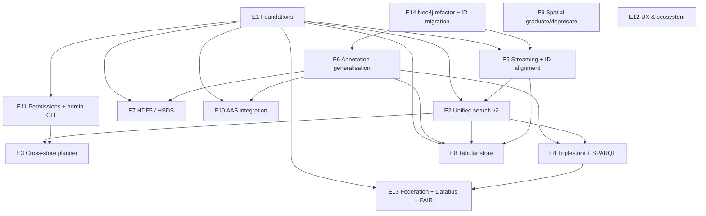

# Epic Roadmap — shepard

Snapshot date: 2026-05-05.
Audience: maintainers planning the next 6–18 months of work.
Companion to `aidocs/platform/11-implementation-plan.md` (phased delivery) and
`aidocs/16-dispatcher-backlog.md` (live small-item dispatcher
backlog). This document sits one level above both: it describes the
multi-week capability slices that the dispatcher backlog rolls up
into.

---

## 1. What "epic" means here

An **epic** is a multi-week slice that delivers a user-perceptible
capability, possibly spanning backend + frontend + clients + docs.
It is larger than a dispatcher item (`aidocs/16`) and smaller than a
phase container (`aidocs/11`); a size-M epic fits one 6-week round,
L/XL epics are subdivided in §2.

---

## 2. The epic catalogue

Backlog IDs in the **Maps to** column refer to `aidocs/16-dispatcher-backlog.md`:
A-prefix = architecture, P = performance, L = leverage / UX, R = research /
ecosystem, S = security, X = cross-cutting. Epic IDs (E1, E2, …) are
introduced here.

Each epic carries a T-shirt size (M = ≤ 6 weeks · 1 dev, L = 6–12 weeks
· 1 dev or 6 weeks · 2, XL = 12+ weeks; XXL items have been
subdivided). Dependencies are by epic ID.

---

### E1. Foundations: auth/role hardening, observability, API versioning, pagination

**Goal.** Every endpoint has a documented permission contract, a
stable identifier, a paginated/streamable response shape, and an
observable failure mode.

**Scope.**
- Permissions hardening (Cluster F in `aidocs/02`): C3 fallback
  closure plus the startup audit that fails deploy if any
  `BasicEntity` lacks a `has_permissions` edge (`aidocs/11:55-66`).
- Observability: structured logs, request IDs, Prometheus
  histograms, runtime health per DB — picks up `input_raw.md:1399-1440`.
- API versioning (`/shepard/api/v2` gateway) with a deprecation
  banner on `/shepard/api/*`; anchors `aidocs/12` §11.B.3 and
  `aidocs/13:436-449`.
- Cursor pagination rolled to every list endpoint > 100 rows;
  offset kept two minor releases (`aidocs/13:281-298`).
- Streaming JSON envelopes (`StreamingOutput` + Jackson
  `JsonGenerator`) on read endpoints that materialise today
  (`aidocs/12:613-691`).

**Out of scope.**
- The full streaming read path for timeseries (covered by E5).
- Re-architecting the permission model itself (covered by E11).

**Maps to backlog IDs.** A0 (auth/role), A1c, A1d, A1f, A4d
(observability finishing), P4 (API versioning), L6 (pagination
rollout). New: **L9** (deprecation-banner middleware in JWTFilter),
**X5** (request-ID propagation header).

**Estimated size.** L (foundations are wide; multiple sub-strands
landing in parallel).

**Dependencies.** None — this is the substrate.

**Open decisions.**
- API version scheme: `/api/v2` path prefix vs. media-type
  versioning. Path is simpler and matches `input_raw.md:1761-1764`.
- Whether to expose feature-toggle admin endpoint now (A3 in input,
  see `input_raw.md:1519-1523`) or defer to E11.

---

### E2. Unified search v2

**Goal.** One `POST /search/v2` endpoint replaces the five existing
search endpoints. Cursor pagination, fulltext, semantic-annotation
predicates, opt-in `raw.sql` / `raw.sparql` escape hatches.

**Scope.**
- Endpoint shape and predicate JSON per `aidocs/13:114-216`.
- Frontend `useUnifiedSearch` composable replaces three composables.
- Neo4j fulltext indexes (Lucene) for Collection / Container /
  DataObject / Reference / SemanticAnnotation
  (`aidocs/13:230-249`).
- `tsvector` + GIN on Postgres-backed kinds for #763 fulltext
  (`aidocs/13:250-260`).
- Telemetry on legacy endpoints (`POST /search`, `POST /search/collections`,
  …) as gating data for §4 deprecation removal.
- Migration runbook for `frontend/pages/search/index.vue` and
  `frontend/utils/buildSearchQuery.ts`.

**Out of scope.**
- Cross-store planner (E3 carries that).
- SPARQL escape hatch (E4).
- `raw.sql` sandboxing — split out as **E2b** below if scope grows.

**Maps to backlog IDs.** A2a (search unification), A2b (fulltext),
L6 (pagination rolls forward here), R6 (search ergonomics). New:
**E2b** (raw.sql sandbox, separable).

**Estimated size.** L. Splits cleanly into E2 (predicate JSON +
fulltext + cursor) at M and E2b (`raw.sql`) at M if scope hits a
calendar wall.

**Dependencies.** E1 (cursor pagination, API versioning), E5
(identifier alignment is a hard prerequisite for cross-kind result
rows that point at timeseries — `aidocs/13:217-228`).

**Open decisions.**
- Permission semantics on `raw.sql`: row-level security in Postgres
  vs. view layer (`aidocs/13:399-407`, `aidocs/13:455-460`). Affects
  ops complexity meaningfully.
- Whether `estimatedTotal` is best-effort (`count_estimate`) or
  exact. Best-effort recommended (`aidocs/13:154-159`).

---

### E3. Cross-store search planner

**Goal.** A single `where` tree carrying both annotation predicates
and timeseries-payload predicates resolves into a coordinated
Neo4j → Postgres (or Postgres → Neo4j) plan, server-side, with
constant client effort.

**Scope.**
- Tiny query planner (~hundreds of LoC) deciding which side leads
  based on predicate selectivity (`aidocs/13:410-431`).
- Composite cursors that survive both store boundaries.
- Streaming cross-store fan-out via `Result.stream()` + fetch-size
  hints — same shape as `aidocs/12:619-691`.
- Acceptance test: "find Container with annotation X containing a
  timeseries with > 1000 points in the last day" returns results
  in one round trip (`aidocs/13:411-414`).

**Out of scope.**
- Optimiser-level cost model. The planner is rule-based.
- Federated cross-instance search (E13).

**Maps to backlog IDs.** A2c (cross-store search), P2 (batch
permission rollout integrates here so the planner doesn't N+1 on
auth — `input_raw.md:1672-1689`).

**Estimated size.** L.

**Dependencies.** E2 (unified endpoint), E5 (identifier alignment),
E11 (batch permission API).

**Open decisions.** None blocking; cost-model refinement is a
future optimisation.

---

### E4. Triplestore + SPARQL — local then federated

**Goal.** Annotations and ontologies are queryable by SPARQL.
RDFS / OWL inference works ("annotated with `Sensor`" matches
`TemperatureSensor` etc.). Knowledge-graph export becomes a one-liner.

**Scope.**
- Phase D in `aidocs/14:507-518`: n10s plugin on the existing Neo4j;
  expose SPARQL endpoint scoped to the local annotation graph;
  ship one reasoning use case end-to-end.
- Knowledge-graph export endpoint
  `GET /collections/{id}/export?format=turtle`
  (`aidocs/14:476-483`).
- `raw.sparql` operator wired into the unified-search escape hatch
  (`aidocs/13:368-380`). Apache Jena ARQ for parsing.
- Outbox-based sync (`aidocs/14:402-408`) is introduced **only if**
  n10s in-process sync hits limits; otherwise dual-write (option
  1) is fine.

**Out of scope.**
- SHACL validation (queue as **E4b**, after one reasoning use case).
- Replacing n10s with GraphDB / RDF4J — defer until throughput or
  inference profile demands it (`aidocs/14:362-369`).

**Maps to backlog IDs.** R5 (triplestore), R7 (FAIR / KG export).
New: **E4b** (SHACL completeness dashboards — `aidocs/14:485-490`).

**Estimated size.** L.

**Dependencies.** E6 (annotation generalisation — without it, only
graph-entity annotations get into the triplestore, halving the
value), E1 (API versioning, since the new `/v2/sparql` endpoint
goes through the v2 gateway).

**Open decisions.**
- Which ontologies to load by default (`aidocs/14:526-530`). Dublin
  Core + PROV-O are universal; project ontologies are
  per-deployment.
- Reasoning profile per ontology (RL? QL? RDFS+?) — affects query
  cost meaningfully.
- Whether the all-in-one Docker image grows with n10s (it does, but
  modestly; a separate triplestore would grow it materially —
  `aidocs/14:540-543`).

---

### E5. Streaming read path + identifier alignment

**Goal.** A 90-day timeseries export does not allocate the result
set on heap; the numeric `timeseriesId` is the canonical address on
every endpoint.

**Scope.**
- Streaming repository method (`getResultStream()` + fetch size 5000)
  for `TimeseriesDataPointRepository.queryDataPoints`
  (`aidocs/12:617-633`).
- CSV path switched to `StreamingOutput` over the cursor
  (`aidocs/12:640-654`).
- JSON path: stream with Jackson `JsonGenerator` plus a 1 M row hard
  cap returning `413 Payload Too Large` with a `groupBy` hint
  (`aidocs/12:657-665`).
- Multi-series fan-out replaced by single SQL query with
  `timeseries_id IN (?)` (`aidocs/12:667-672`).
- `quarkus.hibernate-orm.jdbc.statement-fetch-size=2000` as backstop
  (`aidocs/12:674-680`).
- Public API: `timeseriesId` query param accepted on `/payload`,
  `/export`, `getMany…`; 5-tuple kept; deprecation banner added
  per the rollout in `aidocs/12:790-806`.
- Client updates: `@dlr-shepard/shepard-client`, Python client,
  `scripts/`.

**Out of scope.**
- Reactive (Mutiny) HTTP pipeline — explicitly deferred per
  `aidocs/12:693-701`.
- Continuous aggregates for time facets (E5b).

**Maps to backlog IDs.** P1 (streaming), P3 (identifier alignment),
A4d (fetch-size + driver settings — see also `aidocs/12:613-691`).
New: **E5b** (continuous aggregates / time facets — bundles with
`aidocs/13:271-281` Phase 3 facets).

**Estimated size.** L.

**Dependencies.** None for the streaming half. Identifier alignment
needs E1's cursor + deprecation infrastructure to land cleanly.

**Open decisions.**
- Telemetry threshold for the 5-tuple removal step (step 5 of
  `aidocs/12:801-806`). Suggest "< 1% of read calls without
  `timeseriesId`" before dropping.

---

### E6. Annotation generalisation across all payload types

**Goal.** Files, structured-data documents, and spatial records can
carry semantic annotations exactly the way timeseries already can.

**Scope.**
- Bridge entities `AnnotatableFile`, `AnnotatableStructuredData`,
  `AnnotatableSpatial` per `aidocs/14:104-148`.
- Generalised abstract `AnnotatablePayload<ID>` parent class so the
  three new bridges share Cypher patterns and service helpers.
- REST surface mirroring `AnnotatableTimeseriesRest`
  (`aidocs/14:149-162`); see existing `backend/src/main/java/de/dlr/shepard/context/semantic/`.
- Identifier discipline: every bridge addressed by numeric id
  (UUID for files), no 5-tuple analogue
  (`aidocs/14:294-314`).
- Permissions inherited from parent container — no new types
  (`aidocs/14:164-174`).
- Label-as-cache refactor (`aidocs/14:228-246`): identity is
  `(propertyIRI, valueIRI)`; labels become a side cache,
  refreshable, multilingual. Coordinates with the search predicate
  shape in `aidocs/13:301-340`.
- Search-as-you-type for terms via a backend `/terms/search` over a
  Neo4j fulltext index of locally cached terms
  (`aidocs/14:248-266`); replaces free-text IRI fields in
  `frontend/components/context/semantic/annotation/AddAnnotationDialog.vue`.

**Out of scope.**
- Triplestore (E4 picks up).
- SHACL completeness dashboards (E4b).
- Bulk-annotate endpoint — note as future work
  (`aidocs/14:181-186`).

**Maps to backlog IDs.** A1b (Annotatable bridges), R4 (term picker
UX). New: **L10** (label-cache refresh job).

**Estimated size.** L. Subdivides into E6a (bridges + REST) at M
and E6b (term-picker UX + label cache) at S–M.

**Dependencies.** Loose dependency on the Neo4j refactor in cluster
E (`aidocs/02:13-14`); the asymmetry in `aidocs/14:21-46` is
independent of #274 in principle, but the refactor's data model
must not contradict the bridge model. Coordinate.

**Open decisions.**
- Multi-tenant ontology scope (`aidocs/14:531-535`).
- Whether to expose "presentation only" mark on `propertyName` /
  `valueName` in OpenAPI (`aidocs/14:537-540`). Recommended yes.

---

### E7. HDF5 / HSDS support as a new payload type

**Goal.** Researchers can store HDF5 files via shepard and access
them through HSDS (Highly Scalable Data Service) endpoints — exposing
HDF5 datasets as REST resources without round-tripping the whole
container.

**Hard constraint (maintainer-confirmed, 2026-05-05).**
**Compatibility with the existing Python ecosystem is mandatory.**
End-users have existing analysis code built on `h5py`, `PyTables`,
and `pandas.read_hdf`; that code must keep working against shepard
without translation layers. Practically this means:

- **`h5pyd` is the canonical access path** (it is the HSDS-specific
  drop-in for `h5py`; the user-facing API surface is identical).
  Any HDF5 surface shepard ships must be reachable via `h5pyd.File(...)`
  with the same group / dataset / attribute / slicing semantics.
- **A "download the whole file" fallback** must keep returning the
  byte-identical HDF5 file so plain `h5py.File(local_path)` keeps
  working when network access to HSDS isn't viable.
- **A custom JSON-over-REST representation** of HDF5 structure
  (without an `h5py(d)`-compatible client wrapper) is **not
  acceptable** — it would force users to migrate their existing code
  and is a non-starter under this constraint.
- This rules out option (a) "HDF5 as opaque payload only" from
  `aidocs/archive/21-user-interest-gauge.md:68-69` as a sufficient answer
  and elevates option (b) "HSDS as a backing store"
  (`aidocs/archive/21-user-interest-gauge.md:71-78`) to the required path.

**Scope.**
- New `HdfContainer` and `HdfReference` types alongside today's
  file / timeseries / structured / spatial. Lives in `data/hdf` per
  the existing module pattern.
- HSDS as an external service the backend brokers — not embedded.
  Container creation provisions an HSDS group; reads proxy through.
  Aligns with `input_raw.md:699` and `input_raw.md:8336-8338`.
- OpenAPI: `GET /hdf-containers/{id}/datasets/{path}/value` etc.,
  shaped to mirror HSDS so `h5pyd` keeps working transparently.
- An `h5pyd`-compatible auth bridge so a user can do
  `h5pyd.File("/<container-id>/...", endpoint=..., api_key=...)`
  using the same shepard API key flow as other clients (see L5).
- A "download original file" endpoint that returns the underlying
  HDF5 bytes for `h5py.File(local_path)` consumers — independent of
  HSDS availability, so users without HSDS connectivity still work.
- Annotation hookup via E6 (`AnnotatableHdfDataset`, dataset path
  is the payload id).
- A small `clients/python` example notebook showing
  `h5pyd.File` + shepard auth side-by-side with the existing client,
  so the compatibility story is demonstrable end-to-end.

**Out of scope.**
- Embedding an `h5pyd`-style query language into the unified search
  (defer; HDF5 datasets are addressed by path, not searched by
  content).
- A bespoke (non-`h5py`-compatible) shepard-flavoured HDF5 client.
- Migration of existing files to HDF5 (none expected).

**Maps to backlog IDs.** A5 (HDF5 / HSDS support — proposed new
backlog series). Likely an **A5a** (read path via HSDS + `h5pyd`
parity test), **A5b** (write path), **A5c** (bulk import),
**A5d** (download-original-file fallback), **A5e** (auth bridge so
shepard API keys work for `h5pyd`).

**Estimated size.** L.

**Dependencies.** E1 (API versioning — HDF endpoints land in v2
only), E6 (annotations ride on the generalised bridge).

**Open decisions.**
- Whether HSDS is mandatory or optional. Given the hard constraint
  above, "no HSDS at all" reduces this epic to the
  download-original-file fallback (A5d) only — which is a useful
  but partial answer. Recommend HSDS is **optional but supported**
  via a feature flag per `infrastructure/.env.example`, like
  `SHEPARD_HDF_HSDS_ENABLED`. Aligns with the build-time / runtime
  toggle question in `input_raw.md:1493-1530`.
- Whether HSDS runs as a sidecar or external dependency. Affects
  the all-in-one Docker image (ADR-003).
- Auth bridge shape (forwarded API key vs. minted HSDS-local token).
  Needs an `h5pyd`-side prototype before the API contract is frozen.

---

### E8. Tabular / relational store as a first-class payload

**Goal.** Tabular data ("a table inside shepard") is a first-class
payload, not a workaround through StructuredData JSON or CSV files.
Resolves the `input_raw.md:701` "Table Store / relational database
in shepard" item.

**Scope.**
- New `TableContainer` + `TableReference` backed by a curated set
  of Postgres tables under a `shepard_tables` schema (one schema
  per container; one Postgres table per dataset).
- CRUD via REST: row-level POST/PATCH/DELETE; bulk import from CSV
  / Parquet.
- Read path uses E5's streaming pattern (cursor by composite PK).
- `raw.sql` access via E2's escape hatch — same hard rails
  (read-only role, statement timeout, row cap, view-scoped).
- Column-level type validation; basic schema migration (add
  column).
- Annotation hookup via E6 (`AnnotatableTable`, addressed by
  `(containerId, tableName, rowId)`).

**Out of scope.**
- Joins across tables in different containers in the v1 API
  surface — defer.
- Index suggestions / cost model.

**Maps to backlog IDs.** A6 (tabular payload — proposed). New
sub-IDs **A6a** (entity + REST), **A6b** (bulk import / export),
**A6c** (raw.sql exposure).

**Estimated size.** XL — must subdivide. Recommended split:
**E8a** (entity + CRUD) at L, **E8b** (bulk import + Parquet) at
M, **E8c** (raw.sql + annotation hookup) at M.

**Dependencies.** E1 (versioning), E5 (streaming pattern), E2/E2b
(`raw.sql` sandbox), E6 (annotations).

**Open decisions.**
- Whether to consolidate the `shepard_tables` schema with
  TimescaleDB's instance (`input_raw.md:1565-1581`) or keep
  separate. Same Postgres-instance question as PostGIS.
- DDL governance — who can create / drop tables, mapped to
  permissions on the parent container.

---

### E9. Spatial finish — graduate or deprecate

**Goal.** Settle the long-running cluster C question (`aidocs/02:11`):
either remove `SHEPARD_SPATIAL_DATA_ENABLED` and ship #441-#447 /
#530 / #557, or formally deprecate.

**Scope (graduate path).**
- C1 SQL injection fix already in Phase 1 of `aidocs/11`.
- Implement #441 / #442 / #443 / #444 / #445 / #446 / #447 / #530 /
  #557 with the spatial integration test suite that's missing today
  (coverage 0.26 — `aidocs/03:14`).
- Remove the feature flag.
- Annotation hookup via E6.
- "Spatial + height" extension hinted at `input_raw.md:8336`.

**Scope (deprecate path).**
- Bulk-close the spatial cluster per `aidocs/archive/09-ready-to-close.md`.
- Remove `data/spatialdata/`, the `SHEPARD_SPATIAL_DATA_ENABLED`
  conditional, the PostGIS service, and ADR-014 / ADR-017
  references.
- Document migration story for any deployments that adopted it.

**Out of scope.**
- HMC2 satellite-data ontology work (E12 / `input_raw.md:8326-8343`)
  — a graduate decision for E9 is its prerequisite, not its
  output.

**Maps to backlog IDs.** A7 (spatial decision). New **A7a**
(graduate) / **A7b** (deprecate) — exactly one materialises.

**Estimated size.** L (graduate) or S (deprecate). Decision is XS
once a maintainer says yes/no.

**Dependencies.** E1 (versioning umbrella).

**Open decisions.**
- **The decision itself.** Per `aidocs/15:80`, the call is pending.
  Graduation is a year of focused work and produces a feature with
  unclear active demand; deprecation is fast and frees mental
  load.

---

### E10. AAS integration — shepard as the storage backend

**Goal.** shepard becomes a registered backend for an AAS (Asset
Administration Shell) registry. Asset metadata lives in the AAS
ecosystem; the actual data sits in shepard.

**Scope.**
- AAS registry adapter: shepard exposes an AASX submodel-like view
  on collections (or a configurable subset).
- Identifier mapping: AAS asset ID ↔ shepard collection / dataobject.
- Read endpoints conforming to the AAS REST API spec for the
  subset we host.
- Per `input_raw.md:712`: "lots to define".

**Out of scope.**
- Becoming an AAS registry (we're a backend, not a registry).
- Bidirectional sync with arbitrary AAS implementations.

**Maps to backlog IDs.** R2 (AAS integration — proposed).

**Estimated size.** L; a research-flavoured discovery sub-task is
recommended first (M) before scoping the implementation.

**Dependencies.** E1 (versioning, since this lives at `/api/v2/aas`),
E6 (annotations are the natural way to attach AAS submodel
metadata).

**Open decisions.**
- Which AAS profile / version (3.0?) to target.
- Whether identifier mapping is mandatory or via a side table.
- Engagement with HMC2 partners (`input_raw.md:8308-8320`) — if AAS
  is on the HMC2 critical path, this epic gets a co-pilot.

---

### E11. Permissions model overhaul + admin tooling

**Goal.** Permissions are easy to reason about, fast to check
in batch, easy to debug, and administered through a CLI rather than
hand-edited Cypher.

**Scope.**
- Batch permission API: `checkPermissionsBatch(List<Long>)` per
  `input_raw.md:1672-1689`. Single Cypher query for N entities.
- Caffeine-backed permission cache replacing the basic in-memory
  Map at `auth/security/PermissionLastSeenCache.java`. LRU + TTL
  per `input_raw.md:1679-1684`.
- Admin CLI (Python, lives in `scripts/shepard_scripts/`): list /
  inspect / grant / revoke / repair-orphans. Anchors `input_raw.md:707`
  and `input_raw.md:8398`.
- Static admin user (DISABLE through env), per
  `input_raw.md:8398`. Documented; rotation procedure required.
- Templates feature (`input_raw.md:713`): apply a defined set of
  permissions / annotations / structure as an idempotent operation
  to a collection or container.
- Tech-debt #1 (entity-creation invariant) and #2 (cryptic OIDC
  subject usernames) closed (`aidocs/02:14`,
  `aidocs/11:127-130`).

**Out of scope.**
- Replacing Neo4j as the permission store (a separate decision —
  see `input_raw.md:1556-1581`).
- Federated permission negotiation (E13).

**Maps to backlog IDs.** A0 (auth/role model), L1 (admin CLI),
L3 (templates), P2 (batch permission), R3 (provenance — partially,
since admin actions feed the audit trail).

**Estimated size.** L.

**Dependencies.** E1 (foundations: structured logs to feed admin
audit, API versioning to expose `/admin/*` cleanly).

**Open decisions.**
- Whether the static admin user is on by default (recommend off).
- Format of the templates DSL — JSON vs. YAML vs. a service-layer
  builder API.

---

### E12. UX & ecosystem: project website, theming, CD-aligned UI

**Goal.** A project website (GitLab/GitHub Pages) and a
DLR-CD-aligned theme on the existing frontend ship together; new
adopters can find shepard, evaluate it against competitors, and
stand it up themselves.

**Scope.**
- Website skeleton (`input_raw.md:8363-8370`): about, core features,
  getting started, admin doc, user doc, FAQ (interactive
  knowledgebase), imprint.
- Comparison page versus Coscine, InvenioRDM, ResearchSpace
  (`input_raw.md:8373-8376`).
- DLR-CD theming: typography, colours, motion-CI primitives — input
  files in `aidocs/input/*.htm` (the CD handbook and the chapter
  HTMLs are already vendored).
- Frontend test foundation (Vitest + Vue Test Utils + first
  Playwright e2e) lands inside this epic if it has not landed in
  Phase 2 (`aidocs/11:111-115`). If it has, this epic just relies
  on it.
- Documentation: REST-API examples (`input_raw.md:8396`),
  improved RO-Crate export selectivity
  (`input_raw.md:8381-8382`).

**Out of scope.**
- Replacing Nuxt / Vuetify. ADR-005 stands.
- Multi-language UI (the theme work is a prerequisite, not a
  blocker).

**Maps to backlog IDs.** R8 (DLR-CD theming), R9 (project website),
L7 (REST-API examples), L8 (RO-Crate export selectivity).

**Estimated size.** L.

**Dependencies.** None blocking (the website can ship without
backend changes); E11's admin-docs interleave naturally.

**Open decisions.**
- Hosting: GitLab Pages (authoritative) vs. GitHub Pages (mirror).
  GitLab is consistent with repo policy.
- Whether the FAQ knowledgebase is a separate static site or
  Discourse-style — affects ops surface.

---

### E13. Federation, Databus, FAIR export, provenance

**Goal.** A shepard instance can publish a collection to a Databus
catalogue, write back the public URI, and answer federated semantic
queries from peer instances.

**Scope.**
- Databus integration prototype (`input_raw.md:721`,
  `input_raw.md:8306`): `POST /collections/{id}/publish/databus`
  produces the JSON-LD form, uploads the package, registers the
  Databus version, writes a `URIReference` back into shepard with
  the public URI (the M8 back-reference in `input_raw.md:1199-1212`,
  scoped to *this* repository's adapter half).
- FAIR / RO-Crate export refinement: selectiveness of payload
  inclusion (`input_raw.md:8381-8382`); RO-Crate metadata via
  NovaCrate or `rocrate` Python lib (`input_raw.md:8389`).
- Provenance via PROV-O triples (`aidocs/14:432-446`); plays into
  E4's triplestore.
- Federation discovery (read-only first): `/.well-known/instance`
  per `input_raw.md:8204-8214`; cross-instance search dispatches
  to peers (poll model first; push model later).
- Federated identity: trust map of OIDC issuers, per-peer
  permission negotiation.

**Out of scope.**
- Fully consistent cross-instance writes / CRDTs
  (`input_raw.md:8278-8284`).
- Dataship sister-repo work (M3-M9 in `input_raw.md:1106-1214`
  target a different codebase).

**Maps to backlog IDs.** R1 (Databus), R3 (provenance), R7 (FAIR
export), and a new **R10** for federation discovery.

**Estimated size.** XL — must subdivide:
- **E13a** Databus integration + URI back-reference (L).
- **E13b** RO-Crate / FAIR refinements (M).
- **E13c** Federated discovery + read-only cross-instance search (L).
- **E13d** Federated identity + permission negotiation (L).

**Dependencies.** E4 (PROV-O lives in the triplestore), E2 (cross-
instance dispatch reuses the unified-search planner shape), E1
(deprecation / versioning, since federation contracts are a new
public surface).

**Open decisions.**
- Push vs. poll for cross-instance update (`input_raw.md:8208-8213`).
- Whether to align with Fediverse / ActivityPub primitives or stay
  REST-only.
- Whether PROV-O is the canonical provenance vocabulary or
  OpenLineage (`input_raw.md:8386`).
- Cross-instance permission semantics — federated SPARQL across
  permission boundaries is the hardest case (`aidocs/14:545-547`).

---

### E14. Neo4j refactor + Neo4j-ID migration

**Goal.** Cluster E (`aidocs/02:13`) ships. The deepest blocker for
D (semantics), parts of A (timeseries long-term), and parts of H
(search) is removed. Neo4j ID generation aligns with the rest of
the codebase.

**Scope.**
- ADR-021 documenting the new entity model
  (`aidocs/11:166-172`).
- Stage 1: new entity classes alongside old.
- Stage 2: read path prefers new model, falls back to old.
- Stage 3: dual-write in writer services.
- Stage 4: cutover; legacy paths removed.
- Stage 5: deprecated MongoDB query cleanup
  (`StructuredDataSearchService.java:87` TODO,
  `aidocs/11:172-173`).
- Neo4j-ID migration (`L2` — `input_raw.md:717`): replace the legacy
  internal-id reliance with the new external id scheme; coordinate
  with E5's identifier alignment so we have one identifier
  conversation, not two.

**Out of scope.**
- Replacing Neo4j with a different graph store.
- Reasoning / triplestore work (E4).

**Maps to backlog IDs.** A1a (Neo4j refactor), L2 (Neo4j-ID
migration). Inside the cluster: #274, #577, #660, #43, #553, #656.

**Estimated size.** XL — keep as a single epic but plan in 5
PR-sized stages per `aidocs/11:166-172`. Each stage is M.

**Dependencies.** None (it's the deepest foundation), but it
**collides** with E6 (annotation generalisation) on the
`Annotatable` model and with E5 on identifier alignment. Sequence:
E14 stage 2 lands before E6 starts; E5's identifier work lands
between E14 stages 3 and 4 to avoid a moving target.

**Open decisions.**
- **Owner.** Per `aidocs/11:174-176`, none assigned. Without
  one, E14 cannot start; this is the single largest scheduling
  question for the next 12 months.
- Backwards compat for older Python clients (closed #664 left
  notes).
- Performance budget vs. current Neo4j patterns — measure first,
  cut later.

---

## 3. Dependency graph

Reading the graph:

- **E1 and E14 are the two roots.** E14 is foundational but
  unowned today; E1 is foundational and ownable now.
- **E5 sits between E14 and E2** because identifier alignment is a
  hard prerequisite for cross-kind search rows
  (`aidocs/13:217-228`).
- **E6 is the hub** for new payload types (E7, E8, E10) — once it
  ships, those three cost less.
- **E4 → E13** is the long arc: triplestore enables PROV-O →
  federation reuses PROV-O.

---

## 4. Two parallel tracks for the next 6 months

The two tracks are designed to run without blocking each other.
Track A is for a backend-leaning team; Track B for a full-stack /
UX-leaning team. Each track has 4 epics in suggested order.

### Track A — Foundations (must-do)

1. **E1 Foundations** — auth/role hardening, observability, API
   versioning, pagination rollout. Three weeks of front-loaded
   substrate work. Drains A0 / A1c-f / P4 / L6 from the dispatcher.
2. **E5 Streaming + identifier alignment** — closes the visible
   "exports are slow / OOM" complaint. P1 + P3 from `aidocs/16`.
3. **E11 Permissions + admin CLI** — permissions epic that has been
   stalled, plus admin tooling that operations has wanted for
   years. A0 / L1 / L3 / P2.
4. **E2 Unified search v2** (predicate JSON + cursor + Neo4j
   fulltext only; defer raw.sql, defer cross-store) — collapses
   the search surface, lands frontend `useUnifiedSearch`. A2a / A2b.

### Track B — Highest perceived user value

1. **E12 UX & ecosystem** — project website, DLR-CD theming,
   REST-API examples, RO-Crate export selectivity. R8 / R9 / L7 /
   L8. Ships independently; recovers visibility.
2. **E6 Annotation generalisation** (E6a + E6b) — the GUI gets a
   term picker, files / structured-data / spatial gain
   annotations. A1b / R4. Loose dependency on E14 — *coordinate*
   the entity model rather than wait.
3. **E9 Spatial graduate/deprecate** — fast win once the
   maintainer makes the call. A7a or A7b.
4. **E4 Triplestore + SPARQL** (only the n10s start; defer SHACL) —
   knowledge-graph export becomes a one-liner; sets the table for
   E13. R5 / R7.

Track A's E2 and Track B's E6 meet at the search-by-annotation
predicate (`aidocs/13:301-340`). That handoff is the only
Track-A ↔ Track-B coordination cost.

Out of scope for the 6-month window: E14 (no owner), E13
(post-triplestore), E7 (post-E1 + research), E8 (XL — slated for
the next round), E10 (HMC2 partner-driven, not unilateral).

---

## 5. Recommended cadence

A "round" is **6 weeks**. Each round commits to one epic per
track plus dispatcher items: week 0 plans (epic pulls 2–6
dispatcher items, residue stays in `aidocs/16`); weeks 1–4
implement (mid-round demo at week 3); week 5 hardens and docs;
week 6 releases and retros. An **epic is done** when (a) its
acceptance scope is merged, (b) touched modules meet the coverage
gate (timeseries, semantic, search are HIGH-risk per
`aidocs/03:11`), (c) OpenAPI plus at least one client reflects
the change, and (d) release notes are written. Telemetry-gated
deprecation steps defer their *sub-epic* closure but don't block
the rest. The dispatcher backlog should not exceed ~30 items; when
it does, the next planning round "epic-ifies" the largest cluster.

---

## 6. Risks at the epic level

1. **E14 is unowned (per `aidocs/11:174-176`).** Every month it
   slips, E6 / E5 / E4 / E13 each accumulate a coordination tax
   (because their entity model assumes a target state of E14
   that drifts). Mitigation: declare an explicit owner *or*
   declare E14 not happening this calendar year and downscope
   E6 / E5 to live with the current Neo4j model. The worst
   outcome is "we'll do E14 someday" without a date.

2. **E14 ↔ E6 ↔ E5 timing.** Migrating Neo4j IDs (E14 / L2)
   concurrently with annotation generalisation (E6) creates a
   moving target on the `Annotatable` interface and on every
   bridge node. Mitigation: lock E14 stage 2 (read-side parity)
   before E6 starts; treat E5's identifier work as a synchronisation
   point between E14 stages 3 and 4.

3. **E2 raw.sql sandboxing** is an attack surface comparable to
   C5 Cypher injection (`aidocs/11:60-64`). Mitigation: gate
   `raw.sql` behind an admin role + curated views; pen-test
   against fixtures *before* exposing publicly; consider
   splitting E2b into its own round so it gets full review
   bandwidth.

4. **E4 inference cost** — OWL DL is not free
   (`aidocs/14:533-536`). A naive load of large ontologies into
   n10s with full reasoning will stall the hot path. Mitigation:
   start with RDFS+ on a small ontology set; measure before
   widening; document the inference profile per ontology.

5. **E13 federation introduces cross-instance permission
   semantics** that we don't have a model for today. Mitigation:
   ship E13a (Databus) and E13b (FAIR) before E13c/d
   (federation); use the time to write an ADR on cross-instance
   permission default-deny.

6. **E11 admin CLI accumulating a "static admin user"** is a
   security regression risk if it's on by default
   (`input_raw.md:8398`). Mitigation: off by default; require
   explicit env var + rotation procedure; add a startup banner
   that warns when it's enabled.

7. **E12 ships a website and theme on a frontend without
   tests** (`aidocs/01:107`). A theming refactor that breaks an
   untested component is a regression risk. Mitigation: Vitest
   scaffolding (Phase 2 enabler in `aidocs/11:111-115`) must
   land *before* the theming PR, not concurrently.

8. **E9 graduate path costs a year of work for a feature with
   unclear demand.** The deprecation path is faster but
   irreversible. Mitigation: ask before doing; if no clear
   answer in two weeks, default to deprecation per
   `aidocs/15:80`'s pending-decision callout.

---

## 7. Cross-references

- `aidocs/00-index.md` — central reading order (the dispatcher
  registers this doc there).
- `aidocs/archive/02-cluster-map.md` — Cluster E (→ E14), F (→ E11), C
  (→ E9), D (→ E6 + E14), B (→ E12 frontend test foundation).
- `aidocs/archive/03-issues-status.md` and `aidocs/archive/08-first-issues.md` —
  small items; #717 / #721 / #720 land inside E1 / E5 / E12.
- `aidocs/platform/11-implementation-plan.md` — phased plan; phases 3–4
  land inside epics here.
- `aidocs/12-…` §11 grounds E5; `aidocs/13-…` grounds E2/E3/E2b;
  `aidocs/14-…` grounds E6/E4/E4b.
- `aidocs/16-dispatcher-backlog.md` — the **Maps to** column.

Treat E1–E14 as stable. The **Maps to** column should be
re-validated at the start of each round; the §3 graph re-rendered
when an epic closes or a new one is added.
