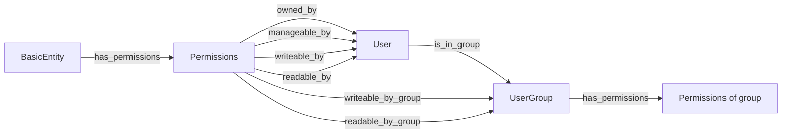

# 24 — Permission-System Review

**Snapshot date:** 2026-05-05
**Scope:** shepard backend (`backend/src/main/java/de/dlr/shepard/auth/permission/**`,
plus the JWT/API-key plumbing it sits on top of). Companion to
`07-security-issues.md` (C3 canonical) and the dispatcher backlog
(A0, A4 cache, C3, L2, L8, P2c). Cites; does not repeat.

---

## 1. Executive summary

shepard's authorization is a per-entity discretionary access model
stored in Neo4j: every protected node has a `(:Permissions)` sibling
linked by `:has_permissions`, with outbound edges to a single owner,
plus reader/writer/manager users and reader/writer groups; entry
points are `PermissionsService.isAccessTypeAllowedForUser` (cached,
called from every Service) and `PermissionsService.isAllowed`
(path-segment dispatch, today only used by `SubscriptionFilter`).
The biggest fragility is the **C3 fail-open default** in
`getRoles` — any entity that lacks a `:has_permissions` edge becomes
publicly read/write/manage to every authenticated user
(`PermissionsService.java:258-262`); two close seconds are the
**absent admin role** (`JWTPrincipal.roles = new String[0]` at
`JWTPrincipal.java:24`, so `JWTSecurityContext.isUserInRole` is
permanently false) and the **path-segment switch** in `isAllowed`
that couples policy to URL shape and would silently weaken under L2
(non-numeric IDs) or P4 (`/v1/...` prefix). The largest single
4-engineer-week opportunity is to invert the failure default,
introduce a declarative `@Authz` seam over the existing model, and
add a Neo4j-degraded fail-closed invariant — none of which require
rewriting `PermissionsService`.

---

## 2. The model today

### 2.1 Subjects

- **OIDC users.** `JWTFilter.parsePrincipalFromAccessToken`
  (`JWTFilter.java:177-208`) extracts the OIDC subject, splits on
  `:`, takes the last segment as `username`. Optional global gate
  `oidc.role` (`JWTFilter.java:67, 191-198`) — a realm-role
  whitelist for *who may use shepard at all*; not used per-entity.
- **API keys.** `JWTFilter.parseApiKey` (`JWTFilter.java:224-247`)
  validates a stored JWT and constructs a `JWTPrincipal(subject,
  keyId)` (`JWTFilter.java:258`); the constructor sets
  `roles = new String[0]` (`JWTPrincipal.java:24`).
- **Groups.** `UserGroup` exists (`UserGroup.java:21-28`); users
  are linked via `:is_in_group` (incoming, line 23), and a
  `UserGroup` itself can own a `Permissions` node so a group has
  its own ACL. Groups are **referenced** by `Permissions` via
  `readerGroups` / `writerGroups` (`Permissions.java:47-52`) but
  there is no `manager_groups` and no group-level *grant
  inheritance* through the graph at query time — instead
  `PermissionsService.fetchUserNames` (`PermissionsService.java:245-256`)
  flattens groups to a `Set<String>` of usernames for each check.
- **No admin role.** The OIDC `realm_access.roles` is parsed
  (`JWTFilter.java:183, 192`) only to enforce the global
  `oidc.role` gate; it is then discarded — `JWTPrincipal` always
  carries an empty `roles` array. `JWTSecurityContext.isUserInRole`
  (`JWTSecurityContext.java:23-25`) iterates that empty array, so
  `@RolesAllowed("admin")` would never match. This is the
  canonical A0 blocker.

### 2.2 Resources

Anything extending `BasicEntity` that gets a Permissions node at
creation time. Concrete types confirmed in code today:
DataObject containers (Timeseries, File, Structured, Spatial,
Generic), Collection, LabJournal entry, UserGroup, semantic vocab
types. The link is the `:has_permissions` edge from a
`BasicEntity` to a `Permissions` node (`PermissionsDAO.java:14`,
`Permissions.java:30-31`). Path types **explicitly excluded** by
`isAllowed`: `temp/migrations/...`, `users/...`, `apiKeys/...`,
`subscriptions/...`, `lab-journal-entries/...`, and
`search/{users|containers|collections|user-groups}`
(`PermissionsService.java:202-240`) — i.e. their permission
checks live inside their own services.

### 2.3 Actions

`AccessType` enum: `Read`, `Write`, `Manage`, `None`
(`AccessType.java:3-7`). Roles enum is a flat 4-bit struct
(owner, manager, writer, reader) — `Roles.java:14-24`.

**Composition.** Decided in `isAccessTypeAllowedForUser`
(`PermissionsService.java:115-128`):

- `Owner` short-circuits to true for *any* `AccessType` — owner
  implies manage, write, read.
- `Read` is satisfied by reader OR writer OR manager.
- `Write` by writer OR manager.
- `Manage` by manager only.

So `Owner > Manager > Writer > Reader` is the partial order, but
the implementation is open-coded boolean OR rather than a
hierarchy on the enum.

### 2.4 Relations

Rel-type constants (`Constants.java:117-123`):

- `:has_permissions` — entity → permissions
- `:owned_by` — permissions → user
- `:readable_by`, `:writeable_by`, `:manageable_by` — permissions → user
- `:readable_by_group`, `:writeable_by_group` — permissions → group
- `:is_in_group` — user → group (inferred from `UserGroup.java:23`,
  declared elsewhere as `Constants.IS_IN_GROUP`)



Note the asymmetry: a `UserGroup` is itself a `BasicEntity` with
its own `Permissions`, so deciding "may user X edit group Y" walks
the same model recursively. There is no
`(:User)-[:can_admin]->(:Tenant)` style global edge.

### 2.5 Decision rule

`isAllowed` (`PermissionsService.java:198-243`) is a
**path-segment switch**, not a graph traversal:

1. If the second path segment is numeric, parse it as the entity
   id and call `isAccessTypeAllowedForUser` (line 226-229).
2. Otherwise hard-coded whitelists (lines 202-240) decide whether
   to pass through (the comment "Permissions are already checked
   inside ...Service" at line 215, 221 documents that the
   *invariant* that the downstream Service checks is doc-only,
   not enforced — see fragility below).

The actual decision happens in `isAccessTypeAllowedForUser`:
fetch the entity's permissions via `PermissionsDAO.findByEntityNeo4jId`
(`PermissionsDAO.java:12-19`, Cypher
`MATCH (e:BasicEntity)-[:has_permissions]->(p:Permissions)
WHERE ID(e) = $id`), reduce to a `Roles` 4-bit, OR the bits
according to `AccessType` (lines 121-127). It is a property
check on the Permissions node, **not** a multi-hop graph
traversal — group membership is not a Cypher join, it is a Java
loop over `readerGroups` / `writerGroups`
(`PermissionsService.fetchUserNames:245-256`,
`isReader:280-286`, `isWriter:288-293`).

### 2.6 Cache

`@CacheResult(cacheName = "permissions-service-cache")` on
`isAccessTypeAllowedForUser` (`PermissionsService.java:114`).
Quarkus Caffeine cache, key is the implicit
`CompositeCacheKey(entityId, accessType, username)` (the explicit
cast at line 144). TTL/max-size: not declared in
`application.properties`; defaults to Quarkus's unbounded
unexpiring config unless externally overridden. Manual
invalidation only on update via `removeEntityFromCache`
(`PermissionsService.java:142-147`), which iterates by
`entityId == keyElements[0]`.

There is **no `PermissionsCacheWarmer` and no
`MostUsedEntityProvider` in the tree today** — those are A4c
proposals from `16-dispatcher-backlog.md`, not landed code. The
review treats them as future state.

Implications: (a) revoking a grant flushes only that
`(entityId, *, *)` slice, which is correct; (b) flipping a
group's membership does **not** flush any entity cache, since
group membership is resolved in Java per-call against `UserGroup`
relationships not visible to the cache key; (c) renaming an OIDC
user (subject change) silently invalidates the cache by missing,
which is benign but wasteful.

### 2.7 Auth & roles integration

OIDC and API-key paths converge in `JWTFilter` (lines 108-131)
and produce the same `JWTPrincipal`. The principal is wrapped in
`JWTSecurityContext` (line 143) and stashed in
`AuthenticationContext` (line 145). Any `@RolesAllowed(...)`
annotation on a JAX-RS method consults `isUserInRole` over an
empty array — so role-based gating at the JAX-RS layer is dead
code today. This is A0.

### 2.8 Subscriptions

`SubscriptionFilter.filter` (`SubscriptionFilter.java:60-73`)
loops over every subscription matching the request method, regex-
matches its `subscribedURL` against the request URL, then calls
`permissionsService.isAllowed(requestContext, Read, sub.creator.username)`.
For N subscriptions matching the method this is O(N) `isAllowed`
invocations per response, each of which does at most one cached
permission lookup but at minimum a path-segment scan. The TODO at
line 62 ("This could develop into a bottleneck") names it. P2c
territory.

---

## 3. Fragilities, ranked by blast-radius

### 3.1 C3 — fail-open fallback in `getRoles`

`PermissionsService.getRoles:258-262` returns
`new Roles(false, true, true, true)` for any entity that has no
`:has_permissions` edge — full reader/writer/manager (only owner
is false, but `isAccessTypeAllowedForUser` lines 121-127 do not
gate Manage/Write/Read on owner). One missed `createPermissions`
call (a new entity type, a transactional race in creation, a
deletion-without-cascade leaving an orphan) silently exposes the
data with full grant power to every authenticated user.
**Already escalated; treat as decided.** Tests missing today:
(a) per-entity-type integration test creating each `BasicEntity`
subclass and asserting a `Permissions` node exists; (b) negative
test exercising the path where an entity has no permissions and
asserting denial (currently asserts allow); (c) startup audit
job that fails the deploy if any `BasicEntity` lacks
`:has_permissions`.

### 3.2 Path-segment switch dispatch

`isAllowed` (`PermissionsService.java:198-243`) couples *policy*
to *URL shape*:

- `pathSegments.getFirst().getPath().equals(Constants.LAB_JOURNAL_ENTRIES)`
  (line 214) — pass-through.
- `pathSegments.getFirst().getPath().equals(Constants.USERS)`
  (line 220) — pass-through.
- `StringUtils.isNumeric(idSegment)` (line 226) — only path that
  actually delegates to `isAccessTypeAllowedForUser`.
- `Constants.SEARCH` whitelist (lines 232-240).

Three implications:

1. **L2 (id migration to application-generated non-numeric IDs).**
   Once entity ids stop being numeric, line 226's
   `StringUtils.isNumeric` falls through to line 242's `return false`
   and the *correct* path becomes the *deny* path. The migration
   must update both this dispatcher and `PermissionsService`'s
   cache key shape (today `long entityId` at lines 69, 88, 101,
   115, 137 — needs to become a `String` or a typed id).
   `PermissionsDAO.findByEntityNeo4jId:14` uses Neo4j `ID(e)` —
   that needs to change to a property match
   (`WHERE e.shepardId = $id`) anyway under L2.
2. **P4 (`/v1/...` URL prefix).** A version prefix shifts every
   path segment by one; line 200 (`pathSegments.get(1).getPath()`)
   would now read the version, not the id. Audit required.
3. **`isAllowed` is only called from `SubscriptionFilter`** today;
   the rest of the codebase calls `isAccessTypeAllowedForUser`
   directly from Services
   (`AbstractContainerService.java:84,98,112,125`,
   `CollectionService.java:295,312,329`,
   `UserGroupService.java:165,182,199`). The path-segment branch
   exists for a single caller; making it declarative removes a
   policy seam that cannot be unit-tested without a full
   `ContainerRequestContext`.

**Recommend** a declarative `@Authz` annotation pattern
(F1 below) — same model, cleaner seam.

### 3.3 No admin role (A0)

`JWTPrincipal.roles = new String[0]` (`JWTPrincipal.java:24`,
also line 205 of `JWTFilter` for the OIDC path). Realm roles are
parsed (`JWTFilter.java:183, 192`) and discarded after the
`oidc.role` global gate. Consequences:

- `@RolesAllowed("admin")` is dead code. There is no built-in
  way to bypass per-entity ACLs for ops tasks (cleanup, force
  delete an orphan, rotate group membership of a corrupted
  group).
- `isAccessTypeAllowedForUser` has no admin short-circuit;
  emergency access requires a DB-side write to add the user as
  manager.

### 3.4 No global / sharing semantics beyond per-entity DAC

Groups exist (§2.1) but the model has no concept of:

- **Project** or **tenant** — every entity stands alone; an
  inadvertent grant of one container is not bounded by a
  containing project.
- **Manager group** — `manageable_by_group` is absent
  (`Constants.java:117-123` and `Permissions.java:54-56` only
  expose user-level manager).
- **Sharing link with expiry** — `validUntil` exists on API keys
  (per L5) but per-entity grants have no expiry.

For a research-data platform whose target users routinely share
"this dataset, until end of grant period" this is a gap.

### 3.5 Cache key blindness to context flips

`@CacheResult` keys on `(entityId, accessType, username)`
(§2.6). The cache is invalidated only by `removeEntityFromCache`
when permissions are *directly* updated
(`PermissionsService.java:183`). It does **not** invalidate
when:

- A user is added to or removed from a `UserGroup` referenced as
  reader/writer.
- A user is renamed or merged.
- The `oidc.role` global gate is changed.

Group membership flips in particular are silent — until the
entry naturally evicts, a user removed from a reader group still
passes `isReader` if their old check is cached. Recommend a
versioned key (`+ permissionsVersion` or `+
groupMembershipEpoch(username)`) or, simpler, a
`UserGroupService` hook that invalidates by username slice on
membership change.

### 3.6 Inconsistent application across endpoints

`isAllowed` is only invoked by `SubscriptionFilter.java:66`. The
rest of the codebase opts in via Service-layer asserts
(`assertIsAllowedToReadContainer` etc., e.g.
`AbstractContainerService.java:82-130`). This means:

- The "permissions are already checked inside ...Service" comments
  at `PermissionsService.java:215, 221` are documentation-as-
  invariant. M8 in `07-security-issues.md` (line 126) flags this.
- A new endpoint that forgets to call `assertIsAllowed...` will
  serve data unprotected, with no compile-time or test-time
  signal.

Spot-check (3 endpoints): `AbstractContainerService` always
asserts; `CollectionService` always asserts; the public
search/user paths bypass `isAllowed` by whitelist (lines
220-223, 232-240). I did not find a clear bypass in production
endpoints, but the *absence* of a structural enforcement point
is the issue.

### 3.7 No audit trail for grants/revokes

Grep for `audit.?log`, `grant.?audit`, `permission.?audit` in
`backend/src/main` returns nothing.
`PermissionsService.updatePermissionsByNeo4jId:156-185` mutates
the Permissions node with no event emitted. For a system where
"who shared what with whom and when" is a compliance question
(DLR is research, often DFG/EU-funded), this is a gap.

### 3.8 N+1 in `SubscriptionFilter` (P2c)

Already covered in §2.8. Per the TODO at
`SubscriptionFilter.java:62`. The fix is straightforward (batch
the regex pre-filter and the permission check, or filter
subscriptions by URL prefix in Cypher), but it depends on having
a batch `findByEntityNeo4jIds` in `PermissionsDAO` (the post-P2
addition). Today only the single-id `findByEntityNeo4jId` exists
(`PermissionsDAO.java:12`).

### 3.9 Cross-DB consistency under degraded Neo4j

If Neo4j is unreachable, `PermissionsDAO.findByEntityNeo4jId`
throws; `getRoles` is called from a try-block-less path in
`isAccessTypeAllowedForUser` (lines 116-117) so the exception
propagates and the request 500s. That is *fail-closed by
accident* — the desired property is *fail-closed by invariant*,
asserted by an integration test that downs Neo4j and verifies no
endpoint returns 200. This ties to A1b (readiness probe).

---

## 4. Adjacent friction

- **`isAllowed` reads request path** → cannot be unit-tested
  without a JAX-RS `ContainerRequestContext` test harness; the
  switch arms at `PermissionsService.java:202-240` are not
  individually covered.
- **`Roles` composition is open-coded.** The four bits in
  `Roles.java:14-24` plus the OR-cascade in
  `PermissionsService.java:121-127` make adding a fifth role
  (`Annotator`, `Sharer`) a multi-file change. Confirm or flag —
  the present model works but is not extensible.
- **`validUntil` on API keys vs. per-entity sharing.** Post-L5,
  API keys gain a `validUntil`. There is no per-entity grant
  expiry today; for "share with collaborator until end of grant"
  that asymmetry is awkward. Worth adding a `validUntil` field
  on `Permissions` reader/writer entries (would need OGM model
  change — outside this review's scope).

---

## 5. Room for development

T-shirt: S ≈ 1d, M ≈ 1w, L ≈ 2-3w, XL ≈ ≥1mo.

### A0 — Admin role

**Pitch.** Wire OIDC realm-role parsing through to
`JWTPrincipal.roles` and add an admin short-circuit in
`isAccessTypeAllowedForUser`.
**Size.** S.
**Benefit.** Unblocks `@RolesAllowed`, gives ops a way to do
emergency cleanup without DB-side writes.
**Risk.** A buggy admin grant equals total-access; the change
must include audit-log entries (F3) for any admin-bypass
decision.
**Prereqs.** None. Backlog ID: A0.

### C3 — Close the fallback backdoor

**Pitch.** Invert the default in `getRoles`
(`PermissionsService.java:258-262`) to
`new Roles(false, false, false, false)`. Add a startup audit
that fails the deploy if any `BasicEntity` lacks
`:has_permissions`. Add per-entity-type integration tests.
**Size.** S.
**Benefit.** Closes a critical-severity finding.
**Risk.** Existing legacy entities without permissions become
inaccessible until an admin (A0) grants. Migration step: scan
and back-fill `:has_permissions` with owner = creator (look up
via audit log if available, else "system" + manage to original
creator).
**Prereqs.** A0 (so an admin can backfill).
Backlog ID: C3.

### F1 — Declarative `@Authz` annotation

**Pitch.** Replace the path-segment switch in `isAllowed` with a
JAX-RS interceptor that reads a method-level annotation. The
annotation declares the `AccessType` and how to extract the
entity id from the request.
**Sketch:**

```java
@Retention(RUNTIME)
@Target(METHOD)
public @interface Authz {
  AccessType action();
  ResourceKind resource();
  String idParam() default "id";       // @PathParam name
  IdSource source() default IdSource.PATH;  // PATH | BODY | QUERY
  boolean ownerOnly() default false;   // Manage-only short-cut
}

// Usage:
@GET @Path("/collections/{id}")
@Authz(action = Read, resource = COLLECTION, idParam = "id")
public CollectionIO get(@PathParam("id") long id) { ... }
```

A `@Provider` request filter (`AuthzFilter`) reads the
annotation off `ResourceInfo`, resolves the id, calls
`isAccessTypeAllowedForUser`. Services keep their internal
`assertIsAllowedTo...` calls for in-flow checks.
**Size.** M.
**Benefit.** Removes the policy/URL coupling; new endpoints opt
in by annotation, not by remembering to call the assert helper;
unit-testable in isolation; resilient to L2 (id type-agnostic
via `IdSource`/`@PathParam`) and P4 (URL prefix doesn't matter).
**Risk.** Two enforcement points (annotation + service-level
assert) creates ambiguity; document the rule that the annotation
is the *gate* and service-level asserts are *defence in depth*
for cross-entity flows.
**Prereqs.** None hard, but lands cleanest after L2 because the
id type stabilises.
Backlog ID: new (proposed F1).

### F2 — Group sharing model with manager-groups + grant inheritance

**Pitch.** Add `:manageable_by_group` to mirror
`:readable_by_group` / `:writeable_by_group`. Add Cypher-side
group expansion so `findByEntityNeo4jId` returns user *and*
group reachability in one query (today
`PermissionsService.fetchUserNames:245-256` does the expansion
in Java per request).
**Migration.**

1. Cypher migration to add `:manageable_by_group` rel-type and
   index it.
2. Update `Permissions.java` to add `managerGroups` field
   (mirror of `readerGroups`/`writerGroups`).
3. Update `findByEntityNeo4jId` to a single Cypher query that
   returns the bool flags directly (faster, cache-able by
   query result not by Java loop).

**Size.** L.
**Benefit.** Makes "give the lab group manage rights to this
collection" a one-step grant; fixes the cache blindness
(F4) by making group reachability part of the query result not a
Java post-filter.
**Risk.** Schema migration; existing data with
`writerGroups` keeps working but tests need backfill cases.
**Prereqs.** A0 (admin needed for backfill), C3 (so missing
permissions don't fail-open during migration).
Backlog ID: new (proposed F2; subset of L8).

### F3 — Permission audit log (Postgres)

**Pitch.** On every `createPermissions`,
`updatePermissionsByNeo4jId`, or admin-bypass decision, write a
row to a `permission_audit` table in TimescaleDB's Postgres
(it's already there; no new DB).
**Schema sketch:** `(ts, actor_username, action ENUM(grant,
revoke, admin_bypass), entity_id, entity_kind, target_username,
target_group_id, role_before, role_after, request_id)`.
**Size.** S-M.
**Benefit.** Compliance answer to "who shared this with whom".
Cheap query surface (Postgres) instead of Cypher for typical
audit questions.
**Risk.** Storage growth — but rate is grant-events not data,
likely <1M rows/year for shepard's scale. Use a regular table
not a hypertable.
**Prereqs.** None.
Backlog ID: new (proposed F3).

### F4 — Versioned cache invalidation key

**Pitch.** Add a `permissionsVersion` field to `Permissions` (a
`long` incremented on every update) and to `UserGroup` (for
membership changes). Include it in the cache key as a fourth
element. On read, fetch the version cheaply; on group change,
the next read sees a different key and re-resolves.
**Size.** S.
**Benefit.** Closes §3.5 — group membership flips are no longer
silent against the cache.
**Risk.** One extra round-trip per read unless the version is
piggy-backed on the same Cypher query that returns the
permissions (it can be).
**Prereqs.** F2 (the migration is cleaner with the same field
added at the same time).
Backlog ID: new (proposed F4).

### F5 — Fail-closed invariant when Neo4j degrades

**Pitch.** Add an integration test that downs Neo4j and asserts
no endpoint returns 2xx. Make `PermissionsService` translate
Neo4j unavailability into a `503 Service Unavailable`, not a
500, so the contract is "permissions store down → no answers"
rather than "exceptions leak out".
**Size.** S.
**Benefit.** Documents and tests the fail-closed property,
which is currently emergent.
**Risk.** None.
**Prereqs.** A1b (readiness probe so the test is aligned with
ops behaviour).
Backlog ID: new (proposed F5).

### F6 — Extensibility for OPA / Cedar at the `isAllowed` layer

**Pitch.** Keep the existing in-process model. Design F1's
`@Authz` annotation so the policy decision can later delegate
to an external policy engine (OPA via REST sidecar, or Cedar in
process) without changing endpoint code. Concretely: have
`AuthzFilter` consult a `PolicyDecisionPoint` interface with a
default implementation that wraps `isAccessTypeAllowedForUser`.
**Size.** S to design, XL to actually adopt.
**Benefit.** Optionality. If shepard later needs ABAC ("data
classified as sensitive may only be read by users with
training_completed = true"), the seam is in place.
**Risk.** YAGNI if never adopted; the design cost is ~half a day
if you do F1 first.
**Recommendation.** **Yes, design for it; no, do not adopt
OPA/Cedar now.** shepard's policy is small, fast-moving,
graph-shaped; OPA is good for declarative orgs with many
services, not single-service Quarkus apps. Build F1 with a
`PolicyDecisionPoint` seam and stop.
**Prereqs.** F1.
Backlog ID: new (proposed F6).

### F7 — Row-level security in TimescaleDB / PostGIS

**Pitch.** Push the per-entity ACL down into Postgres RLS so
direct DB connections (analytics, BI) cannot bypass it.
**Size.** XL.
**Recommendation.** **No for v1.** Reasons:

- shepard's auth model lives in Neo4j; replicating it into
  Postgres means two sources of truth, with cache-coherence and
  drift bugs.
- The mitigation today — only the backend connects to
  TimescaleDB — is sound for the threat model.
- RLS is hard to get right with `JOIN`s and continuous
  aggregates; performance cost can be 10-30%.

Conditions under which the answer flips: (a) shepard exposes a
read-only Postgres connection to data scientists, (b) a second
service joins shepard's TimescaleDB directly, (c) a regulatory
requirement mandates DB-level isolation. Until then, keep the
backend as the single enforcement point.
Backlog ID: new (proposed F7).

### L8 — Permissions model review (umbrella)

**Pitch.** L8 in the dispatcher backlog is a meta-item ("review
permissions model"). This document is its concrete unpacking:
**L8 = C3 + A0 + F1 + F2 + F3 + F4 + F5**, sequenced as below.
**Size.** XL (umbrella).
**Benefit.** Closes the canonical permissions epic.
**Risk.** Tracking-only; the work is in the children.
Backlog ID: L8 (existing).

---

## 6. Recommended sequence

1. **A0 — admin role.** Unblocks emergency operations and
   `@RolesAllowed`, and is a prerequisite for the C3 backfill
   migration.
2. **C3 — invert fail-open.** Critical-severity fix; needs A0 to
   ensure an admin can backfill missing permissions.
3. **F3 — audit log.** Cheap, independent, lights up everything
   that follows. Especially valuable to have *before* F1 lands
   so the annotation rollout is observable.
4. **F1 — `@Authz` annotation.** The single biggest structural
   improvement; everything downstream is easier with it.
5. **F2 — manager-groups + Cypher-side group expansion.** Best
   done after F1 because the annotation makes the rollout
   endpoint-by-endpoint testable.
6. **F4 — versioned cache key.** Slot in alongside F2 (same
   schema migration).
7. **F5 — fail-closed invariant test.** Belongs with A1b
   (readiness) but the assertion can land sooner.
8. **F6 — `PolicyDecisionPoint` seam.** Drop into F1 as a
   half-day design exercise; no adoption.
9. **L2 cross-cut audit.** When L2 lands, audit
   `PermissionsService.java:226` (numeric-id branch),
   `PermissionsDAO.java:14` (`ID(e)` → property), and the cache
   key shape (`long entityId` → typed id).

This matches the L8 epic in the dispatcher backlog when one is
formally drawn up; aidocs/20 (epic roadmap) does not exist at
snapshot date and should reuse this ordering.

---

## 7. Things to deliberately *not* do

1. **Do not bolt on Keycloak's authz services** as the policy
   engine. shepard's permissions live in Neo4j alongside the
   data graph; pushing them out to Keycloak duplicates state
   and adds a second consistency boundary for no benefit.
2. **Do not replicate permissions into every data DB in v1.**
   Reject F7 for now; keep the backend as the single
   enforcement point.
3. **Do not rewrite `PermissionsService`.** The model is sound;
   the seams (decision point, cache key, fail-closed default,
   audit) are the work. The maintainer has explicitly ruled
   rewrite out.
4. **Do not introduce ABAC predicates** ("classified =
   sensitive AND user.training = complete") before F6 lands.
   Embedding them in `isAccessTypeAllowedForUser` directly
   accelerates the path-segment-switch problem one layer down.
5. **Do not couple the OIDC realm-role list to fine-grained
   shepard roles.** A0 should use realm roles only for the
   coarse `admin` / `non-admin` distinction; per-entity grants
   stay in Neo4j.

---

## 8. Open questions for maintainer

- **Is "owner" supposed to imply "manager + writer + reader" by
  composition, or by short-circuit?** Today
  `isAccessTypeAllowedForUser:118-119` short-circuits on owner
  but the `Roles` struct has independent bits — should the
  invariant be "if owner then all bits true" or "owner is a
  separate axis"?
- **Should `manageable_by_group` exist?** Currently groups can
  read/write but not manage. Is that deliberate (avoiding
  group-driven privilege escalation) or accidental?
- **Per-entity grant expiry — yes/no?** Mirror of `validUntil`
  on API keys. Worth a sentence in the L5 ticket if the answer
  is yes.
- **Admin role naming** — `admin` (Keycloak realm role default)
  or `shepard:admin` (namespaced)? Affects the OIDC config the
  maintainer asks instances to ship.
- **Audit retention.** How long does shepard need to keep
  `permission_audit` rows? Sets the Postgres partition
  strategy.
- **`isAllowed` only used by `SubscriptionFilter` today** — is
  that intentional, or should it have replaced the per-Service
  asserts long ago? (F1's answer: replace both with one
  declarative seam.)
