# Long-Running Process Pattern — Async Jobs

**Scope.** Forward-looking design note proposing a single shared pattern for
operations whose runtime exceeds a sensible synchronous request budget.
Modelled on the precedent already shipped for the InfluxDB → TimescaleDB
migration (P3, commit `7cc74b8`); generalises that one-off into a reusable
shape so that R2 RO-Crate export, P14 NDJSON ingest, P10 SQL fallback, and
the L2 schema-migration phases stop reinventing it.

**Companion to** `aidocs/16-dispatcher-backlog.md` (P3 / P3b / P3c, P14, P10,
R2 series, A1f, A4 cache), `aidocs/ops/28-paradigms-and-clients-synthesis.md` §3
Surface D (SSE), `aidocs/platform/29-p10-implementation-design.md` §6 (the
"fall-through to async" gap this doc closes), and
`aidocs/workflows/31-rocrate-export-optimisation.md` (the optimisations that pair with
the async shape here).

**Status legend.** Same as the perf doc (`aidocs/12`).

**Snapshot date.** 2026-05-07.

---

## 1. Summary

The proposed pattern is: every long-running operation submits a row to a
single Postgres `job` table via a small `JobService` surface, returns
`202 Accepted` with `Location: /jobs/{id}`, and is run by a Quarkus
`@Scheduled` poller against a bounded virtual-thread pool. Progress lives in
the same row; clients poll `GET /jobs/{id}` or subscribe via SSE at
`GET /jobs/{id}/events`; cancellation is cooperative through
`DELETE /jobs/{id}`. Successful results are delivered as presigned-S3 URLs
(P12). The two operations the maintainer should adopt this for first are
**R2 RO-Crate export** (currently synchronous, can run minutes on a large
collection) and **P14 NDJSON ingest** (currently request-scoped, wrong
shape for multi-million-row imports). The migration progress table from P3
becomes the worked example, then is refactored onto the shared surface
once the team has confidence.

---

## 2. The shape

```mermaid
flowchart LR
    C[Client]
    subgraph API["REST surface"]
        P[POST /collections/&#123;id&#125;/export-jobs]
        G[GET /jobs/&#123;id&#125;]
        S[GET /jobs/&#123;id&#125;/events SSE]
        D[DELETE /jobs/&#123;id&#125;]
    end
    subgraph Server["Quarkus backend"]
        J[(job table\nPostgres)]
        W[Scheduled poller +\nvirtual-thread pool]
        R[JobRunner\nkind-specific work]
        H[Stale-job reaper\n@Scheduled]
        Z[(S3 / object store)]
    end

    C -->|submit| P
    P -->|insert PENDING| J
    P -->|202 + Location| C
    W -->|claim PENDING| J
    W --> R
    R -->|recordProgress| J
    R -->|upload result| Z
    R -->|markSucceeded resultUrl| J
    H -->|RUNNING + stale| J

    C -->|poll| G
    G --> J
    C -->|subscribe| S
    S --> J
    C -->|cancel| D
    D -->|set CANCELLED| J
    R -->|cancellationRequested?| J
```



Single state machine: `PENDING → RUNNING → (SUCCEEDED | FAILED |
CANCELLED)`. No intermediate "queued for retry" state in v1; failures are
terminal and the client resubmits.

---

## 3. Job model

A single Postgres table, owned by the application schema (not Timescale —
it is not a hypertable). The shape mirrors the
`migration_progress` precedent at
`backend/src/main/resources/db/migration/V1.9.0__add_migration_progress_table.sql`
but generalises the columns so every kind of job lives in the same row.

| Column | Type | Notes |
|---|---|---|
| `id` | `uuid` | UUID v7, per L2 design choice (`aidocs/25` §3). Time-sortable; cheap on B-tree. |
| `kind` | `text` | Enum-by-convention: `EXPORT`, `INGEST`, `SQL_QUERY`, `MIGRATION`, future entries. Stored as text so adding a kind is a no-DDL change. |
| `principal` | `text` | The submitting user (sub claim) or API key id. Permission boundary key. |
| `status` | `text` | `PENDING` / `RUNNING` / `SUCCEEDED` / `FAILED` / `CANCELLED`. |
| `created_at` | `timestamptz` | Submission time. |
| `started_at` | `timestamptz` | First time the worker claimed the job; nullable until then. |
| `last_progress_at` | `timestamptz` | Heartbeat for the stale-job reaper. |
| `finished_at` | `timestamptz` | Set when status moves to a terminal value. |
| `progress_total` | `bigint` | Kind-specific count; nullable when the runner cannot estimate. |
| `progress_done` | `bigint` | Always ≤ `progress_total` when both are non-null. |
| `progress_message` | `text` | Latest line of human-readable status. |
| `error_class` | `text` | Set only when `status = FAILED`. Internal exception class or a stable code (`JOB_STALLED`, `JOB_CANCELLED`). |
| `error_message` | `text` | Human-readable, redacted. |
| `result_url` | `text` | Where the success payload lives — S3 presigned URL (P12) or an internal API path. Nullable until success. |
| `result_metadata` | `jsonb` | Kind-specific. For `EXPORT` mirrors the `selection` block from R2's manifest (`aidocs/16` R2). For `SQL_QUERY` records `rows`, `bytes`, `format`. |
| `request_payload` | `jsonb` | The original request body so the user can see what they asked for. **Sensitive fields redacted** (passwords, API keys) before insert. |

Indexes:

- `(principal, status)` — drives "my jobs by status" listings.
- `(kind, status, finished_at)` — drives the GC scan and operator queries.
- Implicit primary key on `id` covers single-job lookup.

**Permission boundary.** The principal that submitted the job is the only
caller that can `GET` or `DELETE` it. Admins (post-A0, see `aidocs/24`
§Admin role) can list all. The principal column is checked in
`JobService.getJob` before the row is returned; there is no field-level
ACL.

**TTL.** Completed / failed / cancelled jobs are retained for `N` days
(default 14, configurable via `shepard.jobs.retention-days`) and then
deleted by a `@Scheduled` GC. Result blobs in S3 are removed in the same
sweep — the runner is responsible for setting an S3 lifecycle rule that
matches the same TTL when the result is presigned.

---

## 4. The shared service surface

A new package
`backend/src/main/java/de/dlr/shepard/common/jobs/`
holding:

- `Job` — entity bound to the table above.
- `JobKind` — enum.
- `JobStatus` — enum.
- `JobRepository` — Hibernate / Panache repo.
- `JobService` — the only thing callers should depend on.
- `JobContext` — the per-run handle the runner gets.
- `JobRunner` — `@FunctionalInterface` `Consumer<JobContext>`.
- `JobScheduler` — the `@Scheduled` poller (see §5).
- `JobRest` — the REST resource (see §6).
- `JobSseResource` — SSE companion, gated on P13 shipping.

`JobService` interface, in pseudo-Java:

```java
public interface JobService {
    Job submit(JobKind kind, String principal,
               JsonNode requestPayload, JobRunner runner);

    void markStarted(UUID jobId);
    void recordProgress(UUID jobId, long done, Long total, String message);
    void markSucceeded(UUID jobId, String resultUrl, JsonNode resultMetadata);
    void markFailed(UUID jobId, Throwable t);
    void markCancelled(UUID jobId);

    Job getJob(UUID jobId, String principal);  // permission-checked
    Page<Job> listJobs(String principal, JobStatus status, JobKind kind,
                       int page, int size);
}
```

`JobContext`:

```java
public interface JobContext {
    UUID jobId();
    JsonNode requestPayload();
    void recordProgress(long done, Long total, String message);
    boolean cancellationRequested();   // cheap; reads cached status
}
```

The R2 / P14 / P10 callers each implement a small `JobRunner` and submit
through this surface. They do not implement their own progress tables.
This is the single architectural rule the doc enforces.

`submit` is transactional: the row insert and any caller-side bookkeeping
(e.g. linking the job to a collection) commit together. The runner is
**not** invoked in the submitter's transaction; it is picked up by the
scheduler later.

---

## 5. Worker model

Quarkus `quarkus-scheduler` (added by A1f, commit `2f80600`) drives the
worker. The reference for the `@Scheduled` shape is
`backend/src/main/java/de/dlr/shepard/common/healthz/DbRecoveryScheduler.java`.

```java
@ApplicationScoped
public class JobScheduler {

    @ConfigProperty(name = "shepard.jobs.max-concurrent", defaultValue = "4")
    int maxConcurrent;

    @Scheduled(every = "{shepard.jobs.poll-interval}",
               concurrentExecution = SKIP)
    void poll() { ... }

    @Scheduled(every = "{shepard.jobs.reaper-interval}",
               concurrentExecution = SKIP)
    void reapStale() { ... }

    @Scheduled(cron = "{shepard.jobs.gc-cron}")
    void gc() { ... }
}
```

Defaults:

- `shepard.jobs.poll-interval` = `5s`.
- `shepard.jobs.reaper-interval` = `1m`.
- `shepard.jobs.gc-cron` = `0 17 3 * * ?` (03:17 daily).
- `shepard.jobs.max-concurrent` = `4`.
- `shepard.jobs.stale-after` = `5m` (RUNNING with `last_progress_at` older
  than this is reaped to FAILED with `error_class = JOB_STALLED`).
- `shepard.jobs.retention-days` = `14`.

**Claim semantics.** The poller selects up to `maxConcurrent - inFlight`
PENDING rows and updates them to RUNNING in the same transaction, with
`SELECT ... FOR UPDATE SKIP LOCKED`. This is the standard Postgres queue
pattern; SKIP LOCKED means a second pod (when shepard is run with more
than one replica, post-A1f) cannot double-claim. No external queue
infrastructure is needed.

**Execution.** Each claimed job is dispatched to a virtual-thread executor
(`Executors.newVirtualThreadPerTaskExecutor()`), with a semaphore that
caps live tasks at `maxConcurrent`. Virtual threads keep the pool cheap
even when a runner is mostly blocked on I/O (S3 upload, COPY into
Timescale). The worker runs outside any HTTP request — explicit Hibernate
session management is the runner's responsibility (we are not in a
`@Transactional` method scope).

**Heartbeat and reaper.** Runners must call
`ctx.recordProgress(...)` at least once every `stale-after / 2`.
The reaper transitions any RUNNING row whose `last_progress_at` is older
than `stale-after` to FAILED with `error_class = JOB_STALLED`. This is the
only protection against a worker crash.

**Cancellation.** Cooperative. `DELETE /jobs/{id}` flips the row's status
to CANCELLED *if it is PENDING*, or sets a cancellation flag bit
(implementation: a `cancel_requested boolean default false` column,
omitted from §3 above for brevity but added in the migration) *if it is
RUNNING*. The runner polls `ctx.cancellationRequested()` between
checkpoints and aborts cleanly. We do not interrupt the worker thread —
that races with Hibernate session cleanup and S3 multipart uploads.

---

## 6. REST surface

New resource at `de.dlr.shepard.common.jobs.JobRest`. Three endpoints
(plus one SSE):

- `GET /jobs?status=&kind=&page=&size=` — list jobs for the calling
  principal. Admins (post-A0) see all. Default sort `created_at DESC`.
- `GET /jobs/{id}` — single job, permission-checked.
- `DELETE /jobs/{id}` — request cancellation; idempotent (already-CANCELLED
  or already-terminal returns 204 / 409 with a stable error code).
- `GET /jobs/{id}/events` — SSE stream of progress updates, one event per
  state change. Terminates on the first `SUCCEEDED` / `FAILED` /
  `CANCELLED` event. **Depends on P13 (Surface D) shipping**; before that
  ships, clients poll `GET /jobs/{id}` every few seconds.

Long-running endpoints elsewhere return `202 Accepted` with
`Location: /jobs/{id}` and an inlined `Job` representation. The submitter
gets a usable response without a follow-up GET.

`Job` JSON shape mirrors the table with the obvious renaming
(`progressDone`, `progressTotal`, etc.). `requestPayload` is omitted from
the listing endpoint to keep response sizes tractable; clients fetch it
via the single-job `GET` if they need it.

---

## 7. Caller-side adoption

For each existing or planned long-running caller, the migration is:

### 7.1 R2 RO-Crate export

- Today: `POST /collections/{id}/export` is synchronous; the response body
  is the full ZIP. ExportService at
  `backend/src/main/java/de/dlr/shepard/context/export/ExportService.java`
  builds the crate in-process and writes to the response output stream.
- Tomorrow: `POST /collections/{id}/export-jobs` is the new sibling. The
  runner calls into the existing `ExportService`, but per `aidocs/31` O3
  writes to a temp file and uploads to S3, then calls
  `markSucceeded(jobId, presignedUrl, ...)`. Per `aidocs/31` O2/O8/O10 the
  builder phases (resolve → manifest → asset stream) report progress to
  the context after each batch.
- Today's synchronous endpoint **stays** as a fast path for small exports;
  it switches over to the async path internally only when the estimated
  asset byte count exceeds a threshold (default 100 MiB; configurable per
  `shepard.export.async-threshold-bytes`). This is the only place we
  recommend an automatic stream-vs-job choice; everywhere else the path
  is explicit.

### 7.2 P14 NDJSON ingest

- Today: request-scoped streaming ingest into the timeseries COPY path.
  The NDJSON body is consumed as it arrives; if the connection drops
  mid-stream the import is half-applied.
- Tomorrow: for very large imports, `POST
  /timeseriesContainers/{id}/payload-jobs` accepts the NDJSON body, spools
  it to an internal staging area (S3 multipart upload or a temp file on
  the worker pod), and returns 202. The runner streams the staged body
  line-by-line into the COPY path, recording progress every K rows.
  The synchronous endpoint stays for small imports (default cap
  configurable per `shepard.ingest.async-threshold-rows`).
- The staging step is non-trivial but unavoidable — the request thread
  cannot keep the body alive for the runner. Pragmatic v1: require the
  client to upload to a presigned S3 URL first and submit the URL as the
  payload. Alternative: accept the body, write to S3 inside the
  202-handling path, then return.

### 7.3 P10 SQL fallback

- `aidocs/29` caps `POST /sql/timeseries` at 1 M rows / PT60S. Today,
  exceeding either cap returns `truncated=true` and the user has no way
  to get the full result.
- Tomorrow: when a query hits either cap, the response is `303 See Other`
  with `Location: /jobs/{id}` (a job is created in the request handler
  before the redirect). The runner re-runs the same query without the
  cap and writes the CSV / Arrow stream to S3, then `markSucceeded` with
  the presigned URL. The client follows the redirect, polls / subscribes,
  and downloads on completion.
- 303 (rather than 202) preserves the "you asked for data; here is where
  it will be" semantics. POST → 303 with Location → GET on the new URL is
  a standard pattern (RFC 7231 §6.4.4).

### 7.4 P3 InfluxDB → TimescaleDB migration (existing)

Already async with its own `migration_progress` table at
`backend/src/main/resources/db/migration/V1.9.0__add_migration_progress_table.sql`,
its own runner at
`backend/src/main/java/de/dlr/shepard/data/timeseries/migration/services/MigrationRunner.java`,
and its own progress endpoint at `/temp/migrations/state` served by
`MigrationProgressRest`. Refactor onto the shared surface **once the team
has confidence** in the surface — keep the bespoke endpoints alive with a
deprecation note in the OpenAPI description for one release, then redirect.
The existing implementation is a worked example, not a tomb.

### 7.5 L2 schema migrations

`aidocs/25` Phase 2 (backfill) is a natural fit. Submit one job per
backfill task; the runner uses the same SQL as today's V-class Flyway
migrations but reports progress every N rows so the operator can see
forward motion. Phase 1 (DDL) and Phase 3 (cleanup) stay synchronous —
they are short.

---

## 8. Stream vs. job — when does an operation become async?

The decision rule, deliberately blunt:

- **Bounded by a per-request budget** (≤ PT30S for reads, ≤ PT5M for
  writes) → stay synchronous; let the existing caps return early. The
  budget is enforced at the endpoint; if you cannot prove the operation
  fits, treat it as unbounded.
- **Anything that exceeds the budget** → fall through to a job. There is
  no third option; we do not stream a partial result and then "continue
  in the background". The client either gets the full answer in one
  response or a job id.

Per-endpoint thresholds are documented explicitly in the OpenAPI
description, in plain words: "this endpoint returns at most 1 M rows;
larger queries return 303 to a job". This makes the contract testable.

The rule is not symmetric for ingest and read. Reads have a cap because
the holding-on-to-the-connection cost is paid by the server (response
buffer, JDBC cursor). Writes have a longer budget because the cost of
staging the request body is high — but anything over PT5M still becomes
a job, because (a) clients time out, (b) ingress proxies time out, (c)
the operator cannot reason about a 30-minute write.

---

## 9. Things to deliberately *not* do

1. **No separate job-queue infrastructure.** No Quartz cluster, no
   RabbitMQ, no Temporal. Postgres + `quarkus-scheduler` + SKIP LOCKED is
   enough for the load shepard sees. If volume grows past what one pod's
   poller can sustain, A1f's multi-replica work already covers
   horizontally scaling the pollers; a queue server can come later.
2. **No automatic async for every endpoint.** Synchronous is the default
   and the right answer for the common case. The only endpoint that
   *transparently* falls through to async is R2 export (§7.1), and only
   above an explicit threshold; everything else uses dedicated `*-jobs`
   siblings or 303 redirects.
3. **No second progress store.** One source of truth in Postgres. No
   Redis, no in-memory map, no append-only event log in v1. SSE re-reads
   the row on each tick; that's fine at the volumes involved.
4. **No connection-tied cancellation.** A client closing the SSE stream
   does *not* cancel the job. Cancellation is an explicit `DELETE`. This
   matches the P3 precedent and avoids the well-known footgun where a
   page reload kills a 20-minute migration.
5. **No worker-thread state in the API.** Jobs are a black box behind
   `Job`. We do not expose pod ids, thread names, or queue positions.
   The principal does not need to know how the work happens; the
   operator reads logs and metrics.

---

## 10. Open questions for maintainer

- **Result delivery.** S3 presigned URL (P12) is the recommendation, on
  the grounds that the result of any non-trivial export / query is
  already too big to live in Postgres comfortably. Alternative: an
  internal API path served by the backend that streams from S3. The
  internal path costs a hop but lets us re-authenticate. Decide before
  implementing R2's runner.
- **Admin scope.** "Admins see all jobs" depends on A0 landing first.
  Either (a) ship v1 without that distinction (every principal sees only
  their own), and add the admin scope when A0 ships; or (b) gate the
  whole feature on A0. Recommend (a).
- **SSE re-emit cadence.** Do we re-emit the latest progress every N
  seconds even if nothing changed, to help reconnecting clients? Default
  recommendation: yes, every 30 s, as a keep-alive event with the
  latest row. Cheap (one SELECT) and simplifies clients.
- **`?async=true` vs. dedicated `*-jobs` siblings.** A query-param
  switch on the synchronous endpoint is appealing for symmetry, but the
  request/response shapes are different (sync returns the data; async
  returns 202 + Job). Recommend dedicated siblings: explicit URL,
  explicit OpenAPI shape, no surprises in client generators.
- **Request-body staging for P14 ingest.** The "client uploads to S3
  first, then submits the URL" pragmatic path (§7.2) shifts work onto
  the client SDK. Worth it? Or do we accept the streaming-into-S3 cost
  in the 202-handling path? No strong opinion; depends on whether the
  shepard-timeseries-collector deployment can be taught to upload to S3
  cheaply.

---

## 11. Backlog impact

- New: **J1 — JobService scaffolding** (`common/jobs` package, table
  migration, scheduler, REST). Estimate: M (3–5 d). Blocks J2.
- New: **J2 — adoption pass for R2 + P14 + P10**. Estimate: M (3–5 d
  per caller, parallelisable). Depends on J1 and on `aidocs/31` O3 (S3
  upload from export builder).

P3's existing implementation is *not* counted here; its refactor onto
the shared surface is a P3-internal follow-up, owned by whoever ships
the migration epic.

---

## 12. References

- `aidocs/16-dispatcher-backlog.md` — P3 (`MigrationProgress*`,
  `migration_progress` table), P14 (NDJSON ingest), P10 (SQL surface),
  R2 (RO-Crate export), A1f (`quarkus-scheduler`, multi-replica),
  A4 (cache).
- `aidocs/22-admin-cli.md` — bulk import / export of collections; future
  caller of the same surface.
- `aidocs/platform/24-permission-system-review.md` — admin role, principal
  identity model.
- `aidocs/25-l2-migration-phases.md` — Phase 2 backfill as a job.
- `aidocs/ops/28-paradigms-and-clients-synthesis.md` §3 Surface D — SSE as
  the natural progress channel.
- `aidocs/platform/29-p10-implementation-design.md` §6 — fall-through-to-async,
  the gap this doc closes.
- `aidocs/workflows/31-rocrate-export-optimisation.md` — O2 / O3 / O8 / O10, the
  changes that pair with the async shape here.
- P3 precedent (existing code):
  - `backend/src/main/java/de/dlr/shepard/data/timeseries/migration/services/MigrationProgressService.java`
  - `backend/src/main/java/de/dlr/shepard/data/timeseries/migration/services/MigrationRunner.java`
  - `backend/src/main/java/de/dlr/shepard/data/timeseries/migration/MigrationProgress.java`
  - `backend/src/main/java/de/dlr/shepard/data/timeseries/migration/MigrationProgressStatus.java`
  - `backend/src/main/java/de/dlr/shepard/data/timeseries/migration/MigrationProgressIO.java`
  - `backend/src/main/java/de/dlr/shepard/data/timeseries/migration/MigrationProgressRest.java`
  - `backend/src/main/resources/db/migration/V1.9.0__add_migration_progress_table.sql`
- `backend/src/main/java/de/dlr/shepard/common/healthz/DbRecoveryScheduler.java`
  — reference for `@Scheduled` worker shape.
- `backend/src/main/java/de/dlr/shepard/context/export/ExportService.java`
  — the R2 caller that gets the first adoption.

---

## 13. Changelog — concrete instances

- **2026-05-22 — IMP1a/PR-2 ships the first concrete instance** of
  this JobService design as the `importer_run` Postgres table in
  `shepard-plugin-importer`
  (`plugins/importer/src/main/resources/db/migration/V1.11.1__add_importer_run_table.sql`).
  The column set deliberately mirrors §3's kernel
  (`status`, `created_at`, `started_at`, `last_progress_at`,
  `finished_at`, `progress_total`, `progress_done`,
  `progress_message`, `error_class`, `error_message`,
  `result_url`, `result_metadata`, `request_payload`,
  `cancel_requested`) so a future generic
  `de.dlr.shepard.common.jobs.Job` entity can adopt this table by
  renaming the backing class without touching SQL or wire shape.
  The importer-specific extras (`source_kind`, `source_config`,
  `target_collection_app_id`) stay co-located on the plugin's
  `ImporterRun` subclass — they don't belong in the generic
  kernel. The plugin's `ImporterRunService` mirrors §4's
  `JobService` interface method-for-method
  (`submit`, `markStarted`, `recordProgress`, `markSucceeded`,
  `markFailed`, `markCancelled`, `requestCancellation`, `getRun`,
  `getRunForAdmin`, `listMyRuns`). PR-4 of the IMP1 series wires
  the scheduler + REST surface. When the generic JobService
  graduation pass lands (J1 in §11), the importer's `ImporterRun`
  becomes a subclass of `Job` or a `Job`-bearing record; the SQL
  migration stays as-is (the kernel-column set was already
  designed for this).
