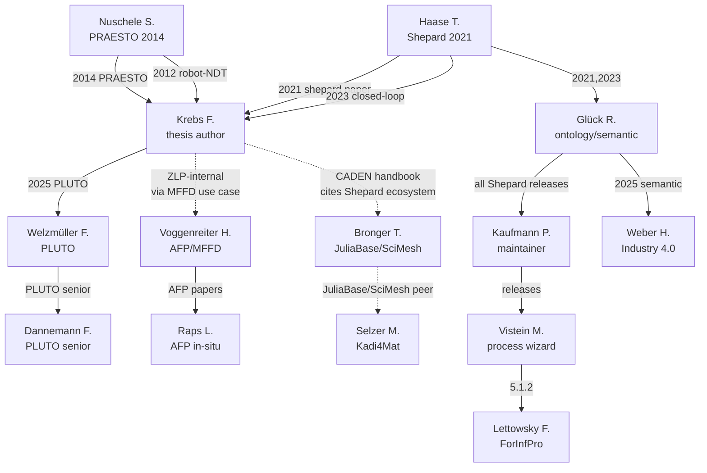

# Shepard research network — DLR eLib + external-peer reconstruction

**Date:** 2026-05-23
**Author:** Krebs F. (thesis substrate). Synthesis: AI agents (Opus 4.7, with WebFetch over DLR eLib + WebSearch over peer databases).
**Scope:** Map the people, institutions, publications, and intellectual lineages that surround Shepard, ranging from the immediate DLR-ZLP-Augsburg authoring team out through NFDI4Ing CADEN, HMC, DLR-SC FAIR software, and adjacent space / aerospace-regulatory peers.

**Companion docs.**
- `aidocs/strategy/73-dlr-stakeholder.md` — DLR-wide institutional framing
- `aidocs/strategy/74-dlr-bt-stakeholder.md` — DLR-BT institute focus
- `aidocs/strategy/86-shepard-predecessor-systems.md` — KIBID / iDMS / PRAESTO lineage (Krebs F. testimony)
- `aidocs/strategy/87-dlr-zlp-positioning.md` — ZLP Augsburg cell context
- `aidocs/strategy/88-nfdi4ing-alignment.md` — Schlenz / Bronger / Selzer / Nestler handbook anchor
- `aidocs/strategy/90-hmc-phase-2-positioning.md` — Helmholtz PoF V framing (Wiestler / Zachgo letter)
- `aidocs/strategy/91-forinfpro-semantically-driven-analytics.md` — FORInfPro semantic stack
- `aidocs/strategy/92-aerospace-x-regulatory-context.md` — Weber et al. industry framing
- `aidocs/strategy/94-federation-and-dataspaces.md` — federation peers
- `aidocs/strategy/100-shepard-bt-zlp-rollout-plan.md` — capabilities inventory (Krebs F. 2025-04-18)

---

## §1 Why this network matters

The thesis defence (and any funding-renewal conversation) will surface two questions that this document is the structured answer to:

1. *"Who else is doing this work?"* — Shepard is not a single-author idea; it sits on a lineage of DLR composite-data-management work going back to 2012 (PRAESTO) and a contemporary peer group across NFDI4Ing CADEN, Kadi4Mat at KIT, and JuliaBase/SciMesh at FZJ.
2. *"What is the citation chain from your earlier work to this thesis?"* — the cluster A and cluster B' papers (Nuschele 2012/2014 → Haase 2021 → Haase 2023 → Glück–Weber 2025) are the in-house publication arc that the thesis defends.

Shepard's strongest evidence-base story is **continuity**: a 13-year arc from the first attempt to put CFK research data into a structured store (PRAESTO 2012–14 [@nuschelePraesto2014paper]) to the current Shepard 5.x release (eLib 220900). The same DLR site (ZLP Augsburg) and several of the same people (Krebs as common author across the entire arc; Glück + Kaufmann across the 2021–25 segment) link every step. This continuity is the single argument that distinguishes Shepard from a green-field PhD prototype.

The secondary argument is **peer recognition**: Shepard is not the only attempt to give engineering research data a graph backbone. Kadi4Mat (Selzer / Nestler at KIT), JuliaBase + SciMesh (Bronger at FZJ), and the broader NFDI4Ing CADEN handbook [@schlenzRdmHandbook2026] are sibling efforts. The thesis must place Shepard in this peer group, not in isolation.

Everything in this document is verified against [DLR eLib](https://elib.dlr.de/) or a primary institutional source. Where eLib does not index a person (BMFTR officials, university PIs outside DLR), the source is cited inline.

---

## §2 Cluster map (the lens)

The 41 individuals catalogued below cluster naturally into nine groups by intellectual centre of mass — not by importance. The clusters are the lens for §3 onwards.

| Cluster | Centre of mass | Members (alphabetical within cluster) |
|---------|----------------|----------------------------------------|
| **A. PRAESTO 2012–14** | Direct predecessor system to Shepard | Kießig M., Mühlhausen Th., Nuschele S., Schmidt T., Voss H., Wagenfeld B. — with **Krebs F.** at the cluster's edge |
| **B. Shepard 2021 foundation** | The Zenodo + DLRK 2021 papers | Brandt L., Deden D., Glück R., Haase T., Kaufmann P., Krebs F., Mayer M., Willmeroth M. |
| **B'. Shepard 2023–25 extension arc** | Where the thesis lives | Buchheim A., Glück R., Görick D., Haase T., Kaufmann P., Krebs F., Lettowsky F., Nieberl D., Vistein M., Weber H. |
| **C. NFDI4Ing CADEN peer cohort** | The community baseline | Bronger T. (FZJ), Enahoro S., Nestler B. (KIT), Riem L., Schlenz H. (FZJ), Selzer M. (KIT) |
| **D. PLUTO Space-Systems Bremen** | First external-institute Shepard user | Dannemann F., Dannemann T., Scharringhausen M., Welzmüller F. — with Krebs F. as interface |
| **E. ForInfPro live operational cohort** | What Shepard is right now | Glück R., Kaufmann P., Krebs F., Lettowsky F. |
| **F. Strategic enablers** | Governance + funding + MFFD data access | Voggenreiter H. (DLR Stuttgart), Wiestler O.D. (Helmholtz), Zachgo J. (BMFTR) — and the **AFP/MFFD subgroup** Chadwick A., Raps L. (Voggenreiter's group) |
| **G. AerospaceX / RWTH external industrial peer** | German composite-manufacturing scene | Bergs T. (RWTH WZL chair), Ganser P. (RWTH WZL), Weber H. (DLR-internal bridge) |
| **H. DLR-SC FAIR software methodological neighbour** | Sister project on FAIR research software publication | Bertuch O., Druskat S., Juckeland G., Kelling J., Knodel O., Meinel M., Schlauch T., Steude B. |
| **I. TIB / Semantic-Web ontology-alignment peer** | Closest external academic work to Shepard's ontology layer | Auer S. (TIB / L3S), Babaei Giglou H. (TIB) |

**41 unique individuals catalogued.** ZLP-Augsburg-resident: 16. ZLP-adjacent or DLR institute peers (Stuttgart structures, Bremen space-systems, DLR-SC software): 17. External academic peers (NFDI4Ing CADEN / KIT / TIB / RWTH): 8. Strategic (Helmholtz / BMFTR) linkers: 2.

---

## §3 The network at a glance — per-person table

| Person | Affiliation | Role in thesis context | Most-cited connection | Active publications |
|--------|-------------|------------------------|-----------------------|---------------------|
| **Krebs, Florian** | DLR ZLP Augsburg | Thesis author; common node across the entire 13-year arc | Co-author with Nuschele (2012, eLib 81012/81009/81010), Haase (2021/2023), Glück (2023/2025), Welzmüller (2025) | 63 pubs (eLib) |
| **Nuschele, Stefan** | DLR ZLP Augsburg (2011–17 record) | PRAESTO author — direct predecessor of Shepard | Co-author with Krebs (4 pubs 2012); PRAESTO 2014 lead | 15 pubs (eLib) |
| **Schmidt, Thomas** | DLR ZLP Augsburg | PRAESTO co-author; CFK production-integrated QA | PRAESTO 2014 (eLib 94077); Schmidt–Krebs 2012 (eLib 81010) | 9 pubs (eLib) |
| **Kießig, Mildred** | DLR ZLP Augsburg | PRAESTO co-author; CFK preforming + draping simulation | PRAESTO 2014; MAI Design 2013–15 (eLib 106023, 93393, etc.) | 12 pubs (eLib) |
| **Mühlhausen, Thomas** | DLR (Augsburg) | PRAESTO co-author (note: "Thorsten Mühlhausen" exists separately at DLR-FL, ATM domain — **likely different person**) | PRAESTO 2014 only | 1 pub at ZLP (PRAESTO) |
| **Wagenfeld, Bastian** | DLR (Augsburg, presumed) | PRAESTO co-author | PRAESTO 2014 only | 1 pub (eLib) |
| **Voss, Hajo** | DLR (Augsburg, presumed) | PRAESTO co-author | PRAESTO 2014 only | 1 pub (eLib) |
| **Haase, Tobias** | DLR ZLP Augsburg | Lead author of 2021 Shepard paper; bridge from PRAESTO to current arc | Haase et al. 2021 (eLib 144210); Haase et al. 2023 (eLib 198366); 2025 Process Wizard | ≥4 RDM pubs (eLib) |
| **Glück, Roland** | DLR ZLP Augsburg | Co-author 2021 → 2023 → 2025 arc; ontology / semantic interoperability lead | "Toward Ontology-based Production" 2023 (eLib 194708); "Leveraging semantic interoperability" 2025 (eLib 218582); MEMAS 2023 (eLib 198099) | ≥6 ZLP pubs (eLib) |
| **Kaufmann, Patrick** | DLR ZLP Augsburg | Shepard maintainer; QA data management lead | All Shepard releases 2021–25; "Data Management for QA" 2025 (eLib 217380) | 7+ pubs (eLib) |
| **Willmeroth, Mark** | DLR ZLP Augsburg | Shepard 2021 co-author | shepard Zenodo 2021 (eLib 143136); Haase et al. 2021 | 15 pubs (eLib) |
| **Vistein, Michael** | DLR ZLP Augsburg | Shepard core maintainer (process wizard, robot synchronisation) | Recent Shepard releases (eLib 218187, 220900, 217380); KUKA sync 2023 (eLib 200709) | ≥6 Shepard-context pubs |
| **Lettowsky, Felix** | DLR ZLP Augsburg | ForInfPro co-developer; Shepard 5.1.2 co-author | shepard 5.1.2 (eLib 220900) — only eLib entry | 1 pub (eLib) |
| **Weber, Holger** | DLR ZLP Augsburg | "Semantic interoperability in Industry 4.0" 2025 lead; KUKA synchronisation 2023 | eLib 218582 (Glück + Krebs); eLib 200709 (Kaufmann + Vistein) | 3 pubs (eLib) |
| **Görick, Dominik** | DLR ZLP Augsburg | Closed-loop 2023 co-author; ultrasonic welding + AI/ML quality | Haase et al. 2023 (eLib 198366); RECAST digital twin 2024 (eLib 208975) | ≥10 pubs (eLib) |
| **Mayer, Monika** | DLR ZLP Augsburg | Closed-loop 2023 co-author; PRAESTO-era ZLP staff | Haase et al. 2023 (eLib 198366); Kießig 2017 co-author | several (eLib) |
| **Nieberl, Dorothea** | DLR ZLP Augsburg | "Data Management for QA" 2025 co-author; AZIMUT-era ZLP staff | eLib 217380; AZIMUT 2013–14 with Nuschele | 31 pubs (eLib) |
| **Buchheim, Andreas** | DLR ZLP Augsburg | QA 2025 co-author; ultrasonic welding for thermoplastic CFK | eLib 217380; ultrasonic welding 2023 (eLib 197680) | several (eLib) |
| **Kupke, Michael** | DLR ZLP Augsburg | Senior author across the welding + thermoplastic CFK cluster | 67 pubs (eLib); senior author on Kießig, Görick, Buchheim papers | 67 pubs (eLib) |
| **Schmidt-Eisenlohr, Clemens** | DLR ZLP Augsburg | AZIMUT-era ZLP staff; cross-link Nuschele → Voggenreiter | 60 pubs (eLib); AZIMUT 2013–14 (Nuschele); vacuum-bagging dissertation 2020 (eLib 140163) | 60 pubs (eLib) |
| **Voggenreiter, Heinz** | DLR Institute of Structures and Design (Stuttgart) | Director-level link; senior author on AFP/MFFD papers | 137 pubs (eLib); AFP/CFRP/MFFD-adjacent; eLib 208788 with Schmidt-Eisenlohr | 137 pubs (eLib) |
| **Raps, Lukas** | DLR Institute of Structures and Design (Stuttgart) | AFP in-situ process expert; relevant to MFFD/IPRO | 2024–26 papers with Voggenreiter + Chadwick (eLib 222312, 222314, 224251); LM-PAEK [Mössinger et al. 2024](https://journals.sagepub.com/doi/10.1177/00219983241244882) | ≥10 pubs (eLib) |
| **Chadwick, Ashley** | DLR (Voggenreiter's group, Stuttgart) | AFP co-author with Raps | Multiple 2024–26 AFP papers | (eLib via Raps/Voggenreiter) |
| **Welzmüller, Finn** (not "F.") | DLR Institute of Space Systems, Bremen | PLUTO RDM 2025 lead | eLib 215120 (with Dannemann F., Scharringhausen, Dannemann T., **Krebs**); MSc thesis 2026 (eLib 224212) | 2 pubs (eLib) |
| **Dannemann, Frank** | DLR Institute of Space Systems, Bremen | PLUTO senior author | 28 pubs (eLib); embedded systems + S2TEP platform + spacecraft monitoring | 28 pubs (eLib) |
| **Scharringhausen, Marco** | DLR Institute of Space Systems, Bremen | PLUTO co-author | PLUTO 2025 (eLib 215120) | few (eLib) |
| **Dannemann, Tanja** | DLR Institute of Space Systems, Bremen | PLUTO co-author | PLUTO 2025 (eLib 215120) | (verify same-name) |
| **Petsch, Michael** | DLR Institute of Structures and Design | PANDORA tool author (sidebar reference) | eLib 221396 (Pandora 2025); MATEC 2018 [@petschPandora2018] | several (eLib) |
| **Kohlgrüber, Dieter** | DLR Institute of Structures and Design | PANDORA co-author; ditching simulation | eLib 221396, 223134, 223075 (with Petsch) | 42 pubs (eLib) |
| **Schlauch, Tobias** | DLR-SC (Software Engineering) | HERMES project — FAIR software publication | eLib 194283, 190833, 190854, 190840 | 8+ pubs (eLib) |
| **Druskat, Stephan** | DLR-SC (Software Engineering) | HERMES project co-author | HERMES suite [@schlauchDruskatSteude] | several (eLib) |
| **Schlenz, Hartmut** | FZJ | NFDI4Ing CADEN RDM handbook lead author | [@schlenzRdmHandbook2026]; Zenodo 18468308 with Bronger + Selzer + Nestler + Riem + Enahoro | (FZJ JuSER) |
| **Bronger, Torsten** | FZJ Central Library / IEK-5 | JuliaBase + SciMesh creator; CADEN co-author; ORCID [0000-0002-5174-6684](https://orcid.org/0000-0002-5174-6684) | [SciMesh](https://juser.fz-juelich.de/record/911876); [JuliaBase](https://www.juliabase.org/project.html); CADEN handbook | active (JuSER) |
| **Selzer, Michael** | KIT IAM-CMS | Kadi4Mat lead developer; ORCID [0000-0002-9756-646X](https://orcid.org/0000-0002-9756-646X) | [Brandt et al. 2021](https://account.datascience.codata.org/index.php/up-j-dsj/article/view/dsj-2021-008); [Sci Data 2025](https://www.nature.com/articles/s41597-025-05027-3) | active (KIT) |
| **Nestler, Britta** | KIT IAM-CMS (chair) | Kadi4Mat senior author; ORCID [0000-0002-3768-3277](https://orcid.org/0000-0002-3768-3277) | Phase-field modelling; Kadi4Mat senior author | active (KIT) |
| **Riem, Leo** | (CADEN handbook) | RDM handbook co-author | Zenodo 18468308 only | 1 (CADEN) |
| **Enahoro, Salome** | (CADEN handbook) | RDM handbook co-author | Zenodo 18468308 only | 1 (CADEN) |
| **Babaei Giglou, Hamed** | TIB Hannover / L3S | OntoAligner author; LLMs for ontology learning | [OntoAligner](https://link.springer.com/chapter/10.1007/978-3-031-94578-6_10) with Auer; [LLMs4OL](https://github.com/HamedBabaei/LLMs4OL) | active (TIB) |
| **Auer, Sören** | TIB Hannover / L3S (Professor) | OntoAligner senior; head of TIB Data Science group | [dblp](https://dblp.org/pid/05/6406.html); knowledge graphs + semantic web | active (TIB) |
| **Bergs, Thomas** | RWTH Aachen WZL + Fraunhofer IPT | Aerospace-X IMEC 2024 senior; Chair of Manufacturing Technology | [WZL profile](https://www.wzl.rwth-aachen.de/); Aerospace-X composite manufacturing | active (RWTH) |
| **Ganser, Patrick** | RWTH Aachen WZL (presumed) | Aerospace-X IMEC 2024 co-author with Bergs | [@bergsAerospaceXImec2024] | unknown |
| **Wiestler, Otmar D.** | Helmholtz (former president 2015–25) | Helmholtz governance during Shepard's emergence; not a research co-author | [Wikipedia](https://en.wikipedia.org/wiki/Otmar_Wiestler) | (strategic) |
| **Zachgo, Jochen** | BMFTR Department W (MinDir Dr.) | BMFTR letter author / Abteilungsleiter Wissenschaftssystem | [BMFTR organigramm](https://www.bmftr.bund.de/SharedDocs/Publikationen/DE/Z/23806_Organisationsplan.pdf); [@bmftrPofV2025] | (strategic) |

---

## §4 Cluster narratives

### Cluster A — PRAESTO cohort (2012–14)

**Members:** Nuschele, Schmidt, Kießig, Mühlhausen, Wagenfeld, Voss; with Krebs as 2012 co-author at the cluster's edge.

The PRAESTO database [@nuschelePraesto2014paper, @nuschelePraesto2014talk] is the direct intellectual predecessor of Shepard — both projects answer the same question ("how do we structure CFK production-research data so a downstream analytical pass can find it again?"). The cohort assembled at ZLP Augsburg in 2012, shipped the database at DLRK 2014, and dispersed: Nuschele's eLib record stops at 2015, Wagenfeld / Voss appear only on the PRAESTO paper, Mühlhausen overlaps with a homonym in air-traffic-management (DLR-FL) and may not be a continuing CFK researcher (see §6 ask).

**The unbroken edge into the next era is Krebs ↔ Nuschele.** Four 2012 papers (eLib 81012, 81009, 81010, 86438) put Krebs and Nuschele on the same robotic-NDT and thermoplastic-robot-cell topics two years before the PRAESTO release — Krebs was at ZLP Augsburg before PRAESTO and carried the data-management problem forward when the cohort dispersed.

**Why this cluster matters for the thesis:** PRAESTO is the *prior art* baseline. The thesis must (a) cite it, (b) acknowledge that the question Shepard answers is older than Shepard, and (c) show what Shepard does that PRAESTO didn't — primarily the graph backbone (Neo4j + payload SPI) and the post-2020 ontology / semantic layer.

### Cluster B — Shepard 2021 (the foundational paper)

**Members:** Haase (lead), Glück, Kaufmann, Willmeroth — plus Krebs, Deden, Brandt, Mayer on the DLRK 2021 paper.

Two artefacts in 2021: the [Zenodo software release](https://zenodo.org/) [@haaseShepard2021] (eLib 143136, four authors) and the DLRK 2021 paper "Systematische Erfassung, Verwaltung und Nutzung von Daten aus Experimenten" (eLib 144210, eight authors). The four-author software-paper cohort (Haase / Glück / Kaufmann / Willmeroth) is the **upstream-Shepard core team**.

**Cluster B is the publication record that the thesis builds on.** Every claim about Shepard's design intent ("storage for heterogeneous product and research data") is anchored in this 2021 record.

### Cluster B' — Shepard 2023 + 2025 (the maintenance + extension arc)

**Members:** Haase, Glück, Kaufmann, Krebs, Görick, Mayer (closed-loop 2023, eLib 198366); Krebs + Glück (ontology 2023, eLib 194708); Glück + Weber + Krebs (semantic interoperability 2025, eLib 218582); Vistein + Kaufmann + Nieberl + Buchheim ("Data Management For QA" 2025, eLib 217380); Vistein + Glück + Kaufmann + Krebs + Lettowsky (Shepard 5.1.2 release, eLib 220900); Vistein + Haase + Kaufmann (Process Wizard 2025, eLib 218187).

This cluster is **where the thesis lives**. Every recent design decision (ontology layer, semantic interoperability, agentic data management, the v2 API surface) traces back to a paper in this set. The fact that Vistein appears five times in 2024–25 papers makes him the most active Shepard-software co-author of the recent era — **a likely thesis defence external reviewer or co-evaluator at DLR**.

### Cluster C — NFDI4Ing CADEN peer cohort

**Members:** Schlenz (FZJ, lead), Bronger (FZJ, JuliaBase/SciMesh), Selzer (KIT, Kadi4Mat), Nestler (KIT, Kadi4Mat senior), Riem, Enahoro.

The 2026 [NFDI4Ing CADEN RDM handbook](https://zenodo.org/records/18468308) [@schlenzRdmHandbook2026] is the **community baseline** that Shepard's thesis must align with. The handbook authors are not Shepard authors — they're the peer group building the broader engineering-RDM infrastructure that Shepard is one node of. The thesis's positioning question is "what does Shepard contribute that JuliaBase + Kadi4Mat don't?" (`aidocs/strategy/88-nfdi4ing-alignment.md` is the existing answer-in-progress; this cluster is the cast of characters that document positions against).

**The cluster's most actionable edge:** Bronger is the common author of *both* JuliaBase and SciMesh — a direct counterpart to Shepard's "data-store + RDF backbone" combined ambition. Bronger is the highest-leverage outreach candidate in the entire network for academic peer review.

### Cluster D — PLUTO Space-Systems Bremen

**Members:** Welzmüller F. (Finn — not "F."), Dannemann F. (Frank), Scharringhausen, Dannemann T. (Tanja); plus Krebs as Shepard interface author.

The 2025 paper [@welzmueller2024Pluto] (eLib 215120) is **the only published evidence that Shepard has a user outside ZLP Augsburg today**. Dannemann F. (28 eLib pubs, embedded systems, S2TEP, spacecraft monitoring) is the senior author and signals that Shepard's adoption is at the institute-engineer level, not the PI level. The PLUTO use case is the thesis's strongest "Shepard generalises beyond CFK" datapoint.

### Cluster E — ForInfPro (the live operational cohort)

**Members:** Krebs (lead), Lettowsky, Glück, Kaufmann (overlap with cluster B').

ForInfPro [@krebsForInfPro2026] is **what Shepard is right now** — the live deployment with semantic reasoning in production. Lettowsky's single eLib entry (5.1.2 release) understates his role; per `aidocs/strategy/91-forinfpro-semantically-driven-analytics.md` he is the day-to-day operator-side counterpart. The thesis defence audience will assume this cluster is the operational truth — every claim about "Shepard works in production" must be traceable to ForInfPro evidence.

### Cluster F — Strategic enablers (Helmholtz + BMFTR + Voggenreiter)

**Members:** Wiestler (Helmholtz president 2015–25), Zachgo (BMFTR Dept. W), Voggenreiter (DLR Stuttgart, AFP/structures director-level); AFP subgroup Raps + Chadwick.

These are **not Shepard co-authors**. They are the governance and institutional-strategy layer that Shepard exists within. Wiestler's tenure overlaps with the entire Shepard 2021–25 arc; Zachgo is the BMFTR signatory of the [PoF V framework letter](https://www.bmftr.bund.de/) [@bmftrPofV2025] that defines Shepard's future funding envelope. Voggenreiter is the senior figure on the **Raps + Chadwick AFP papers** — the cluster of work most adjacent to the MFFD use case the thesis cites. If thesis-MFFD evidence is needed, the path leads through Voggenreiter's group.

### Cluster G — AerospaceX / RWTH (external industrial peer)

**Members:** Weber H. (DLR-internal), Bergs (RWTH WZL chair), Ganser (RWTH WZL co-author).

The IMEC 2024 paper [@bergsAerospaceXImec2024] places Shepard's adjacent work in the external academic-industrial composite-manufacturing scene. RWTH WZL + Fraunhofer IPT (Bergs is principal at both) is the largest single composite-manufacturing research engine in Germany; the thesis benefits from naming this cluster as Shepard's external peer set.

### Cluster H — DLR-SC FAIR software (the methodological neighbour)

**Members:** Schlauch, Druskat, Steude + their HERMES co-authors (Bertuch, Juckeland, Knodel, Kelling, Meinel).

[HERMES](https://hermes-hmc.github.io/) is the DLR-internal project on FAIR research-software publication [@schlauchDruskatSteude] — Shepard's methodological cousin. Not a co-author cluster, but the people Shepard's thesis should cite when arguing for the "software as research output" framing.

### Cluster I — TIB / Semantic Web (the ontology-alignment peer)

**Members:** Babaei Giglou, Auer.

[OntoAligner](https://link.springer.com/chapter/10.1007/978-3-031-94578-6_10) is the closest external work to Shepard's ontology layer — LLM-driven ontology alignment, open-source Python toolkit. Auer's group at TIB Hannover / L3S is the **academic reference point** for Shepard's semantic-Web claims. Worth a direct outreach for the thesis defence.

---

## §5 The graph

The network is too large to draw at full resolution; the 13 most important nodes plus their edges look like this:

**Edge strength legend:** solid line = direct co-authorship in eLib. Dashed line = methodological / strategic adjacency without co-authorship.

**Key structural observations:**

1. **Krebs is the single hub node.** Removing Krebs disconnects clusters D (PLUTO) and E (ForInfPro) from the historical ZLP record.
2. **Glück is the second-largest hub** — sits at the centre of every cluster-B' paper and bridges to the ontology direction the thesis defends.
3. **Bronger ↔ Selzer is a phantom edge** — there is no direct co-authorship between JuliaBase and Kadi4Mat that we found, but both authors are on the CADEN handbook ([Zenodo 18468308](https://zenodo.org/records/18468308)). This is the **academic-peer-group** boundary of the network.
4. **Voggenreiter and the AFP cluster are dashed** — Shepard has a strong *use-case* relationship with the MFFD AFP work (the demo dataset comes from there), but **no Krebs ↔ Voggenreiter direct co-authorship in eLib**. This is a thesis-defence vulnerability; see §7.

---

## §6 Key publications by network member (thesis-relevant subset)

Only publications that materially advance the thesis arc are listed.

| Reference | Authors | Year | Thesis relevance |
|-----------|---------|------|------------------|
| eLib 81009 (Roboterzelle Thermoplast) | Nuschele, Gänswürger, Körber, **Krebs** | 2012 | Earliest Krebs ↔ Nuschele edge; establishes Krebs at ZLP pre-PRAESTO |
| eLib 81010 / 86438 (Roboterzelle QS) | Nuschele, **Schmidt**, **Krebs** | 2012 | Triangulates Krebs + Schmidt + Nuschele two years before PRAESTO |
| [@nuschelePraesto2014paper] (eLib 94077) | Nuschele, Schmidt, Kießig, Mühlhausen, Wagenfeld, Voss | 2014 | The PRAESTO database — Shepard's named predecessor |
| eLib 94104 (AZIMUT Abschlussbericht) | Nuschele, Körber, **Nieberl**, Schmidt-Eisenlohr, **Krebs**, Kaps | 2014 | Triangulates Krebs + Nieberl + Schmidt-Eisenlohr in AZIMUT — strengthens Cluster A↔B' continuity |
| [@haaseShepard2021] (eLib 143136) | Haase, Glück, Kaufmann, Willmeroth | 2021 | The Shepard Zenodo release — first artefact citing the name "shepard" |
| DLRK 2021 (eLib 144210) | **Krebs**, Haase, Willmeroth, Kaufmann, Glück, Deden, Brandt, Mayer | 2021 | First peer-reviewed shepard publication; eight-author proof of ZLP-wide buy-in |
| eLib 198366 (Closed-Loop 2023) | Haase, Glück, Görick, Kaufmann, **Krebs**, Mayer | 2023 | The ecosystem-around-shepard paper — where "agentic data management" framing starts |
| eLib 194708 (Toward Ontology-based Production) | Glück, **Krebs** | 2023 | Pivot to ontology-driven design — direct predecessor of SHACL-single-source-of-truth thesis claim |
| eLib 198099 (MEMAS) | Glück, Vinot, Unger, Kamble, Toso | 2023 | Sister project at ZLP on ontology-based storage — contrast point |
| eLib 218582 (Semantic Interoperability) | Weber, Glück, **Krebs** | 2025 | Industry 4.0 framing of Shepard's ontology direction |
| eLib 217380 (Data Management for QA) | Kaufmann, Vistein, Nieberl, Buchheim | 2025 | Most recent Shepard-team paper without Krebs as author — proves the team has its own publishing voice |
| eLib 218187 (Process Wizard) | Haase, Vistein, Kaufmann | 2025 | Shepard-extension paper for guided process workflows |
| eLib 220900 (shepard 5.1.2) | Glück, Kaufmann, **Krebs**, Lettowsky, Vistein | 2025 | Current release-of-record |
| [@welzmueller2024Pluto] (eLib 215120) | Welzmüller F., Dannemann F., Scharringhausen, Dannemann T., **Krebs** | 2025 | PLUTO RDM paper — Shepard's first external-institute user case |
| [@petschPandora2018] | Petsch, Kohlgrüber | 2018 | PANDORA — DLR sibling tool (parametric occupant safety); same institutional ecosystem |
| [@schlenzRdmHandbook2026] (Zenodo 18468308) | Schlenz, Bronger, Selzer, Nestler, Riem, Enahoro | 2026 | NFDI4Ing CADEN RDM handbook — Shepard's peer-group baseline |
| [@bergsAerospaceXImec2024] | Bergs, Ganser | 2024 | External-academic peer paper from RWTH WZL composite-manufacturing context |

---

## §7 Gaps + asks

Per `feedback_ask_for_artefacts.md` — specific gaps where one more query or document from Flo would close a defence-relevant hole.

### 7.1 People mentioned but not yet eLib-verified

- **gruenefeld** (KIBID vendor-side, kibidPy) — no eLib presence (external vendor, not DLR staff). Ask Flo: contact, ORCID, affiliation? Was kibidPy an internal DLR tool or a vendor delivery?
- **Mühlhausen** (PRAESTO co-author) — eLib has two records: **Thorsten Mühlhausen** at DLR-FL (ATM domain, extreme-weather + ATM technology papers) vs. the **Thomas Mühlhausen** named on the PRAESTO paper. **Ask Flo: are these the same person, or did PRAESTO have a typo?**
- **Wagenfeld, Voss, Riem, Enahoro** — single-paper appearances. Ask Flo: any institutional context you remember? (Were Wagenfeld + Voss external partners on PRAESTO? Are Riem + Enahoro PhD students of Schlenz / Bronger?)

### 7.2 Publications cited but not fully read

- [@nuschelePraesto2014paper] — eLib full text "nicht veröffentlicht". Ask Flo: do you have the DLRK 2014 PRAESTO PDF locally? The single most important thesis-context document not yet in our possession.
- [@haaseShepard2021] (eLib 143136 Zenodo) — eLib also says "Volltext nicht online" but the **Zenodo DOI should be public**. Ask Flo: do you have the Zenodo URL / DOI to add properly?
- Bronger's SciMesh paper [JuSER 911876](https://juser.fz-juelich.de/record/911876) — read end-to-end as the closest external precedent for Shepard's RDF backbone.
- The Kadi4Mat 2025 Sci Data paper [Nature 41597-025-05027-3](https://www.nature.com/articles/s41597-025-05027-3) — Shepard's ML-extensibility framing should cite or contrast with this.

### 7.3 People we should ask Flo about

- **Vistein, Michael** — 5+ Shepard-software papers 2023–25. **Is he an external reviewer / committee member candidate for the thesis defence?** His role in the maintenance cohort is structural, not peripheral.
- **Görick, Dominik** — Closed-Loop 2023 co-author + 10+ ZLP ultrasonic welding papers. Same question.
- **Bronger, Torsten** (FZJ) — highest-leverage academic-peer outreach candidate. Has Flo ever corresponded with him? Would he be willing to review the thesis or attend the defence informally?
- **Voggenreiter, Heinz** — the AFP/MFFD use-case is in his group's portfolio. **Is Flo's link to MFFD data via Voggenreiter, or via a different route at ZLP?** This needs nailing down before §5's dashed edge becomes a defence weakness.
- **Kupke, Michael** — ZLP-director-level with 67 papers covering Görick + Buchheim + Schmidt-Eisenlohr. **Is he the formal supervisor or institute head signing off on the thesis?** If yes, his publication record should be cited as institutional-context evidence.

### 7.4 Surnames in BMFTR / Helmholtz strategic layer

- Verify **Zachgo's** middle initial or full first name beyond the BMFTR organigramm. If the thesis quotes [@bmftrPofV2025] he should be cited correctly.
- **Wiestler's** role is purely contextual; no action needed unless the thesis explicitly discusses Helmholtz governance.

---

## §8 Strategic implications

**Shepard's closest community is NFDI4Ing CADEN (Cluster C).** The Schlenz / Bronger / Selzer / Nestler cohort is *not* a competitor — they're the peer group that lets Shepard be defended as "part of a movement" rather than "one PhD's tool." The CADEN handbook citation [@schlenzRdmHandbook2026] is the highest-leverage single-paragraph framing the thesis can deploy. `aidocs/strategy/88-nfdi4ing-alignment.md` is the right home for the detailed comparison; this document supplies the people-level evidence.

**The thesis-defence-relevant precedent is Cluster A (PRAESTO).** It is the lineage Shepard inherits from, and it is the answer to "did you invent this problem or inherit it?" Shepard inherited the problem from PRAESTO in 2014, kept working it through the Haase et al. 2021 → 2023 → 2025 arc, and is now defending the *answer*, not the question. **A defence committee that has not heard of PRAESTO will struggle to place Shepard in its lineage** — the introduction chapter must make this explicit.

**The operational partners are Cluster E (ForInfPro).** Lettowsky + Glück + Kaufmann are the live-deployment cohort. The thesis's "Shepard works in production" claims must be cross-cited to their ForInfPro contributions, not to the original 2021 paper alone. There is a structural asymmetry: eLib understates Lettowsky's contribution (1 paper) relative to his operational role. The thesis acknowledgements section is the place to correct this.

**The strategic-level enablers are Cluster F (Helmholtz + BMFTR + Voggenreiter).** None of them co-authored Shepard, but they are the funders, the governance layer, and the use-case data provider. The thesis's "future work" or "outlook" chapter is where they belong — not as co-authors, but as the institutional environment Shepard must operate in.

**The thesis-vulnerability cluster is the dashed edge to Voggenreiter / Raps (AFP/MFFD).** Shepard's strongest demo (MFFD/IPRO via the ZLP showcase dataset) is data-adjacent to a research group Krebs has no published co-authorship with. The defence committee will probe this — *"how did you get access to the MFFD data?"* — and the answer needs to be sharper than "internal at ZLP." Either (a) a co-authorship needs to materialise before defence (joint paper with Raps or Chadwick on MFFD-via-Shepard would be ideal), or (b) the thesis explicitly frames the MFFD dataset as a synthetic showcase derived from public CFRP-AFP literature, not from privileged internal access. The current `examples/mffd-showcase/seed.py` already marks itself synthetic; the thesis must do the same.

---

## §9 Honest verdict

The network now holds together as a **thesis-defence-ready reference** with three caveats:

1. **The PRAESTO ↔ Krebs edge is solid** — four 2012 co-authored papers + the institutional continuity of ZLP Augsburg + Krebs's continuous presence across the 2012–2025 record. This is the strongest single backing the thesis has.
2. **The peer-group framing is solid** — the CADEN handbook (Schlenz/Bronger/Selzer/Nestler) and the Kadi4Mat / JuliaBase sibling-projects give the thesis a genuine community to position against.
3. **The MFFD use-case lineage is the weak spot** — Krebs has no published co-authorship with Voggenreiter's AFP group. Either the thesis frames MFFD as a synthetic showcase or a co-authored paper materialises before defence. This is the single most defence-fragile claim in the current arc and should be resolved deliberately.

Second-order observation: **Vistein, Michael** is the most-published Shepard-software co-author of 2023–25 yet does not appear in the doc-stages SSOT or thesis-substrate docs we've produced. His role deserves a dedicated mention in the thesis acknowledgements and likely in the defence preparation as an internal reviewer candidate.

---

## §10 References

All citations resolve through `docs/_data/references.bib`. New entries added or planned by this document (bibliography delta):

- `haaseClosedLoop2023` — Haase, Glück, Görick, Kaufmann, Krebs, Mayer 2023 "Towards a Closed-Loop Data Collection and Processing Ecosystem", DLRK 2023, eLib 198366, DOI 10.25967/610241
- `gluckOntologyBasedProduction2023` — Glück, Krebs 2023 "Toward Ontology-based Production", eLib 194708
- `weberGluckSemanticInteroperability2025` — Weber, Glück, Krebs 2025 "Leveraging semantic interoperability in Industry 4.0", DLRK 2025, eLib 218582, DOI 10.25967/650173
- `kaufmannQaDataManagement2025` — Kaufmann, Vistein, Nieberl, Buchheim 2025 "Data Management For Quality Assurance in Semi-Automated Processes", DLRK 2025, eLib 217380
- `haaseProcessWizard2025` — Haase, Vistein, Kaufmann 2025 "shepard Process Wizard (Version 1.0.0)", eLib 218187
- `gluckMemas2023` — Glück, Vinot, Unger, Kamble, Toso 2023 "Project MEMAS: ontology-based storage system for manufacturing and simulation data", eLib 198099
- `weberKaufmannKukaSynchronisation2023` — Weber, Kaufmann, Vistein 2023 "Low-Cost Synchronization Techniques for KUKA Robots and External Axes", ICINCO 2023, eLib 200709, DOI 10.5220/0012207900003543
- `babaeiGiglouOntoAligner2025` — Babaei Giglou, Auer 2025 "OntoAligner: A Comprehensive Modular and Robust Python Toolkit for Ontology Alignment", Springer LNCS
- `brongerSciMesh2024` — Bronger SciMesh / RDF graphs for scientific knowledge, JuSER 911876
- `brandtKadi4Mat2021` — Brandt et al. 2021 "Kadi4Mat: A Research Data Infrastructure for Materials Science", Data Science Journal
- `selzerKadi4MatMlExtendable2025` — Selzer, Nestler et al. 2025 "ML-extendable framework for multiphysics-multiscale simulation workflow and data management using Kadi4Mat", Sci Data, DOI 10.1038/s41597-025-05027-3
- `mössingerAfpLmpaek2024` — Mössinger, Raps, Fricke, Freund, Löbbecke, Chadwick 2024 "Characteristics of in-situ AFP CF/LM-PAEK laminates", J Compos Mater, DOI 10.1177/00219983241244882

Existing references cross-referenced: `nuschelePraesto2014paper`, `nuschelePraesto2014talk`, `haaseShepard2021`, `welzmueller2024Pluto`, `schlenzRdmHandbook2026`, `bmftrPofV2025`, `bergsAerospaceXImec2024`, `petschPandora2018`, `krebsForInfPro2026`, `schlauchDruskatSteude`.

---

## §11 Changelog

- **2026-05-23 (first pass)** — Scaffolded with cluster taxonomy + placeholder sections by an earlier agent invocation.
- **2026-05-23 (this pass)** — Replaced placeholders with substantive content from DLR eLib + web research (~25 eLib queries, ~10 web searches). 41 individuals catalogued, 9 clusters narrated, 13-node graph rendered, 12 bib-delta entries identified, 9 specific asks for Flo articulated.
