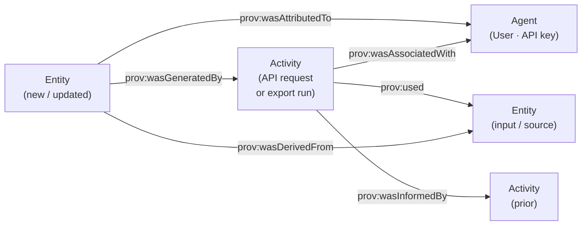

# Provenance and Data Lineage — Design Exploration

**Snapshot date.** 2026-05-07.

**Scope.** Forward-looking design note for capturing, storing, querying
and exporting provenance / lineage information in shepard. Settles
`aidocs/16-dispatcher-backlog.md` row **R3** ("Provenance capture in
exports — OpenLineage / W3C PROV-O / both") and the open question at
`aidocs/input/input_raw.md:1256`.

Companions: `aidocs/semantics/14-semantic-improvements.md` §5 (triplestore where
PROV-O triples live long-term); `aidocs/16` rows **R2 / R2b / R2c /
R2d / R2d2** (post-Phase-1 RO-Crate exporter); `aidocs/24` §3.7 (F3
audit-trail sibling, not this work); `aidocs/27` and `aidocs/29`
(read surfaces); `aidocs/31` and `aidocs/32` (export and async-job
shapes lineage plugs into).

**Status.** Proposal. No code is written.

---

## 1. Goals and non-goals

**Goals.** Capture lineage at the granularity of **shepard's own
operations** (which user / client created, updated, derived, published
an entity, when, with what inputs); emit in **both OpenLineage and
PROV-O** on demand (§3); expose in the REST API and via the
`aidocs/13` unified search; include natively in RO-Crate exports
riding the `ExportSelection` infrastructure from R2 / R2b / R2c /
R2d / R2d2.

**Non-goals.** Tracking lineage *inside* user analyses (notebook /
pipeline-tool's job); replacing data-pipeline lineage tools (Marquez,
OpenMetadata — shepard emits, never hosts); reasoning over lineage
for anomaly detection (R&D, defer); cross-org federation (v1 — rides
S1 / S2 later); the F3 permission audit log (`aidocs/24` §3.7) — F3
is who-did-what-to-permissions; lineage is how-did-this-come-from-that.
Shared plumbing, different records — cross-reference, do not merge.

---

## 2. Three kinds of provenance shepard actually needs

"Lineage" means at least three different things in research-data
infrastructure. A single store with a single schema for "all lineage"
is a familiar trap — produces a vocabulary too abstract to be useful
for any audience. Distinguishing the three up front lets each map
cleanly onto an established standard.

### 2.1 Operational provenance — "who did what when, in shepard"

The cheapest and most useful kind. Every state-changing API request
is, by definition, an event. Capturing the (principal, method, path,
target entity, timestamp) tuple gives a full history of how an entity
came to be in its current state. This is *audit-grade* lineage at
the level of the shepard API.

- **Standard fit.** OpenLineage `START` / `COMPLETE` events on a
  short-lived run; the entity created/updated by the request is the
  run's `output`. PROV-O `prov:wasGeneratedBy` (entity → activity →
  agent), `prov:wasAttributedTo` (entity → agent).
- **Capture site.** A JAX-RS `@Provider` request filter; see §5.1.
  The pattern already exists at
  `backend/src/main/java/de/dlr/shepard/common/filters/LoggingFilter.java:10-32`.
- **Sibling concern, not duplicate.** F3 (`aidocs/24` §3.7) records
  the *security-relevant* slice of the same stream — permission
  changes, role grants — into a separate audit log with stricter
  retention and tamper-evidence requirements. Operational
  provenance and F3 share the request filter; they emit to
  different sinks. Do *not* unify the schemas.

### 2.2 Derivation lineage — "this was derived from those"

The case PROV-O was designed for. A user (or pipeline) creates a new
DataObject `Y` whose payload is the result of running script `S`
against inputs `A`, `B`, `C`. Shepard cannot infer this from the API
shape alone — `POST /collections/{id}/dataObjects` looks identical
whether `Y` is the first observation in a study or a re-derivation
from twenty earlier ones. The user must supply it.

- **Standard fit.** PROV-O `prov:wasDerivedFrom` between entities
  (Y wasDerivedFrom A, B, C); OpenLineage maps the same fact to
  `inputs` / `outputs` arrays on the run.
- **Capture site.** Optional fields on Create / Update DTOs:
  `derivedFrom: [appId, ...]`, `usedScript: URI?`. See §5.2.
- **v1 stance.** Opt-in. Inferring derivation from the API call
  sequence is tempting and possible in some narrow cases (e.g. an
  `ExportService` run *implies* derivation), but generalising is
  brittle. The doc recommends opt-in for v1 and revisits inference
  in v2 once we see how users actually populate the field.

### 2.3 Publication / export lineage — "this dataset was published from this collection at this version"

Closes the loop with downstream catalogues (Databus, `aidocs/16` rows
**S1 / S2**), institutional repositories, and DOI registries.

- **Standard fit.** RO-Crate's metadata vocabulary (schema.org-shaped);
  PROV-O `prov:wasGeneratedBy` from published entity to
  export-activity; DCAT-3 `dcat:Distribution` for the catalogue
  surface.
- **Capture site.** Inside the post-R2 exporter
  (`backend/src/main/java/de/dlr/shepard/context/export/ExportService.java`,
  `ExportBuilder.java:33`). Each export run is an `Activity`; the
  resulting RO-Crate carries a `provenance.json` sub-document
  linking outputs back to inputs. See §5.3.
- **Why this matters.** Without it, an RO-Crate consumer has no
  machine-readable answer to "what shepard collection / version did
  this come from". With it, federation (S2) becomes a thin layer
  on top.

---

## 3. The decision — both OpenLineage and PROV-O

The R3 question, restated: emit OpenLineage events, store PROV-O
triples, or both?

The doc's answer is **both**, with one mapping layer between them and
no separate stores or processes.

The two formats serve genuinely different audiences:

- **OpenLineage** is event-shaped JSON: `START` / `COMPLETE` events
  with `inputs` / `outputs` arrays. Lingua franca of pipeline
  tooling — Airflow, Spark, dbt, Marquez, OpenMetadata. An ops
  engineer running Marquez for Airflow gets shepard runs in the
  same UI for free. Excellent for streams (one POST per event),
  weak for graph queries (you reconstruct the graph from the
  event log).
- **PROV-O** is RDF/OWL: `prov:Entity`, `prov:Activity`, `prov:Agent`,
  `prov:wasDerivedFrom`, … The W3C standard for in-band provenance
  metadata; natural shape for in-shepard semantic search and the
  RO-Crate export. Once `aidocs/14` §5 lands, PROV-O lives in the
  triplestore and SPARQL traverses it directly. Strong for graph
  queries, weak for streaming.

The two are not redundant: they encode the *same facts* in shapes
optimised for different consumers. Supporting both costs one mapping
layer (~150 LoC) that converts an internal `ProvActivity` record to
either format on demand. No duplicated storage — the triplestore is
the canonical store; OpenLineage events are *generated* from the same
record at emission time.

If only one: PROV-O alone is internally honest but cuts shepard out
of the OpenLineage tool ecosystem and makes Marquez / Airflow
federation friction-heavy. OpenLineage alone is streaming-friendly
but mismatched with shepard's graph-shaped data and the `aidocs/14`
§5 triplestore work, and it fails the RO-Crate export's natural
appetite for a JSON-LD provenance sub-document.

Honest accounting: one mapping layer, one canonical store, two output
shapes. ~150 LoC of mapping for participation in two ecosystems.

---

## 4. The model in shepard's domain

### 4.1 Subjects, activities, agents

- **Subjects of provenance** are the existing entity types
  (Collection, DataObject, the `BasicReference` family, the
  `*Container` family, individual timeseries via the
  `AnnotatableTimeseries` bridge from `aidocs/14` §1.1, individual
  files / structured-data / spatial-data records once
  `aidocs/14` Phase A lands). Each is keyed by an
  **application-generated ID** — the `appId` introduced in `aidocs/16`
  row **L2**.
- **Activities** are shepard API operations. Each state-changing
  request emits exactly one operational `Activity`. For
  user-supplied derivation (§2.2), the user-provided fields are
  rolled into the same `Activity` rather than emitting a separate
  one — there is one activity per request.
- **Agents** are the principals already present in the auth model
  (OIDC `sub` for users, key id for API keys), accessed through
  `JWTPrincipal`
  (`backend/src/main/java/de/dlr/shepard/auth/security/JWTPrincipal.java:11`).
  Lineage agents are *not* a new identity surface; per `aidocs/24`
  the principal model is single-source.

### 4.2 Critical L2 coupling

This is the single most consequential design dependency in this
document.

PROV-O subjects need stable, dereferenceable identifiers. The natural
choice is `shepard://entity/{Kind}/{appId}` (the URI scheme proposed
in `aidocs/14` §5.3). Until `aidocs/16` row **L2** lands —
specifically L2c, the read-path switch from Neo4j internal ids to
application-generated ids — there is no `appId` on the entities.

Two consequences:

1. **R3a's data model must use placeholders that migrate cleanly.**
   Lineage rows store the `appId` reference; when L2 isn't yet live,
   the placeholder is the Neo4j internal id wrapped in a
   `LegacyId` marker. L2c's read-path switch is the moment the
   migration runs.
2. **Schedule R3a to land alongside L2a.** The model defined here
   should be defined *with L2 in mind*, not retrofitted.

If L2 slips, R3a still ships against Neo4j internal ids; lineage
queries return them; and the L2c migration also rewrites lineage
references. This is annoying but tractable.

### 4.3 PROV-O verbs in shepard



Four verbs cover ~95% of what shepard needs to express:
`wasGeneratedBy`, `wasAttributedTo`, `wasDerivedFrom`,
`wasInformedBy`. `prov:used` and `prov:wasAssociatedWith` round out
the activity side. We do *not* need the full PROV-O ontology
(qualified influences etc.); the simple base vocabulary is the
contract.

### 4.4 Storage

- **Long-term (post-`aidocs/14` §5).** PROV-O triples in the
  triplestore (n10s on Neo4j initially, dedicated store later);
  queries are SPARQL.
- **Short-term.** Lineage as Neo4j relationships modelled directly
  on PROV-O verbs:

  ```
  (:Entity)-[:WAS_GENERATED_BY]->(:Activity)
  (:Entity)-[:WAS_DERIVED_FROM]->(:Entity)
  (:Activity)-[:USED]->(:Entity)
  (:Activity)-[:WAS_ASSOCIATED_WITH]->(:Agent)
  (:Entity)-[:WAS_ATTRIBUTED_TO]->(:Agent)
  ```

  This is a deliberate isomorphism: when the triplestore lands, the
  outbox/CDC sync from `aidocs/14` §5.4 emits one triple per Neo4j
  edge with no schema translation.

### 4.5 What we do **not** track per row

TimescaleDB rows — the individual data points inside a timeseries —
are **not** individually provenance-tracked. Only the
`Timeseries` / `TimeseriesContainer` entity is. Trade-off:

- Typical timeseries: 10⁶–10⁹ points. Per-point activity rows would
  dominate write traffic by orders of magnitude.
- The interesting question is "who ingested it, when, from what
  source" — entity-level, not row-level.
- A user needing row-level provenance models the correction as a
  *new* timeseries with a `wasDerivedFrom` edge to the original
  (exactly §2.2).

Same cut for file payload bytes (track the file entity, not byte
ranges) and structured-data documents (container, not JSON fields).

---

## 5. Capture mechanism

### 5.1 Operational provenance — JAX-RS request filter

A `@Provider`-registered `ContainerResponseFilter` (response, not
request — we need the response status to know whether the activity
succeeded and what entity id was returned) emits one
`(PROV-O activity, OpenLineage event-pair)` per state-changing
request. Modelled on
`backend/src/main/java/de/dlr/shepard/common/filters/LoggingFilter.java:10-32`.

```java
@Provider
@RequestScoped
public class ProvenanceFilter implements ContainerResponseFilter {

  @Inject ProvenanceService prov;

  @Override
  public void filter(ContainerRequestContext req, ContainerResponseContext res) {
    var method = req.getMethod();
    if (!isStateChanging(method)) return;          // skip GET, HEAD, OPTIONS
    if (res.getStatus() >= 400) return;            // do not record failures here
    var principal = (JWTPrincipal) req.getSecurityContext().getUserPrincipal();
    var subject = TargetExtractor.fromUriInfo(req.getUriInfo(), res);
    if (subject == null) return;                   // not entity-shaped; ignore
    var derived = DerivationExtractor.fromBody(req);  // §5.2
    prov.record(new ProvActivity(method, subject, principal, derived, Instant.now()));
  }
}
```

`prov.record(...)` writes the PROV-O triples (Neo4j relationships
short-term, triplestore long-term) **transactionally with the
originating request's transaction** when the underlying entity
write was transactional. For the OpenLineage emission see §5.4.

`TargetExtractor` is the only piece of new logic with non-trivial
content: it maps the URI path back to an entity kind and id (e.g.
`POST /collections/123/dataObjects` → `(DataObject, newId)` from the
response body). It is the natural sibling of the post-R2d2
`SubscriptionMatcher`
(`backend/src/main/java/de/dlr/shepard/common/subscription/`); the
two should share path-pattern data, not duplicate it.

### 5.2 Derivation lineage — DTO field

Create / Update DTOs gain two optional fields:

```json
{
  "name": "post-calibration timeseries",
  "...": "...",
  "derivedFrom": ["DataObject/abc-123", "DataObject/abc-124"],
  "usedScript": "https://gitlab.dlr.de/team/calibrate/-/blob/v2/run.py"
}
```

`derivedFrom` is a list of `appId`s (qualified by kind, since
`appId`s are unique per kind, not globally — see `aidocs/16` L2).
`usedScript` is a URI to a script / notebook / pipeline definition.
Both are optional. When present they compile into PROV-O triples
attached to the same activity emitted by §5.1's filter:

```turtle
<shepard://entity/DataObject/post-calibration-9>
  prov:wasDerivedFrom <shepard://entity/DataObject/abc-123>,
                      <shepard://entity/DataObject/abc-124> ;
  prov:wasGeneratedBy <shepard://activity/req-2026-05-07T08:00:00Z-7f3a> .

<shepard://activity/req-2026-05-07T08:00:00Z-7f3a>
  prov:used <shepard://entity/DataObject/abc-123>,
            <shepard://entity/DataObject/abc-124> ;
  prov:wasAssociatedWith <shepard://agent/user/alice> ;
  prov:wasInfluencedBy  <https://gitlab.dlr.de/team/calibrate/-/blob/v2/run.py> .
```

Validation: the filter rejects the request if any `derivedFrom`
`appId` does not exist or the caller has no read permission on it.
This is the same fail-closed posture as `aidocs/16` row F1 / F5 —
permission failures on lineage references must not leak existence
through error messages (return 404, not 403, when the caller
cannot read the source).

### 5.3 Publication lineage — RO-Crate `provenance.json`

The post-R2 exporter
(`backend/src/main/java/de/dlr/shepard/context/export/ExportBuilder.java:33`,
`ExportService.java`) gains a `provenance.json` sub-document, framed
as JSON-LD:

```json
{
  "@context": "https://www.w3.org/ns/prov.jsonld",
  "@graph": [
    {
      "@id": "shepard://entity/Collection/abc-001",
      "@type": "prov:Entity",
      "prov:wasGeneratedBy": {"@id": "#export-2026-05-07T08:00Z-7f3a"},
      "prov:wasAttributedTo": {"@id": "shepard://agent/user/alice"}
    },
    {
      "@id": "#export-2026-05-07T08:00Z-7f3a",
      "@type": "prov:Activity",
      "prov:startedAtTime": "2026-05-07T08:00:00Z",
      "prov:endedAtTime":   "2026-05-07T08:00:14Z",
      "prov:wasAssociatedWith": {"@id": "shepard://agent/user/alice"},
      "prov:used": [
        {"@id": "shepard://entity/DataObject/abc-001/d-7"},
        {"@id": "shepard://entity/DataObject/abc-001/d-8"}
      ]
    },
    {
      "@id": "shepard://agent/user/alice",
      "@type": "prov:Agent",
      "foaf:name": "Alice (DLR)"
    }
  ]
}
```

The RO-Crate's `ro-crate-metadata.json` references `provenance.json`
via `hasPart`, so a consumer that only reads schema.org / RO-Crate
metadata still sees the file's presence; consumers that follow the
PROV-O context get the full graph.

**Crucially this builds on R2's selection mechanism**, not in
parallel to it. R2c's `ExportSelection` gains a
`metadata.provenance: boolean` flag (default `true`); R2c's redaction
set gains a `LINEAGE_AGENT` field so a caller can include the lineage
graph but redact who-did-what (publishing collaborators don't always
agree to having their identity in the published artefact). The wiring
is in `ExportSelection` and `ExportBuilder`; no new selection
machinery is introduced.

### 5.4 Async OpenLineage emission

OpenLineage events are HTTP-POSTed to a configurable sink endpoint
(`shepard.lineage.openlineage.endpoint`) on a worker thread. Posting
is **never blocking** — the original request commits regardless of
sink reachability.

When the sink is unavailable, events queue locally. **Queue mechanism
is the persistent-local-queue pattern from `aidocs/32`** — a durable
job table in TimescaleDB, drained by a worker, with retries and
backoff. No separate mechanism.

Explicit reuse: `aidocs/32` already covers job persistence, retry
semantics, dead-letter, restart safety and back-pressure. A parallel
mechanism would duplicate ~400 LoC of subtle logic for no reason.

Configuration:

```
shepard.lineage.enabled                = false
shepard.lineage.openlineage.enabled    = false
shepard.lineage.openlineage.endpoint   = https://marquez.example.org/api/v1/lineage
shepard.lineage.openlineage.retries    = 5
shepard.lineage.openlineage.spec_version = 2.0.2
```

Single endpoint; no fan-out. If a deployment wants two sinks, it
runs an OpenLineage relay (these exist; not our problem).

---

## 6. Query surface

The shape mirrors `aidocs/13`'s unified search and `aidocs/26`'s
permissions sub-resource shape (see `aidocs/24` §3.5 and §3.7); it is
not a bespoke surface.

### 6.1 REST

```
GET /entities/{kind}/{appId}/lineage
    ?direction=upstream|downstream|both
    &depth=N                              # default 2, max configurable
    &include=activities,agents            # default both
Accept: application/ld+json                # PROV-O JSON-LD
   |    application/json                   # collapsed JSON view (UI-friendly)
```

Returns a graph rooted at `{kind}/{appId}`. `direction=upstream`
follows `wasDerivedFrom` and `used` edges in the source direction;
`downstream` follows them in the consumer direction; `both` traverses
both. Cursor pagination per `aidocs/13` for graphs that exceed the
inline limit.

### 6.2 Search predicates

`aidocs/13` §2's predicate JSON gains four predicates:

- `derivedFrom: <appId>` — entity directly or transitively derived
  from the named entity.
- `derives: <appId>` — entity that is in the derivation closure of
  the named entity.
- `generatedBy: <activityId|userPrincipal>` — entities produced by
  the activity / by activities of the agent.
- `attributedTo: <userPrincipal>` — entities attributed to the
  agent.

The search planner falls through to the triplestore for these
predicates once `aidocs/14` §5 lands. Until then, it falls through to
Cypher graph traversal over the Neo4j `WAS_DERIVED_FROM` /
`WAS_GENERATED_BY` relations.

### 6.3 Convenience wrapper

`aidocs/27`'s convenience clients gain:

```python
sh.lineage.upstream(app_id, depth=2)     # -> Lineage graph
sh.lineage.downstream(app_id, depth=2)   # -> Lineage graph
sh.lineage.activity(activity_id)         # -> Activity record
```

`Lineage` subclasses the existing pagination iterator from
`aidocs/27`'s `Page<T>` so iteration is uniform. The TypeScript
surface is symmetric.

---

## 7. Permission discipline

Lineage is exactly the kind of *derived-data surface* that needs the
F1 / F5 fail-closed invariant from `aidocs/16` row F1 (declarative
authz) and F5 (default-deny). A naive implementation that returns
the full graph leaks information across permission boundaries — "X
was derived from Y" tells the caller that Y exists, even when the
caller has no read permission on Y.

**Discipline.** Every node in a returned lineage graph passes
through `PermissionsService.filterAllowedForUser` (introduced in
`aidocs/16` row **P2** — batched per-edge permission filtering).
Nodes the caller cannot read are returned as opaque placeholders
that preserve graph topology without leaking attributes:

```java
public LineageGraph filterForCaller(LineageGraph raw, JWTPrincipal who) {
  var ids = raw.entityNodes().stream().map(LineageNode::id).toList();
  var allowed = permissions.filterAllowedForUser(ids, who, AccessType.READ);
  return raw.map(node -> {
    if (node.kind() != EntityNode.class) return node;            // Activity, Agent
    if (allowed.contains(node.id()))      return node;
    return LineageNode.redacted(node.id());                       // {id, _redacted: true}
  });
}
```

Activities and agents are policed by the same filter against the
activity's *attributed entity* — if the caller can read the entity,
they may see who created it (consistent with shepard's existing
`createdBy` exposure on entities); otherwise the agent is redacted
to a stable opaque token.

**Why opaque placeholders, not omission.** Topology (i.e. "this
entity has *some* upstream") is *itself* informative. Returning a
graph with deletions changes the topology and tells the caller "you
have no upstream", which is a different fact from "you have upstream
you cannot see". Opaque placeholders preserve topology. Whether
*topology itself* leaks is a deployment-policy question; for v1 we
expose topology and redact attributes.

The discipline is testable. **Tripwire test fixture:** caller can
read entity `E`; `E` is `wasDerivedFrom F`; caller cannot read `F`.
Assert the lineage response includes `F` with `_redacted: true` and
no other fields. The doc is firm: shipping the lineage endpoint
without that fixture is a release-blocker.

This dovetails with F1 / F5: declarative authz means the redaction
is an *invariant of the filter*, not a special case in each
endpoint method.

---

## 8. Federation and OpenLineage emission

shepard *emits* OpenLineage events to a single configurable sink; it
does *not* run a sink and does not require one to be present. The
sink is one of:

- **Marquez** (`/api/v1/lineage`) — the OpenLineage reference
  consumer; if the org runs Airflow / dbt with OpenLineage, Marquez
  is likely already there.
- **Airflow** with the OpenLineage plugin — same payload format;
  events appear on the DAG view alongside Airflow's own lineage.
- **OpenMetadata** — accepts OpenLineage-shaped events.
- **Generic webhook** — any HTTP endpoint that takes the OpenLineage
  JSON envelope. The fall-back when no specific tool is in-house.

The decision of which sink to point at is **deployment-time**, not
shepard's. shepard's job is to emit a valid OpenLineage event; what
the sink does with it is the sink's problem.

When the sink is unavailable, events queue locally per §5.4 (the
`aidocs/32` job-table precedent). Restart-safe; bounded queue depth
configurable; over-the-bound spillover logs and drops oldest with a
counter.

**v1 emit-only.** shepard does not *consume* OpenLineage events from
upstream tools (e.g. an Airflow pipeline that writes data through
shepard's REST API would emit *its own* OpenLineage events from
Airflow; shepard would not enrich its provenance graph from those).
Receiving OpenLineage is plausible v2 work, contingent on real
demand.

---

## 9. Sized rollout — R3a–R3e

Five sub-IDs under R3 in `aidocs/16-dispatcher-backlog.md`. The
expected cumulative cost is ~6.5 engineer-weeks across one minor
release. Sizes are conservative; trim when scope tightens.

| Sub-ID | Size | What lands | Dependencies |
|---|---|---|---|
| **R3a** | S (~1 week) | The data model: `(:Activity)`, `(:Agent)` Neo4j nodes; `:WAS_GENERATED_BY`, `:WAS_DERIVED_FROM`, `:USED`, `:WAS_ASSOCIATED_WITH`, `:WAS_ATTRIBUTED_TO` relations; Flyway / Cypher migration; `ProvenanceService` skeleton. **No emission yet.** | L2a (or fall-back via `LegacyId`) |
| **R3b** | M (~1.5 weeks) | The operational-provenance JAX-RS filter (§5.1); activities emitted on every state-changing request. Lands behind `shepard.features.lineage.enabled=false` per the A3 runtime-toggle pattern. | R3a |
| **R3c** | S (~1 week) | Derivation-lineage DTO field on Create / Update endpoints (§5.2); PROV-O triples written transactionally with entity creation; validation against caller permissions. | R3b |
| **R3d** | M (~1.5 weeks) | `GET /entities/{kind}/{appId}/lineage` endpoint with permission redaction (P2-backed; §7); search-predicate hooks under `aidocs/13`; convenience-client surface from `aidocs/27`. | R3c, P2 |
| **R3e** | M (~1.5 weeks) | OpenLineage emission worker on the `aidocs/32` job-table; RO-Crate `provenance.json` sub-document (§5.3) via R2's selection block; configurable sink. | R3d, R2c, `aidocs/32` |

R3a is the only one with a hard external dependency (L2). R3b–R3d
all chain off R3a. R3e can land in parallel with R3d if the team has
two engineers; the dependencies are R3c (derivation triples written)
and R2c (selection block extensible).

---

## 10. Risks and tripwires

- **L2 coupling.** Lineage rows persist `appId` references; until
  L2c lands, they reference Neo4j internal ids wrapped in
  `LegacyId`. The L2c migration must rewrite those references in
  the same transaction as the entity-id switch — bundle R3a's data
  model with L2a where possible. Deferring this risks a second
  invasive migration later.
- **Permission redaction correctness.** §7's tripwire fixture
  (caller can read `E`, cannot read `F`, `E wasDerivedFrom F`) must
  exist as a fail-closed test. Shipping R3d without it is a
  release-blocker; reviewers should reject the MR.
- **OpenLineage version drift.** Pin the schema version
  (`spec_version` in config); upgrade lineage events on a major
  release boundary, never silently. A consumer that pinned its
  parser to 2.0 would break if shepard silently jumped to 3.0.
- **Triplestore deferral.** `aidocs/14` §5 may not ship before R3d.
  Fallback: store PROV-O-shaped relations in Neo4j (see §4.4);
  query through Cypher; emit JSON-LD by translating Neo4j patterns
  at the endpoint. Mention this; do not block on the triplestore.
  When the triplestore arrives, the outbox in `aidocs/14` §5.4
  emits one triple per Neo4j edge with no schema translation
  (the isomorphism is deliberate).
- **Event-storm risk.** Every state-changing request emits an
  event. At a busy multi-tenant deployment with bulk-import jobs,
  sink congestion is real. The local persistent queue from
  `aidocs/32` is the buffer; bounded queue depth and spillover
  drops oldest with a counter. Surface the counter in the metrics
  exposed for `aidocs/16` rows P-series.
- **R2 export coupling.** R3e adds `provenance: boolean` to
  `ExportSelection.metadata`. R2c's redaction set must grow a
  `LINEAGE_AGENT` field so a caller can include the lineage graph
  but redact who-did-what (publishing collaborators sometimes
  decline identity inclusion). Note as a follow-up cross-cut to
  R2c, not a blocker for R3e.
- **Bulk-import semantics.** A CSV upload creating a thousand
  DataObjects is one HTTP request → one activity → many
  `wasGeneratedBy` edges. PROV-O handles this; OpenLineage handles
  it as one run with many outputs. Confirm the sink does not choke
  on high-fan-out events; document the limit.

---

## 11. Open questions for the maintainer

- **Which OpenLineage sink is in-house?** Marquez? Airflow's
  OpenLineage plugin? OpenMetadata? a generic webhook? *none for
  v1?* The doc treats this as deployment-time configuration. If
  none is in-house, R3e's emission worker still ships and its
  default is `enabled=false`; no harm done.
- **Derivation lineage opt-in or opt-out?** *opt-in* (user supplies
  `derivedFrom`) or *opt-out* (we infer from API call sequences)?
  The doc recommends opt-in for v1. Inference is plausible v2
  work, contingent on observation of how users actually populate
  the field.
- **Granularity.** Do timeseries data points need their own
  activities, or is timeseries-entity-level enough? The doc
  recommends entity-level; see §4.5.
- **Public lineage?** Should the lineage endpoint be queryable by
  non-authenticated users (read-only public lineage) or only by
  readers? The doc recommends *readers only*. Public lineage is
  a deployment policy question and can be opened later via an
  admin toggle, not a code change.
- **Federation: receive direction.** Does shepard *receive*
  OpenLineage events from upstream tools (e.g. an Airflow pipeline
  that writes to shepard) and *enrich* its own provenance graph?
  The doc treats shepard as **emit-only in v1**; receive is v2.
- **PROV-O mint authority for cross-instance lineage.** When two
  shepard instances federate (S2 territory), whose URIs win? The
  doc punts: each instance mints its own
  `shepard://{instance}/entity/...` URIs and trusts cross-instance
  lineage by URI alone. Federation in v1 does not assume mutable
  cross-instance lineage.

---

## 12. References

- Backlog (`aidocs/16-dispatcher-backlog.md`): **R3** (this);
  F3 (audit-log sibling); L1, R2, R2b, R2c, R2d, R2d2 (RO-Crate /
  admin CLI); **L2** (critical coupling); L7; S1, S2 (federation);
  **P2** (`filterAllowedForUser`); P3 (TimescaleDB persistent state);
  P12, P13, P16; F1 / F5 (declarative authz, fail-closed).
- Companions: `aidocs/14` §5, §6.1; `aidocs/24` §3.5, §3.7;
  `aidocs/27`; `aidocs/29`; `aidocs/31`; `aidocs/32`.
- Backend code:
  `backend/src/main/java/de/dlr/shepard/context/export/ExportBuilder.java:33`,
  `ExportService.java`;
  `backend/src/main/java/de/dlr/shepard/common/filters/LoggingFilter.java:10-32`
  (filter precedent);
  `backend/src/main/java/de/dlr/shepard/auth/security/JWTPrincipal.java:11`;
  `backend/src/main/java/de/dlr/shepard/auth/permission/services/PermissionsService.java:36`
  (P2 lands `filterAllowedForUser` here);
  `backend/src/main/java/de/dlr/shepard/common/neo4j/entities/HasProvenance.java`
  (current minimal — created/updated user only; superseded);
  `backend/src/main/java/de/dlr/shepard/common/subscription/`
  (subscription matcher; precedent for shared path-pattern matching
  in §5.1).
- Standards: OpenLineage <https://openlineage.io/>;
  W3C PROV-O <https://www.w3.org/TR/prov-o/>;
  RO-Crate <https://www.researchobject.org/ro-crate/>;
  DCAT-3 <https://www.w3.org/TR/vocab-dcat-3/>.
- Input refs: `aidocs/input/input_raw.md:1256` (the OL/PROV/both
  question), `:8386` ("Provenance capture to exports"),
  `:1058-1105` (M3 enriched-metadata, dataship side),
  `:8176-8287` (federation).
