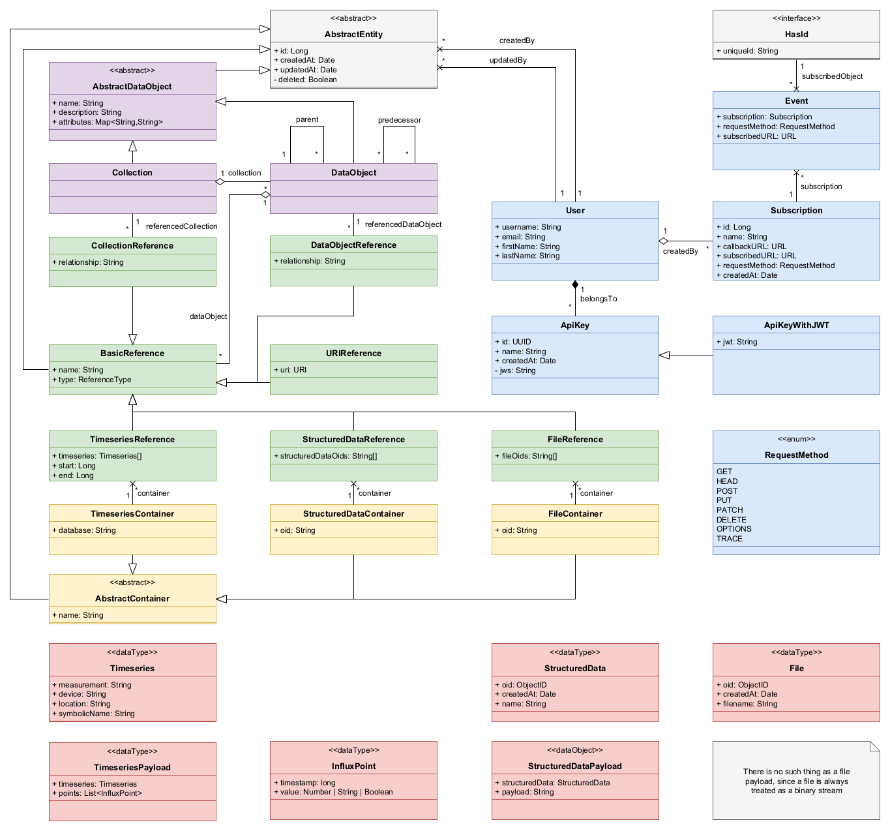

# API V2

## Ideas

- Major(!) rework of data structure
  - following Fair Digital Object (FDO)
  - <https://www.nist.gov/programs-projects/facilitating-adoption-fair-digital-object-framework-material-science>
  - in this context --> PID (Persistant Identifier) und DTR (Data Type Registry)
- Collections
  - Collections contain data-objects
  - enables main data (Stammdaten), personal data collections
  - Basic Permissions can be managed via collections
  - References
    - <https://www.rd-alliance.org/groups/research-data-collections-wg.html>
    - <http://rdacollectionswg.github.io/apidocs/#/>
    - <https://github.com/RDACollectionsWG/specification>
- DataObjects
  - While collections are high-level objects to manage things, DataObjects are there to aggregate related data references
  - DataObjects can be used to model a measurement, a situation, a component, etc.
  - Has relationships with other DataObjects (hierarchical and chronological)
- References
  - Points to one or more datasets within one container
  - Expresses a `part-of` relationship between the dataset and the parent data object, as opposed to `EntityReference` which only references another entity
- Container
  - A container is a separate area within an internal database (e.g. a `database` in InfluxDB or a `collection` in MongoDB)
  - Detailed permissions for these internal databases are managed via containers
  - To store data, a container must be created beforehand
  - Data can only be stored within an existing container

## Endpoints

### Organisational Entities

- `/collections` - get all collections, create a collections
- `/collections/<id>` - get/update/delete a specific collections
- `/collections/<id>/dataObjects/<id>` - get/update/delete a specific DataObject
- `/collections/<id>/dataObjects/<id>/references` - get all references of the given DataObject
- `/collections/<id>/dataObjects/<id>/references/<id>` - get/update/delete a specific reference

### User

- `/user` - get the current User
- `/user/<username>` - get a specific user
- `/user/<username>/apikeys` - get all API keys, create a API key
- `/user/<username>/apikeys/<id>` - get/update/delete a specific API key
- `/user/<username>/subscriptions` - get all subscriptions
- `/user/<username>/subscriptions/<id>` - get/update/delete a specific subscription

### Database Integrations

The following endpoints exist optionally for each kind of data:

#### Structured Data Container

- `/structureddata` - create structured data container
- `/structureddata/<id>` - get/update/delete a specific structured data container
- `/structureddata/<id>/search` - backend search service for structured data container
- `/structureddata/<id>/payload` - upload a new structured data object
- `/collections/<id>/dataObjects/<id>/structureddataReferences` - get all references of the given DataObject, create a new structured data reference
- `/collections/<id>/dataObjects/<id>/structureddataReferences/<id>` - get/update/delete a specific structured data reference
- `/collections/<id>/dataObjects/<id>/structureddataReferences/<id>/payload` - get the payload of a specific structured data reference

#### File Container

- `/file` - create file container
- `/file/<id>` - get/update/delete a specific file container
- `/file/<id>/payload` - upload a new file
- `/collections/<id>/dataObjects/<id>/fileReferences` - get all references of the given DataObject, create a new file reference
- `/collections/<id>/dataObjects/<id>/fileReferences/<id>` - get/update/delete a specific file reference
- `/collections/<id>/dataObjects/<id>/fileReferences/<id>/payload` - get the payload of a specific file reference

#### Timeseries Container

- `/timeseries` - create timeseries databases
- `/timeseries/<id>` - get/update/delete a specific timeseries
- `/timeseries/<id>/payload` - upload new timeseries
- `/collections/<id>/dataObjects/<id>/timeseriesReferences` - get all references of the given DataObject, create a new timeseries reference
- `/collections/<id>/dataObjects/<id>/timeseriesReferences/<id>` - get/update/delete a specific timeseries reference
- `/collections/<id>/dataObjects/<id>/timeseriesReferences/<id>/payload` - get the payload of a specific timeseries reference

## Filtering

Some filter option can be implemented:

- `/collections/<id>/dataObjects/<id>/structureddataReferences?fileName=MyFile`
- `/collections/<id>/dataObjects/<id>/fileReferences?fileName=MyFile&recursive=true` - also searches for references of its sub-entities
- `/collections/<id>/dataObjects/<id>/timeseriesReferences/<id>/attachment?field=value&symbolicName=temperature_A1` - filter timeseries by attributes
- `...`

## Behaviour

When a generated API client is used and existing objects are modified, only explicitly modified properties should be changed.

Example:

```java
TypeA objA = api.getTypeA(...);

objA.setParameterX(...);

api.updateTypeA(objA);
```

In this example, only `ParameterX` should be modified, all other fields, relations, etc. should remain untouched.

## Entities

This is an internal class diagram.
Some attributes are hidden or changed for the user.



## Example Structures

The following structures are examples that demonstrate the user's view of entities.

### Collection

```json
{
  "id": 0,
  "createdAt": "2021-05-21T11:30:53.411Z",
  "createdBy": "string",
  "updatedAt": "2021-05-21T11:30:53.411Z",
  "updatedBy": "string",
  "name": "string",
  "description": "string",
  "attributes": {
    "additionalProp1": "string",
    "additionalProp2": "string",
    "additionalProp3": "string"
  },
  "incomingIds": [0],
  "dataObjectIds": [0]
}
```

### DataObject

```json
{
  "id": 0,
  "createdAt": "2021-05-21T11:31:14.846Z",
  "createdBy": "string",
  "updatedAt": "2021-05-21T11:31:14.846Z",
  "updatedBy": "string",
  "name": "string",
  "description": "string",
  "attributes": {
    "additionalProp1": "string",
    "additionalProp2": "string",
    "additionalProp3": "string"
  },
  "incomingIds": [0],
  "collectionId": 0,
  "referenceIds": [0],
  "successorIds": [0],
  "predecessorIds": [0],
  "childrenIds": [0],
  "parentId": 0
}
```

### BasicReference

```json
{
  "id": 0,
  "createdAt": "2021-05-21T11:31:42.658Z",
  "createdBy": "string",
  "updatedAt": "2021-05-21T11:31:42.658Z",
  "updatedBy": "string",
  "name": "string",
  "dataObjectId": 0,
  "type": "string"
}
```

### CollectionReference(BasicReference)

```json
{
  "id": 0,
  "createdAt": "2021-05-21T11:32:00.172Z",
  "createdBy": "string",
  "updatedAt": "2021-05-21T11:32:00.172Z",
  "updatedBy": "string",
  "name": "string",
  "collectionId": 0,
  "type": "DataObjectReference",
  "referencedDataObjectId": 0,
  "relationship": "string"
}
```

### DataObjectReference(BasicReference)

```json
{
  "id": 0,
  "createdAt": "2021-05-21T11:32:00.172Z",
  "createdBy": "string",
  "updatedAt": "2021-05-21T11:32:00.172Z",
  "updatedBy": "string",
  "name": "string",
  "dataObjectId": 0,
  "type": "DataObjectReference",
  "referencedDataObjectId": 0,
  "relationship": "string"
}
```

### URIReference(BasicReference)

```json
{
  "id": 0,
  "createdAt": "2021-05-21T11:32:28.143Z",
  "createdBy": "string",
  "updatedAt": "2021-05-21T11:32:28.143Z",
  "updatedBy": "string",
  "name": "string",
  "dataObjectId": 0,
  "type": "URIReference",
  "uri": "https://my-website.de/my_data"
}
```

### TimeseriesReference(BasicReference)

```json
{
  "id": 0,
  "createdAt": "2021-05-21T11:32:54.209Z",
  "createdBy": "string",
  "updatedAt": "2021-05-21T11:32:54.209Z",
  "updatedBy": "string",
  "name": "string",
  "dataObjectId": 0,
  "type": "TimeseriesReference",
  "start": 0,
  "end": 0,
  "timeseries": [
    {
      "measurement": "string",
      "device": "string",
      "location": "string",
      "symbolicName": "string",
      "field": "string"
    }
  ],
  "timeseriesContainerId": 0
}
```

### TimeseriesContainer

```json
{
  "id": 0,
  "createdAt": "2021-05-21T11:33:41.642Z",
  "createdBy": "string",
  "updatedAt": "2021-05-21T11:33:41.642Z",
  "updatedBy": "string",
  "name": "string",
  "database": "string"
}
```

### TimeseriesPayload

```json
{
  "timeseries": {
    "measurement": "string",
    "device": "string",
    "location": "string",
    "symbolicName": "string",
    "field": "string"
  },
  "points": [
    {
      "value": {},
      "timestamp": 0
    }
  ]
}
```

### FileReference(BasicReference)

```json
{
  "id": 0,
  "createdAt": "2021-05-21T11:50:40.071Z",
  "createdBy": "string",
  "updatedAt": "2021-05-21T11:50:40.071Z",
  "updatedBy": "string",
  "name": "string",
  "dataObjectId": 0,
  "type": "FileReference",
  "files": [
    {
      "oid": "string"
    }
  ],
  "fileContainerId": 0
}
```

### FileContainer

```json
{
  "id": 0,
  "createdAt": "2021-05-21T11:52:49.642Z",
  "createdBy": "string",
  "updatedAt": "2021-05-21T11:52:49.642Z",
  "updatedBy": "string",
  "name": "string",
  "oid": "string"
}
```

### FilePayload

_There is no such thing as a file payload, since a file is always treated as a binary stream_

### StructuredDataReference(BasicReference)

```json
{
  "id": 0,
  "createdAt": "2021-05-21T11:50:40.071Z",
  "createdBy": "string",
  "updatedAt": "2021-05-21T11:50:40.071Z",
  "updatedBy": "string",
  "name": "string",
  "dataObjectId": 0,
  "type": "StructuredDataReference",
  "structuredDatas": [
    {
      "oid": "string"
    }
  ],
  "structuredDataContainerId": 0
}
```

### StructuredDataContainer

```json
{
  "id": 0,
  "createdAt": "2021-05-21T11:52:49.642Z",
  "createdBy": "string",
  "updatedAt": "2021-05-21T11:52:49.642Z",
  "updatedBy": "string",
  "name": "string",
  "mongoid": "string"
}
```

### StructuredDataPayload

```json
{
  "structuredData": {
    "oid": "string"
  },
  "json": "string"
}
```
