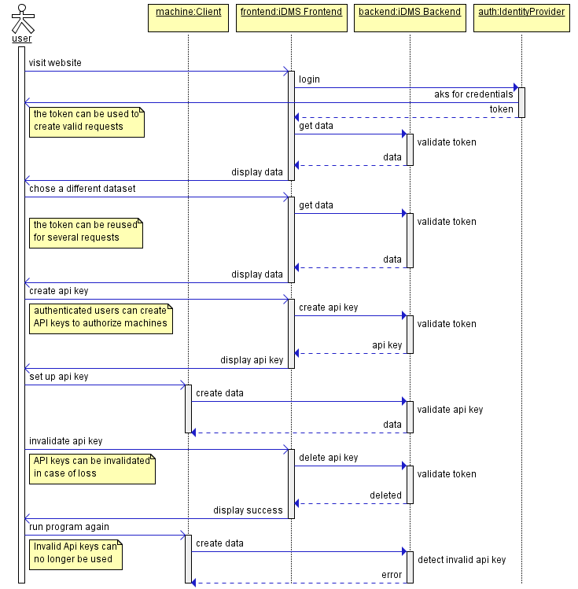

# Authorization

## Requirements

- The backend can verify the identity of users
- Users are uniquely identified in the backend by usernames
- The backend can easily verify whether a user has permissions to a particular object
- This check is quick and easy to perform, so there is no noticeable delay
- Current records can still be used

### Owner

- Objects have an unique owner
- Objects without owners belong to everyone (backward compatibility)
- Owners can be changed later
- Owners automatically have all permissions to the object
- Owners automatically have all permissions on all subordinate objects (inheritance)
- Newly created objects belong to the creator unless otherwise specified

### Permissions

- There are different permissions for readability, writability and managability
- Permissions can be set only for collections and containers, but apply to all subordinate objects
- For each object, there is a list of users who are allowed to read/write/manage the object
- The different permissions build upon each other (read < write < manage)
- Permissions can be edited by all users with manage permissions
- Collections and container can be created by all users with access
- Newly created objects can be read and written by everyone with access

### Long living access tokens (Api Keys)

- Api Keys are used to authenticate and authorize a client for a specific task
- Api Keys belong to one user
- Api Keys can only authorize something as long as the user is allowed to do so
- If a user no longer exists, his Api Keys are automatically invalidated

### Payload databases

- Creation of new data is allowed to any logged in user
- Integrated databases contain payload containers represented by a `container` object in the data model
- Users can create payload containers via the root endpoints
- Containers can be populated with data via the `type/container_id/` URL (e.g. `/files/<id>/`, `/timeseries/<id>/`)
- Containers can be restricted by the permission system mentioned above
- A reference contains the specific ID of the uploaded data inside the container
- Multiple references can point to one and the same data, or narrow it down further

## Implementation

### Users

- Users are stored in Neo4j
- A user also has the following attributes (arrows -> indicate relationships)
  - owned_by -> List of entities, references and containers (n:1)
  - readable_by -> List of entities (n:m)
  - writable_by -> List of entities (n:m)
  - managable_by -> List of entities (n:m)

### Endpoints

- A endpoint `/.../<id>/permissions` can be used to manage permissions of an object
- Allowed methods are `GET` and `PUT`
- Permissions follow the following format:

```json
{
   "readableBy": [
      <usernames>
   ],
   "writableBy": [
      <usernames>
   ],
   "managableBy": [
      <usernames>
   ],
   "ownedBy": <username>
}
```

### Api Keys

- Api Keys are stored in Neo4j
- Each time an AccessToken is accessed, it must be checked that the owner of this token also has the corresponding authorization
- Api Keys have the following attributes
  - uid: UUID
  - name: String
  - created_at: Date
  - jws: Hex String (Will never be delivered after creation)
  - belongs_to: User (n:1)

### Access

- For each access it must be checked whether
  - the user owns the requested object
  - the user is authorized for the requested object
  - the user is authorized to write to the requested payload object (if a payload database is accessed)



## Consequences

- Subscriptions belong to a user, whose privileges are used to filter callbacks
- Simple, concrete requests are allowed or forbidden
- Callbacks must be checked on a case-by-case basis
- Results of search queries must be filtered

## Open Issues

- Groups/Roles (OpenID Connect, internal, ...)
- Restrict Api Keys to specific entities
- Api Keys can expire
